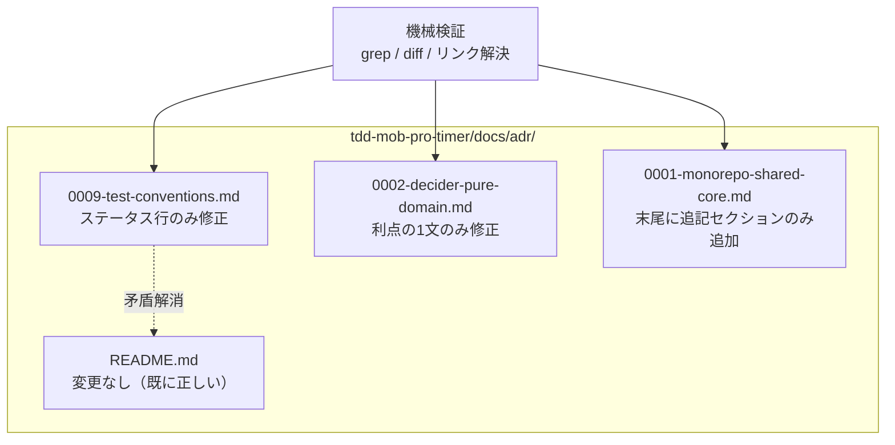

# 実装計画: ADR を #28 後の実態に合わせる

**Issue:** [#33](https://github.com/tomohiroJin/tasuki-tools/issues/33) ・ **仕様:** [`spec.md`](./spec.md) ・ **ステータス:** Draft（設計レビュー中）

## 技術コンテキストと意思決定

本計画に「新しい技術」は存在しない。対象は3つの Markdown ファイルの文面であり、
実装は編集そのものである。判断が必要なのは「何を直し」「何を追記するか」の境界線だけである。

| 意思決定 | 選択 | 根拠（紐づく要件） |
|---|---|---|
| ADR-0009 の直し方 | 本体ステータス行のみを README と同じ意味の文言に書き換える。移行済みファイル一覧（本文中の表）は変更しない | FR-139。ズレは「更新のし忘れ」であり、性質・影響一覧には矛盾が無いため触る必要が無い |
| ADR-0002 の直し方 | 「利点」節の1文だけを、ソロに依拠しない表現へ差し替える。「決定」節・「代償」節は無変更 | FR-140〜142。決定自体は Issue #33 でも有効と明言されている |
| ADR-0001 の直し方 | 既存の本文（背景・決定・影響）は1文字も変更せず、末尾に `## 更新 (2026-07-31)` を追記する | FR-143〜146。決定は有効・根拠が変わった、という「追記で経緯を残す」ケースの典型 |
| 論点4（Decider の破れ） | ADR-0002 に一切追記・修正しない | FR-148。Issue #26 のスコープとしてユーザーが確定済み |
| 検証手段 | ファイルシステム上の grep / diff / リンク解決チェックのみ。新規スクリプトファイルは作らない | 非機能（検証可能性）。本変更はドキュメントのみであり、検証用の恒久的なコード資産を追加するとスコープが「ドキュメントのみ」から逸脱する |

## 規約チェック（Constitution Check）

| 原則 | ステータス | 備考 |
|---|---|---|
| ADR は不変の記録である（`tdd-mob-pro-timer/docs/adr/README.md` 冒頭の原則） | **PASS**（条件付き） | 「決定」節は3ファイルとも一切変更しない。0009 のステータス修正は「決定」ではなく進捗の記録の是正、0002 の利点修正は「決定」ではなく「決定を支える説明」の事実訂正、0001 は追記のみ。いずれも「判断が覆った」場合の `Superseded` 差し替えには当たらない |
| 決定が覆ったら新しい ADR で `Superseded` する（同原則） | **PASS** | 3件とも決定は覆っていない（維持されると Issue #33 で明言）。新規 ADR は不要 |
| ドキュメントのみの変更（本 Issue のユーザー制約） | **PASS** | `tdd-mob-pro-timer/apps/`, `tdd-mob-pro-timer/packages/` への変更は行わない（T009 で machine 検証） |
| 論点4は本スコープ外（ユーザー確定済み） | **PASS** | ADR-0002 への追記・修正は「利点」の1文のみに限定し、論点4関連の記述は追加しない |
| 設計文書の正本は `docs/plans/`（ADR-0010） | **PASS** | 本 spec/plan/tasks は `docs/plans/adr-alignment-post-refactor/` に配置する |

## アーキテクチャ

変更対象は3ファイルのみ。相互の依存関係は無く、並列に手当てできる。



## コンポーネントとインターフェース

ドキュメント変更のため「コンポーネント」に相当するのは対象ファイルそのものである。

- `tdd-mob-pro-timer/docs/adr/0009-test-conventions.md` — L3 のステータス行のみ編集。
  「移行済みファイル」節・その他は無変更。
- `tdd-mob-pro-timer/docs/adr/0002-decider-pure-domain.md` — 「影響」節内の「利点」の
  1文のみ編集。「決定」節・「代償」の記述は無変更。
- `tdd-mob-pro-timer/docs/adr/0001-monorepo-shared-core.md` — 既存全行は無変更。
  末尾に追記セクション（見出し `## 更新 (2026-07-31)`）を新規追加。
- `tdd-mob-pro-timer/docs/adr/README.md` — 変更なし（Issue #33 の時点で既に正しい記述）。

## データモデル

該当なし（ドキュメントのみの変更であり、永続データ・スキーマは存在しない）。

## API / インターフェース契約

該当なし。

## プロジェクト構成

```
tdd-mob-pro-timer/docs/adr/
├── 0001-monorepo-shared-core.md     # 変更: 末尾に追記セクションのみ追加（既存本文は無変更）
├── 0002-decider-pure-domain.md      # 変更: 「利点」の1文のみ差し替え
├── 0009-test-conventions.md         # 変更: L3 のステータス行のみ差し替え
└── README.md                        # 無変更（既に正しい）

docs/plans/adr-alignment-post-refactor/
├── spec.md
├── plan.md
└── tasks.md
```

## エラー処理とセキュリティ

該当性が低いが確認しておく。

- 本変更は機密情報（API キー・トークン等）を一切含まない。
- 「追記」という手当ての性質上、既存文の削除・上書きが誤って発生する失敗モードが
  最大のリスクである。これを防ぐため、テスト戦略で ADR-0001 について
  「追加行のみ・削除行ゼロ」を `git diff --stat` で機械検証する（T007）。
- ADR-0002・0009 は該当箇所以外に変更が及んでいないことを、編集後に該当ファイルの
  `git diff` を目視し、変更行数が想定（それぞれ数行）を超えていないことで確認する。

## テスト戦略

**ドキュメント変更のため、実行可能なテスト（テストランナー上で走るテストコード）は無い。**
代わりに、以下 4 種の機械的検証コマンドを合否判定の手段とする。いずれも
`tdd-mob-pro-timer/` を基準ディレクトリとして実行する。

### 検証1 — ADR-0009 本体と README のステータス文言の一致（FR-139, SC-048）

```bash
grep -n "ステータス" tdd-mob-pro-timer/docs/adr/0009-test-conventions.md | head -1
grep -n "0009" tdd-mob-pro-timer/docs/adr/README.md
```

**合格条件**: 両方の出力に「移行完了」が含まれ、かつ ADR-0009 本体側の出力に
「一部実施中」が含まれないこと。

```bash
grep -c "一部実施中" tdd-mob-pro-timer/docs/adr/0009-test-conventions.md
# 期待値: 0
```

### 検証2 — ADR-0002 からのソロ語の除去（FR-140, SC-049）

```bash
grep -n "ソロ" tdd-mob-pro-timer/docs/adr/0002-decider-pure-domain.md
```

**合格条件**: 出力（マッチ行）が無いこと（`grep` の終了コードが 1）。

同時に、決定節が無変更であることを目視で確認するための差分表示:

```bash
git diff tdd-mob-pro-timer/docs/adr/0002-decider-pure-domain.md
```

**合格条件**: 差分が「利点」節の該当1文のみであること（「決定」節に差分が無いこと）。

### 検証3 — ADR-0001 の既存本文の無変更（追記のみ）（FR-143, FR-144, SC-050）

```bash
git diff --stat tdd-mob-pro-timer/docs/adr/0001-monorepo-shared-core.md
```

**合格条件**: 削除行数（`-` 側）が 0 であること（追加行数のみが増える）。

```bash
grep -n "^## 更新" tdd-mob-pro-timer/docs/adr/0001-monorepo-shared-core.md
```

**合格条件**: 追記セクションの見出しが1件検出されること。

```bash
grep -c "共有パッケージ" tdd-mob-pro-timer/docs/adr/0001-monorepo-shared-core.md
# 追記セクション内に「決定は依然有効」の言及があることの簡易確認
```

### 検証4 — 相対リンクの解決可能性（非機能・SC-051）

```bash
cd tdd-mob-pro-timer/docs/adr
grep -oE '\]\(\./[^)]+\)' *.md | sed -E 's/^[^:]+:\]\(\.\///; s/\)$//' | sort -u | while read -r f; do
  test -f "$f" || echo "BROKEN LINK: $f"
done
```

**合格条件**: `BROKEN LINK` 行が1件も出力されないこと。

### 検証5 — コード非変更の確認（FR-149）

```bash
git diff --stat -- tdd-mob-pro-timer/apps tdd-mob-pro-timer/packages
```

**合格条件**: 出力が空であること（このブランチでコード側に一切差分が無いこと）。

> **順序の原則**: 上記5種の検証コマンドは、ADR編集の**前に**内容を確定し、
> 編集直後にその場で実行する（tasks.md の各タスクに検証ステップとして組み込む）。
> 先にコマンドを決めてから編集するのは、通常の TDD の red → green に相当する順序を
> ドキュメント変更に適用したものである（編集前に「何を確認すれば直ったと言えるか」を
> 決めておくことで、直した後に基準をすり合わせる事態を避ける）。

## 段階分け / 順序

| 段階 | 内容 | 検証ゲート |
|---|---|---|
| **D0** | 検証1〜5のコマンドを確定し、編集前に実行して現状（Red）を記録する。検証1・2・3は不一致/残存/追記なしで失敗し、検証4・5は既に合格するはず（対象外ファイルには触れていないため） | D0 実行ログに検証1/2/3 の失敗、検証4/5 の合格が残る |
| **D1** | ADR-0009 のステータス行を修正 | 検証1が Green |
| **D2** | ADR-0002 の「利点」を修正 | 検証2が Green。かつ `git diff` が「利点」節のみであることを目視確認 |
| **D3** | ADR-0001 に追記セクションを追加 | 検証3が Green |
| **D4** | 検証4（相対リンク）・検証5（コード非変更）を再実行し、全体がすべて Green であることを確認 | 検証1〜5 が全て Green |

D1〜D3 は互いに独立したファイルへの変更であり並列実行可能だが、
検証コマンドの取り違えを避けるため tasks.md ではファイル単位に直列で進める。

## 未解決の `[要確認]`

なし。対象3ファイル・修正方針・追記の位置（末尾）・検証コマンドはいずれも確定済み。
