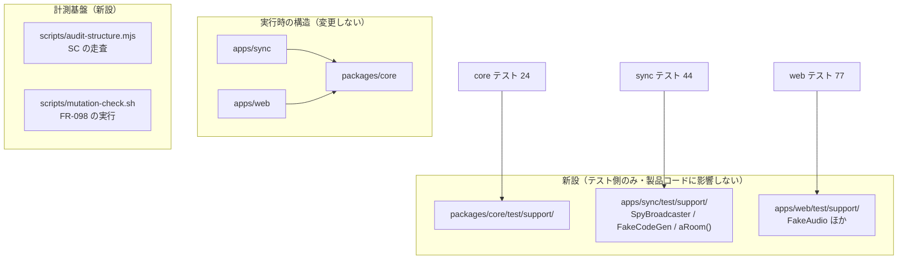

# 実装計画: コードベースの構造是正 — 原則違反の棚卸しと解消

**対応 spec:** [`spec.md`](./spec.md) ・ **Issue:** [#28](https://github.com/tomohiroJin/tasuki-tools/issues/28) ・ **ステータス:** Draft（設計レビュー中）

> 本計画は「どう作るか」を扱う。何を・なぜは `spec.md` を参照。
> 作業ディレクトリはすべて `tdd-mob-pro-timer/`。
>
> **spec との関係:** spec が要件と成功基準の正本である。本計画が spec と食い違う場合、spec が正しい。
> 特に **SC の操作的定義の表（spec）が正本**であり、本計画の走査スクリプトはその実装にすぎない。

## 技術コンテキスト

| 項目 | 内容 |
|---|---|
| 構成 | pnpm workspaces + Turborepo。`packages/core` / `apps/sync`（Bun + ws）/ `apps/web`（React + Vite） |
| 検証ゲート | **CI 無し。** ローカルの `pnpm test && typecheck && lint && build` のみ |
| テスト実行時間 | `apps/web` が 1 回 14 分前後（9p I/O 起因）。個別は `cd apps/web && npx vitest run <file>` が速い |
| カバレッジ閾値 | **`packages/core` のみ** lines/branches 90%（`events.ts` / `errors.ts` / `index.ts` は除外）。sync / web は閾値なし |
| モジュール解決 | `apps/sync/vitest.config.ts` が `@tdd-mob/core` のサブパスを **9 本 alias 解決**している。テスト構成を触るとき影響する |
| 永続化 | 無し（揮発インメモリ）。データ移行は考慮不要 |
| 実行環境 | pnpm は `~/.local/bin/pnpm`、bun は PATH 上 |

### 対象の規模（P1 完了後）

| パッケージ | ファイル | テスト | テスト行 | 平均 件/ファイル |
|---|---:|---:|---:|---:|
| `packages/core` | 24 | 285 | 3,853 | 11.9 |
| `apps/sync` | 44 | 287 | 7,503 | 6.5 |
| `apps/web` | 75 | 519 | 7,332 | 6.9 |
| **計** | **143** | **1,091** | **18,688** | **7.6** |

書き換えの重さは 2 種類に分かれる（spec の見積もりが依拠している区分）。

- **重い 73 ファイル** — 名前の是正・関心の分割・ガードの撤去を伴う（SC-029/030/031 該当）。判断を要する
- **軽い 72 ファイル** — GWT の区切り付与とビルダーへの差し替えが中心。機械的な比重が高い

## 本計画の形を決めている 3 つの事実

設計判断の多くは、次の 3 点から導かれている。**これらはコードを読んで確認した事実である。**

**事実 1 — ハンドラの戻り値は本番で使われていない。**

```ts
// apps/sync/src/server.ts:127
await handlers.handleCommand(connId, cmd);   // ← 戻り値を破棄している
```

`Result<CreateResult, string>` は**テストだけが参照する契約**である。本番の観測点は
`Broadcaster` への送信（snapshot / error / signal）であり、戻り値ではない。

→ FR-100 の解き方が変わる。型を精密にするより、**テストが本番と違うものを観測している**ことが問題である。

**事実 2 — 撤去対象のテストが、書き換え対象に含まれている。**

休眠コードに付随するテストは **8 ファイル・64 件**（約 920 行）ある。**先に撤去すれば書き換える必要が無い。**
spec の優先度（US1 が P1）はこの点でも正しい。

**事実 3 — 「到達不能」の意味が層によって違う。**

| 分岐 | 状態 | 根拠 |
|---|---|---|
| `handlers.ts:97` の `!room.onBreak` | **到達不能** | `break.start` は `buildDomainCommand` に分岐が無く `UNKNOWN_COMMAND` になる |
| `evolve.ts` の `evolveConfigSet` members 分岐 | **到達可能** | 公開 API `evolve()` から呼べる。`coverage-supplement.test.ts:29,50` が実際に呼んでいる |

→ FR-119 が `apps/` に限定されている理由。`packages/` の公開関数の分岐は撤去しない。

## 技術選定と根拠

| 決定 | 選択 | 根拠（紐づく要件） |
|---|---|---|
| テスト共有ヘルパの置き場所 | 各パッケージの `test/support/`。**新規パッケージを作らない** | `SpyBroadcaster` は sync 専用、`FakeAudio` は web 専用で共有対象が実在しない。共有パッケージは「元に戻すことが困難な抽象」（FR-118） |
| Given-When-Then の表現 | **コメント区切り + Given をビルダーで 1〜2 行に圧縮** | lint による強制は仕組みが重く戻せない（FR-118）。Given が短くなれば構造は自然に読める（FR-091） |
| 仕様 ID の移設先 | `describe` 直上の JSDoc に `@requirements FR-006, US1` | 名前から外しつつ追跡を保つ（FR-093, FR-094）。文字列なので grep 可能 |
| テスト名の形式 | 日本語の平叙文。主語は観測可能な結果 | 既存の良いテスト名の多数派に合わせる（FR-092） |
| 前提構築の失敗検出 | 失敗時に `throw` するヘルパ（`expect` を使わない） | 前提の失敗を検証の失敗と区別する（FR-096） |
| 機械的置換の手段 | **`ts-morph` 等を導入せず `sed`/`grep` + 手作業** | 145 ファイルは人手で扱える規模。依存を増やさないほうが可逆（FR-118） |
| 欠陥検出能力の確認 | **固定した変異を注入し、検出されるかを前後で比較** | FR-098 を実行する唯一の現実的手段。既製のミューテーションツールは導入しない |
| 公開契約の表現 | `packages/core/src/index.ts` の `export *` 11 本を**明示列挙に置換** | FR-110。挙動不変で、いつでも戻せる |
| `handlers.ts` の分割 | **行わない** | Issue #26 の担当範囲（spec のスコープ外） |
| 移行進捗の記録 | `docs/adr/0009-test-conventions.md` に移行済みファイル一覧を持つ | FR-122 |

## 規約チェック

`.claude/rules/coding-style.md` と `CLAUDE.md` の MUST ルールとの照合。

| 原則 | 判定 | 備考 |
|---|---|---|
| `any` 禁止・`unknown` + 型ガード | PASS | 本計画で `any` を導入しない |
| 1 関数 1 責務・30 行目安 | PASS | 分割の方向であり違反しない |
| パラメータ 3 個以内 | PASS | ビルダーはメソッドチェーンで受ける |
| 相対パス `../` は 2 階層まで | **要注意** | `test/support/` は各 `test/` 直下に置き、参照を深くしない |
| 名前付きエクスポート優先 | PASS | |
| ファイル名 kebab-case（コンポーネントは PascalCase） | **要注意** | 既存の `Lobby.rotation.test.tsx` 形式は**リネームしない**（差分を増やすだけで原則違反ではない） |
| コメントは日本語・「なぜ」を書く | PASS | |
| 変更前に既存実装を読む | PASS | 各タスクに対象の読解を含める |
| 破壊的変更の前に確認 | PASS | 撤去は spec 決定 1 で承認済み |

**違反なし。** 「要注意」2 件は `tasks.md` で具体的に制約する。

---

## アーキテクチャ

本計画は**実行時のアーキテクチャを変えない**。変えるのは「同じ構造をどう表現するか」である。



## コンポーネントとインターフェース

### 新設 1 — 走査スクリプト `scripts/audit-structure.mjs`

**spec の「操作的定義（何を数えるか）」の表を実装する。表が正本であり、実装が表に従う。**

- **Node スクリプト（`.mjs`）で書く。bash + grep では書けない。**
  SC-027 は「製品コード入口から import を辿り、到達しないファイルを数える」＝**グラフ探索**であり、
  行単位の走査で表現できない。SC-032 の「本体 3 行以上」判定も同様に構文の理解を要する。
  （技術選定の「`ts-morph` を導入しない」は**変換の手段**についての判断であり、
  **走査の手段**には及ばない。Node は既に開発環境にあるため追加依存は生じない）
- 出力は SC ごとの「現状値 / 目標値 / 判定」の表
- **SC-035（文言の定義箇所）は正規表現による近接ペアリングを使わない。**
  `code:` と `message:` の距離で対応付けると誤対応する（現状値の計測時に実際にこの手法を使ったが、
  網羅性も正確性も保証できない）。**同一のオブジェクトリテラル内にある組のみを対応とみなす**か、
  AST で `{ type: "error", code, message }` の形を取る
- **各段階の完了時に実行し、結果を変更単位の記述に残す**
- 実装がズレたときに気づけるよう、**表の各行に対応する関数を 1 対 1 で持つ**
  （`sc027_unreachable_modules` / `sc029_spec_ids_in_names` のように SC 番号を関数名に入れる）

> spec の SC-030・SC-031 は、いずれも「定義文と計測実装がズレていた」ことがレビューで判明して訂正された。
> このスクリプトは**そのズレを再発させないための装置**である。関数名と表の行を対応させるのはそのためである。

### 新設 2 — 変異検査 `scripts/mutation-check.mjs` と `scripts/mutations/*.patch`

FR-098 を実行する。

- 各変異を適用 → **その変異の「検出を期待するテスト」を実行** → 検出された / されなかったを記録 → 復元
- 出力は変異ごとの検出結果の表。**テスト名に依存しない**ため、名前を全面的に変えても比較できる
- **変異は「過去に実際に起きた欠陥の型」から選ぶ。網羅性ではなく的中率で価値を出す**

#### 変異と「検出を期待するテスト」の対応表（必須）

**変異ごとに実行対象のテストファイルを明記する。これが無いと運用できない。**

| # | 変異 | 由来した実際の欠陥 | 検出を期待するテスト |
|---|---|---|---|
| 1 | `advanceDriver` の交代を `(i+1)%n` → `(i+2)%n` | 交代ロジックの分裂（v2.7〜v2.10） | `packages/core/test/evolve.test.ts` |
| 2 | `checkPermission` のある規則の許可/拒否を反転 | 権限判定の 5 層分散（Issue #22） | `packages/core/test/permissions-differential.test.ts`<br>`packages/core/test/permissions.test.ts` |
| 3 | `computeIneligibleIndices` から placeholder の除外を削る | 代理がいると自動交代しない（v2.8 の本丸） | `apps/sync/test/proxy-auto-switch.test.ts`<br>`apps/sync/test/manual-skip-eligible.test.ts` |
| 4 | `normalizeDisplayName` の正規化を 1 段無効化 | 同名の取り違え・識別子の偽造（G8/G9/G10） | `packages/core/test/display-name.test.ts` |
| 5 | `canRemoveParticipant` の呼び出しを削る | 進行できる人が残らない詰み（FR-072/073） | `packages/core/test/participants.test.ts` |
| 6 | `freezeRunningClock` の凍結を外す | 一時停止で満タンに戻る（v2.3 #2a） | `packages/core/test/pause-freeze.test.ts`<br>`packages/core/test/break-freeze.test.ts` |
| 7 | `shouldClearGenerating` の内容比較を参照比較に変える | 生成中表示が固まる（AI お題 UX の FB） | `apps/web/test/ui/problem-generation.test.ts` |
| 8 | `deriveConnectionStatus` の `sessionLost` 分岐を反転 | 接続無関係の警告で「再接続中」と誤表示（R5-1） | **`apps/web/test/connection-status.test.ts`** |
| 9 | `buildNoticeMessage` の「あなた」判定を反転 | 誰が操作したか分からない／誤帰属（FR-077） | `apps/web/test/sync/notice-message.test.ts` |

> ⚠ **この対応表は「あると便利」ではなく「無いと誤った結論を出す」ものである。**
> 本計画のレビュー中、変異 8 を実際に注入して検証したところ、
> `apps/web/test/**ui/**connection-status.test.tsx` を実行して「**検出されなかった**」という
> 誤った結論を出した。正しい検出元は `apps/web/test/connection-status.test.ts`（`ui/` ではない）で、
> **名前がほぼ同じ別のテストが存在していた**（前者は `StatusStrip` コンポーネント、
> 後者は `deriveConnectionStatus` 純粋関数を検証している）。
> 正しいファイルで実行し直すと 3 件すべてが失敗し、変異は正しく検出された。

#### 運用と実行コスト（D-5）

| 実行モード | 対象 | 所要 | いつ使うか |
|---|---|---|---|
| **絞り込み実行** | 対応表のテストファイルのみ | 1 変異あたり 1 分前後 | 通常。G3 の各コミット時 |
| **全体実行** | 変異の属するパッケージ全体 | core/sync は数分、**web は 1 回 14 分** | 段階の完了時に 1 回だけ |

**9 変異 × 前後 2 回 = 18 実行。** 全体実行を毎回行うと最悪 4 時間を超えるため、
**通常は絞り込み実行**とし、段階の完了時にのみ全体実行で裏を取る。

#### ベースラインの妥当性検査（必須）

**ベースラインで検出されない変異は採用しない。** 検出されない変異は前後で「検出されない」まま変わらず、
比較の材料にならない（それどころか「表が一致した」という誤った安心を与える）。

`mutation-check.mjs` は**ベースライン実行時に、全変異が検出されることを確認する**。
検出されない変異があれば、その変異を差し替えるか、**検出できるテストを先に追加する**。

### 新設 3 — テスト用共有実装（`apps/sync/test/support/`）

**現に存在する重複からのみ導く**（FR-118）。既存定義の和集合を超えるものを作らない。

| 記号 | 責務 | 現在の重複数 |
|---|---|---|
| `SpyBroadcaster` | `Broadcaster` の記録つき実装 | 29 ファイル |
| `FakeCodeGen` | `RoomCodeGen` の決定的実装 | 27 ファイル |
| `makeTestHandlers(overrides?)` | `makeHandlers` を既定の依存で組み立てる | 各ファイルに散在 |

`SpyBroadcaster` には**問い合わせメソッドを追加する**。位置依存の検証（61 箇所）の置き換え先である。

```
latestSnapshot()            最後に配信されたルーム
errorsTo(connId)            その接続へ送られたエラーの一覧
hasErrorCode(connId, code)  特定のエラーコードが送られたか
signalsOf(signal)           特定種別のシグナル一覧
```

**添字ではなく意図で取り出す**ことで、イベントを 1 つ増やしただけで無関係なテストが落ちる状態を解消する。

### 新設 4 — ルーム構築ビルダー（`apps/sync/test/support/room-builder.ts`）

Given を 1〜2 行に圧縮する。**FR-091（構造）と FR-095（1 テスト 1 関心）の両方を解く鍵**である。

```
aRoom()
  .withParticipants("Bob", "Carol")
  .withDriver("Bob")
  .started()
  .build()      → { handlers, store, broadcaster, code, ids }
```

**前提の構築に失敗したら throw する**（FR-096）。`expect` は使わない。
これにより、前提段階に置かれた 84 箇所のガードが消える。

### 新設 5 — `packages/core/test/support/`（集約ビルダー）

**`aRoom()` は `makeHandlers` を組み立てる sync 専用のビルダーであり、core には使えない。**
core のテストは集約（`{ session, clock }`）を直接組み立てて `decide` / `evolve` を呼ぶため、
Given の形がまったく違う。

**対象は core 24 ファイル中 12 ファイル（50%・実測）である。**

| core のテスト | ファイル数 | ビルダーの要否 |
|---|---:|---|
| `initialAggregate` を使い集約を組み立てる | **12** | **要る** |
| 純粋関数を直接呼ぶ（`display-name` / `permissions` / `participants` / `clock` / スキーマ各種） | 12 | **不要**。多くは本体 2 行以下で SC-032 の対象外 |

```
anAggregate()
  .withRotation("p1", "p2", "p3")   参加者IDの配列（D6b）
  .withCurrentDriver(1)             currentIndex
  .running()  /  .paused()          clock の状態
  .at(NOW)                          アンカー時刻
  .build()                          → Aggregate
```

- **決定的な時刻**（`NOW` 定数）を既定で持つ。各テストが独自の epoch を書かなくて済む
- `initialAggregate` を内部で使い、**現在 12 ファイルが手で組んでいる形の和集合以上を作らない**（FR-118）
- 前提の構築に失敗したら throw する（FR-096）

> **当初この節は「24 ファイル・285 テストに固有の圧縮手段が要る」と書いていたが、
> 実測すると半分は集約を組み立てていなかった。** 必要な範囲を 2 倍に見積もっていた。

### 新設 6 — `apps/web/test/support/`（`Room` ビルダー + 薄い render ラッパ）

**web の Given は「どの `Room` を、どのコンポーネントに渡して render するか」である。**

**対象は web 75 ファイル中 48 ファイル（64%・実測）。残る 27 は純粋関数テストで render を使わない。**

render 対象は 8 コンポーネント以上に散っている（実測）。

```
Session 70 / RosterPanel 60 / Lobby 38 / SelfDriverToggle 21 /
ProblemEditor 18 / EndSessionZone 15 / NotifySettingsPanel 13 / StatusStrip 11
```

> **主役は `aRoomView()` である。** 当初この節は `renderLobby()` / `renderSession()` を主役に置き
> 残りを「ほか」で片付けていたが、**それでは 8 個以上の render ラッパを個別に設計することになる**。
> 実際の共通項は render の仕方ではなく、**各テストが手で組み立てている `Room`（snapshot の形）**である。
> そこを 1 つにすれば、render ラッパは各コンポーネント数行の薄いもので済む。

| 記号 | 責務 | 位置づけ |
|---|---|---|
| **`aRoomView(overrides?)`** | **`Room` の既定値を作り、上書き分だけ受け取る** | **主役。48 ファイルすべてが使う** |
| `renderWith(Component, props?)` | 既定 props で render し、上書き分だけ受け取る汎用ラッパ | 補助 |
| `renderSession()` / `renderRosterPanel()` / `renderLobby()` … | コンポーネント固有の既定 props。**必要になったものだけ足す** | 薄い。先回りして 8 個作らない（FR-118） |
| `FakeAudio` / `FakeOsc` / `FakeGain` / `FakeWS` | Web Audio・WS の差し替え | 現在 5 / 2 / 2 / 2 ファイルで重複定義 |

> **上書き方式にする理由:** 現在は各テストが `Room` を丸ごと手で組んでおり、これが web の Given が
> 長い主因である。上書き方式なら**そのテストが何を前提としているかが差分として読める**（FR-091）。

> **注意:** props と `Room` の既定値は**実際に App が渡している値**から取る。
> テスト専用の都合のよい既定値を作ると、テストが通っても実画面で動かない状態を招く。

### 変更 1 — `packages/core/src/index.ts` の公開契約（FR-110）

`export *` 11 本を、現在公開されている記号の**明示列挙**に置換する。

- 型定義出力から公開記号を機械的に抽出 → 列挙 → `typecheck` が通ることで同値性を確認
- **列挙の段では削減しない。** 現在公開されているものをすべて列挙するだけ（挙動不変）
- **公開の必要性の見直しは別タスクで行う**（FR-117: 機械的な変更と判断を要する変更を分ける）。
  走査（SC-039 ③）で「自ファイル内でのみ使う公開記号」が **17 件**あることが分かっている
  （`schemas.ts` の各スキーマ、`aggregate.ts` の ID 型、`decide.ts` の `DecideCommand` ほか）。
  これらは `export` を外す。**1 件ずつ `typecheck` で確認してから外す**
- 「どれが契約でどれが実装詳細か」の**分類**（公開 API と内部の区分の設計）は本計画の範囲外。
  本計画が行うのは「使われていない公開を閉じる」ところまで

### 変更 2 — お題データとロジックの分離（FR-109）

| 新ファイル | 内容 | 行数目安 |
|---|---|---|
| `problem-bank.ts` | `FALLBACK_PROBLEMS`（33 件）・`ALL_LANGS` | 約 1,230 |
| `problem.ts` | `validateProblem` / `pickFallback` / `buildProblemPrompt` / 型 | 約 70 |

`index.ts` の公開記号は変えない（`problem.ts` から再エクスポート）。**純粋な移動**である。

### 変更 3 — 表示名の衝突判定の一元化（FR-104, FR-107）

`handlers.ts` の 2 箇所（`addProxy` / `rename`）に同一の比較が独立実装されている。

- `packages/core/src/display-name.ts` に `conflictsWithExisting(participants, desiredName, excludeId?)` を追加
- `handlers.ts` の 2 箇所をこれの呼び出しに置換
- **判定内容は現在と同一**（`trim().toLowerCase()`・自分自身を除外）にする。
  **`nameSkeleton` を使う等の「より正しい判定」への変更は行わない** — それは振る舞いの変更である

### 変更 4 — 参加者行の規則の共通化（FR-107 の最小充足）

`Lobby.tsx` のインライン参加者一覧と `RosterPanel.tsx` が同じ操作を別実装している。

**統合しない。** 次のみ行う。

- 両者が使う**呼び名の解決**（`participantLabel`）と**操作の可否判定**を共通の純粋関数に寄せる
- 描画（JSX）は両者に残す

> **判断の記録:** 完全統合は「元に戻すことが困難な抽象」に当たり FR-118 に反する。
> Issue #22 の G8 で問題になったのは**規則が行き渡らないこと**であって、部品が 2 つあることではない。
> 規則さえ共通なら再発は防げる。

### 変更 5 — エラー文言の一元化（FR-105）— **挙動不変で達成できる**

**調査で判明した事実:** サーバー側の文言は**画面に一度も表示されていない**。

```ts
// apps/web/src/sync/dispatch.ts:58    message は届いている
cb.onError?.(msg.code, msg.message);

// apps/web/src/App.tsx:223            第 2 引数を受け取らず捨てている
onError: (code) => { ... setBanner({ text: friendlyError(code) }) }
```

`friendlyError(code)` はクライアント側の `ERROR_MESSAGES` を引くだけである。
したがって **サーバー側の文言リテラル（ユニーク 23 種・出現 36 箇所 ＋ テンプレート 5）は死荷重**である。

**方針: クライアント側の定義を正本とし、サーバー側の文言を撤去する。表示は 1 文字も変わらない。**

| 手順 | 内容 |
|---|---|
| 1 | `packages/core/src/error-messages.ts` を新設し、**現在クライアントが表示している文言**をそのまま移す |
| 2 | `App.tsx` の `ERROR_MESSAGES` をこの表の参照に置き換える（**文言は 1 文字も変えない**） |
| 3 | `apps/sync` の `message:` リテラルを、同じ表からの引き当てに置き換える |
| 4 | wire の `message` フィールドは**維持する**（FR-089・後方互換）。値は表から埋める |

**同一コードで文言が複数あるものが 5 種ある**（`LAST_MANAGER` / `CANNOT_CHANGE_HOST` /
`PARTICIPANT_NOT_FOUND` / `PARTICIPANT_OFFLINE` / `RATE_LIMITED`）。
しかし**その区別は現在も画面上では失われている**（クライアントはコードだけで引くため）。
サーバー側の具体的な文言（例:「指名対象が見つからないか、ローテーション外です」）を活かすことは
**機能改善であり本計画の範囲外**である。

> **起票済み: [#29](https://github.com/tomohiroJin/tasuki-tools/issues/29)**
> 「エラー文言が操作と一致しない（サーバーの文言が画面に届いておらず、2 件は誤った案内）」。
> 調査の結果、単なる具体性の不足ではなく**誤った案内が 2 件**あることが判明した
> （ドライバー指名の失敗に「ホストを移譲できません」、役割変更の失敗に「自分自身には移譲できません」）。
> **#29 は #28 の完了後に着手する。** 本計画が文言の定義を `packages/core` の 1 箇所に集約するため、
> #29 はその表を土台にコードと文言の対応を正せる。
> **整理整頓（本計画・挙動不変）と欠陥修正（#29・挙動が変わる）を混ぜない。**

**これにより、本計画で挙動が変わるのは FR-119（到達不能分岐の撤去）の 1 件のみになる。**

### 変更 6 — 値の並行保持の縮退（FR-120）

`App.tsx` は同じ値を state と ref の両方で持つ（5 組）。原因は「`makeClient` のコールバックが
生成時の値で固定される」ことであり、**並行保持そのものは避けられない**。

- `useLatestRef(value)` という小さなフックを 1 つ作り、5 組の同期処理を集約する
- **reducer への作り替えは行わない。** それは設計変更であり Tidy First の範囲を超える
- 純粋なガード用 ref（`problemRequestedRef` など state を持たないもの）は**触らない**

### 変更 7 — 到達不能分岐の撤去（FR-119）

`apps/` 限定。`handlers.ts:97` の `!room.onBreak` が対象。

- `break.start` / `break.end` の**wire スキーマは残す**（FR-089・後方互換）
- `Room.onBreak` フィールドも snapshot の形を変えないため残す
- 撤去するのは `reconcileSchedule` の到達不能な条件のみ
- **これが当該モジュール単体の振る舞いを変えるなら FR-115 として分離する**

### 変更 8 — B-2（`decide` の判断破棄）の扱い — **条件付き**

`decide` の `SWITCH` は `nextIndex` を決めて返すが、`handlers.ts` はそれを捨てて
`advanceDriver` の結果で置き換えている（FR-102 違反）。

**直すかどうかは次の検証の結果で決める。**

1. **特性テスト**を書き、現在の交代の振る舞いを固定する
2. `decide` に ineligible 集合を渡す形にしたとき、`evolve(DriverSwitched)` と `advanceDriver` が
   **すべての入力で同じ集約を生むか**をプロパティテストで確認する。
   **`fast-check`（v4）が既に devDependency にあり、これを用いる**（追加依存は不要）。
   生成する入力は rotation の長さ・currentIndex・ineligible 集合の全組み合わせとする
3. **同値であることが示せた場合のみ**、`handlers.ts` の置き換え分岐を撤去する
4. **示せなかった場合、B-2 は本計画から外し独立した Issue とする**

> 現状は「2 つの実装が結果的に一致している」だけかもしれない。一致しない入力があるなら、
> 統合は**振る舞いの変更**であり、spec が認めた 2 件の例外に含まれない。

#### 検証の結果（T075〜T077 実施済み）— **同値は示せなかった。撤退する。**

検証は `packages/core/test/driver-switch-characterization.test.ts`（特性テスト・T075）と
`packages/core/test/driver-switch-equivalence.test.ts`（プロパティテスト・T076）に残してある。

`fast-check` が最小化した反例は **`[rotation の長さ=1, currentIndex=0, ineligible=[]]`**:

| | `driverCounts` | `totalSwitches` |
|---|---|---|
| `evolve(DriverSwitched, nextIndex=0)`（統合後の姿） | `[1]` | `1` |
| `advanceDriver`（現在サーバーが使っている経路） | `[0]` | `0` |

反例の一般形は **「交代先が現ドライバーと同じになる入力」**であり、次の 2 つの場合に起きる。

1. 輪が 1 人（`(0 + 1) % 1 === 0`）
2. 現ドライバー以外が全員対象外（`nextEligibleIndex` が現状維持を返す）

`advanceDriver` はこの場合を「交代していない」とみなして担当回数・交代回数を増やさず、
タイマーだけを再アンカーする。`evolve(DriverSwitched)` は index の異同を見ないため常に増やす。
**利用者が見る記録（担当回数・交代回数）が変わる**ので、この統合は挙動不変ではない。

上記 1・2 はいずれも実運用で起こり得る（1人でモブを回し始めた直後、全員が一時離脱中の交代）。
交代先が現ドライバーと異なる入力については、同じ集約を生むことを確認済みである（2,000 ケース）。

したがって **手順 4 に従い、`handlers.ts:679-688` 相当の置き換え分岐は撤去しない**。
統合するには「交代先が自分自身になったとき担当回数を数えるか」という
**振る舞いの設計判断**が必要であり、それは Issue #26（`handlers.ts` の責務分割）の担当範囲である。

### 変更しないもの（設計判断として明記）

| 対象 | 理由 |
|---|---|
| `handlers.ts` の二重ルート・責務分割 | Issue #26 |
| `applyRoomLevelEvent` と `evolve` の統合（FR-103） | #26 と同じ関数群に触れる。本計画では**契約を型で表現する**ところまで |
| 権限判定の順序（`permissions.ts`） | 順序に意味があり、変えると過去の回帰が再発する |
| 表示名の正規化の順序（`display-name.ts`） | 4 巡の敵対的検証で固めた箇所 |
| テストファイル名の kebab/PascalCase 統一 | 差分を増やすだけで原則違反ではない |
| 既に要件を満たしているテスト | **FR-123 が書き換えを禁じている** |

## データモデル

実行時のデータモデルは変更しない。**唯一の追加**は次の型である。

```
ErrorCode    エラーコードの列挙（現在 string で表現されているもの）
             → packages/core/src/errors.ts に追加
```

現在 `err("NOT_IN_ROOM")` のように任意の文字列で表現されている失敗を列挙型にする（FR-101）。
**値は変えない**（同じ文字列リテラルの union）ため、wire にも挙動にも影響しない。

## インターフェース契約

**外部インターフェース（WebSocket プロトコル）を一切変更しない。**

| 契約 | 変更 |
|---|---|
| `ClientCmd`（受理するコマンド） | 変更なし。`break.start` / `break.end` のスキーマも残す（FR-089） |
| `ServerMsg`（配信するメッセージ） | 変更なし。`error.message` フィールドも維持 |
| `Room`（snapshot の形） | 変更なし。`onBreak` フィールドも残す |
| ハンドラの戻り値 | **テスト専用の契約**。G6 で見直す（本番は使用していない＝事実 1） |

## プロジェクト構成（変更後）

```
tdd-mob-pro-timer/
├── packages/core/
│   ├── src/
│   │   ├── index.ts              ← export * を明示列挙に置換
│   │   ├── errors.ts             ← ErrorCode 列挙を追加
│   │   ├── error-messages.ts     ← 【新規】コード → 文言の単一の表
│   │   ├── problem.ts            ← ロジックのみ（約 70 行）
│   │   ├── problem-bank.ts       ← 【新規】お題データ（約 1,230 行）
│   │   └── display-name.ts       ← conflictsWithExisting を追加
│   └── test/support/             ← 【新規】
├── apps/sync/
│   ├── src/application/handlers.ts   ← 分割しない（#26）。重複の除去と到達不能分岐の撤去のみ
│   └── test/support/             ← 【新規】SpyBroadcaster / FakeCodeGen / aRoom()
├── apps/web/
│   ├── src/
│   │   ├── solo/                 ← 【削除】
│   │   ├── ai/{byok,key-storage}.ts  ← 【削除】（no-ai / provider は残す）
│   │   ├── ui/components/AiSettingsModal.tsx  ← 【削除】
│   │   └── App.tsx               ← useLatestRef に集約。文言は core を参照
│   └── test/
│       ├── support/              ← 【新規】
│       ├── solo/ · ai/           ← 【削除】
│       └── ui/AiSettingsModal.test.tsx  ← 【削除】
├── scripts/
│   ├── audit-structure.mjs       ← 【新規】SC の走査（spec の表の実装・Node）
│   ├── mutation-check.sh         ← 【新規】FR-098 の実行
│   └── mutations/*.patch         ← 【新規】固定した変異
└── docs/adr/
    ├── 0009-test-conventions.md  ← 【新規】テスト規約 + 移行進捗（FR-122）
    └── 0010-design-doc-source.md ← 【新規】設計文書の正本（FR-112）
```

`apps/sync/{adapters,application,domain,ports}/`（空ディレクトリ・git 未追跡）は削除する（FR-111）。

## エラー処理とセキュリティ

- **セキュリティ上の変更は無い。** 撤去対象に認証・認可・入力検証は含まれない
- `key-storage.ts` の削除により `localStorage` への鍵保存経路が消える。**攻撃面が減る方向**
- 文言の集約にあたり、**内部情報を漏らさない現在の方針を維持する**
  （`AI_UNLOCK_FAILED` が機能の存在を秘匿すること、`PASSPHRASE_REQUIRED` と
  `PASSPHRASE_MISMATCH` の出し分けは現状のまま）
- `permissions-differential.test.ts` は**全工程で緑を維持**する

## テスト戦略

### 本計画における「テスト」の二重の役割

テストが**安全ネットであると同時に変更対象**である。spec が「安全ネットの循環」として
構造的な弱点と認めた部分であり、次の分離で緩和する。

| 段階 | 変えるもの | 安全ネット |
|---|---|---|
| G1（撤去） | 製品コード + テスト（削除のみ） | 残るテストが緑 |
| **G2・G3（テスト書き換え）** | **テストのみ** | **製品コードが 1 行も変わらないこと**（`git diff --stat -- 'tdd-mob-pro-timer/*/src/*'` が空。`*/src/*` だけだと同一リポジトリの `planning-poker/` も拾うため限定する） |
| G4〜G7 | 製品コード | 書き換え済みのテスト + 変異検査 |

**G2・G3 では製品コードを一切変更しない。** これにより「テストを変えたらテストが通った」という
自己参照的な誤りを構造的に防ぐ。製品コードが不変である以上、テストが緑であることは
テストが同じものを検証している証拠になる。

### 欠陥検出能力の同一性（FR-098）

G2 の開始前にベースラインを取り、G3 の完了後に再実行する。**検出結果の表が一致することが完了条件**である。

- 検出できていた変異が検出されなくなった → **検証内容を減らした**。差し戻す
- 検出できなかった変異が検出されるようになった → **検証内容を増やした**。FR-099 違反として分離する

### 安全ネット自身の書き換え（`permissions-differential.test.ts`）

spec の定めに従い、次の制約を守る。

1. 単独の変更単位で行い、他の変更と混ぜない
2. 書き換えは**名前の付け方と構造の表現に限る**。オラクルと検証の組み合わせは変えない
3. 前後で**検証される組み合わせの総数が一致すること**を確認する（開始前 150 通り + 開始後）
4. FR-093 の例外表に載っているため、組み合わせを名前に含めてよい

### 各段階の検証

| 段階 | 単体テスト | 型・lint・build | 実機（RC-003） | 変異検査 | 走査（SC） |
|---|---|---|---|---|---|
| G0 計測基盤 | — | 必須 | — | **ベースライン取得** | 初期値の記録 |
| G1 撤去 | 必須 | 必須 | **必須** | — | SC-027 |
| G2 共有ヘルパ | 必須 | 必須 | 不要（テストのみ） | — | SC-028 |
| G3 テスト書き換え | 必須 | 必須 | 不要（テストのみ） | **前後比較** | SC-029〜032 |
| G4 構造 | 必須 | 必須 | **必須** | 再実行 | SC-036 |
| G5 規則の一元化 | 必須 | 必須 | **必須** | 再実行 | SC-035 ＋ **RC-002** |
| G6 契約 | 必須 | 必須 | **必須** | 再実行 | **RC-001** |
| G7 挙動変更の分離 | 必須 | 必須 | **必須** | — | — |

**実機確認（RC-003）は spec の手順に従う。** 特に `vite` を再起動してから確認すること
（この環境は HMR を取りこぼし旧バンドルを配信する）。確認した画面と操作は変更単位に列挙する。

### テストの書き方の規約（G3 で適用・ADR 0009 に記録）

```
describe("<対象の名詞>", () => {
  /**
   * @requirements FR-006, US1
   */
  describe("<状況>", () => {
    it("<観測可能な結果を述べる平叙文>", () => {
      // Given
      const { handlers, code } = aRoom().withParticipants("Bob").started().build();
      // When
      await handlers.handleCommand(hostConn, { command: "session.act", action: "SWITCH" });
      // Then
      expect(spy.latestSnapshot()?.session.currentIndex).toBe(1);
    });
  });
});
```

- **名前**: 「〜のとき、〜する」。仕様 ID・関数名・「〜が呼ばれる」を含めない
- **Given**: ビルダー 1〜2 行。`expect` を置かない
- **When**: 1 つの操作
- **Then**: 1 つの振る舞い。位置ではなく意図で取り出す
- **本体が 2 行以下のテストには区切りを付けない**（SC-032 の対象外）
- **既に規約を満たしているテストは触らない**（FR-123）

---

## 段階分け / 順序

**すべての段階は独立してマージ可能であり、任意の時点で停止できる**（FR-113, FR-116）。
順序は spec の優先度（Tidy First = 安全な順）に従う。

| 段階 | 内容 | 満たす US / FR | 触る対象 | 停止した場合の状態 |
|---|---|---|---|---|
| **G0** | 計測基盤（走査スクリプト・変異検査・変異パッチ） | FR-098 | `scripts/` のみ | 計測手段だけが増える。無害 |
| **G1** | 休眠コードの撤去 | US1・FR-087〜090 | 製品 + テスト（削除） | 約 1,400 行減る。それだけで完結 |
| **G2** | テスト共有ヘルパとビルダーの新設・差し替え（機械的） | US2・FR-097 | **テストのみ** | 重複が消える |
| **G3** | テストの名前・構造・関心の一括是正（判断を要する） | US2・FR-091〜096, 099, 123 | **テストのみ** | **移行済みファイルは新規約、未移行は旧規約**（FR-121・混在はファイル間のみ） |
| **G4** | 構造（公開契約の列挙・データ分離・空ディレクトリ・ADR） | US5・FR-108〜112 | 製品 + docs | 構造が責務を表す |
| **G5** | 規則の一元化（衝突判定・**文言**・呼び名・`useLatestRef`） | US4・FR-104〜107, 120 | 製品 | 規則が 1 箇所になる |
| **G6** | 契約（`ErrorCode` 列挙・戻り値の見直し・B-2 の条件付き対応） | US3・FR-100〜103 | 製品 + テスト | 型が契約を語る |
| **G7** | 挙動が変わる差分（**到達不能分岐 FR-119 の 1 件のみ**） | FR-115・FR-119 | 製品 | 唯一の挙動変更が単独で識別できる |

### 順序の根拠

- **G1 が G2/G3 より前** — 撤去するテスト 51 件を書き換えるのは浪費（事実 2）
- **G0 が G2 より前** — 変異検査のベースラインは、テストを触る前に取らなければ意味がない
- **G2 が G3 より前** — ビルダーが無いと Given を圧縮できず、構造の是正が書けない
- **G2/G3 が G4〜G6 より前** — 製品コードを触る段階の安全ネットになる（spec の優先度そのもの）
- **G4 → G5 → G6 の順（US5 → US4 → US3）** — 製品コードに触る 3 段階を**安全な順**に並べる。
  G4 は列挙・移動・削除が中心で判定ロジックを変えない。G5 は判定規則を統合する。
  G6 は型と契約を変え、B-2 の同値性検証まで含む。**後ろほど危険度が上がる**
  （spec は当初 US5 を P3 としていたが、その根拠が「価値が出るのが遅い」という
  価値の議論で、spec 自身の「安全な順」という基準と噛み合っていなかった。
  本レビューを受けて spec 側を P2 に訂正済み）
- **G7 が最後** — spec が認めた**唯一の**挙動変更を、他がすべて終わって差分が静まった状態で単独に出す
- **本計画全体が Issue #26 より前**（spec 決定 2）

### 見積もりと撤退基準

**本レビュー（2 巡目）で対象規模の実測値が判明したため、G2 を積み直した。**
1 巡目では「core 24 / web 77 のすべてにビルダーが要る」と仮定して 18〜30h としたが、
**実測では core 12 / web 48 であり、しかも web の設計は `aRoomView()` 主役に組み替えた**。

**G2 の内訳（成果物ごとに積む）**

| 成果物 | 対象 | 概算 | 根拠 |
|---|---|---|---|
| sync: `SpyBroadcaster` + 問い合わせメソッド | 29 ファイルで重複定義 | 3〜5 h | 既存定義の和集合 + 問い合わせ 4 種 |
| sync: `FakeCodeGen` + `makeTestHandlers` | 27 ファイル | 2〜3 h | 既存定義の統合のみ |
| sync: `aRoom()` ビルダー | 44 ファイル | 4〜6 h | 最も込み入る。開始状態・ドライバー指定を含む |
| core: `anAggregate()` | **12 ファイル**（24 中） | 2〜4 h | `initialAggregate` の薄いラッパ |
| web: **`aRoomView()`** | **48 ファイル**（75 中） | 4〜6 h | **主役。`Room` の既定値と上書き** |
| web: `renderWith()` + フェイク統合 | 48 ファイル | 3〜5 h | 汎用ラッパ + `FakeAudio`/`FakeWS` の集約 |
| 各パッケージへの差し替え（機械的） | 全体 | 4〜7 h | import 差し替えと重複定義の削除 |
| **G2 計** | | **22〜36 h** | |

> **1 巡目の 18〜30h より増えている。** 対象ファイル数は減ったが、
> **成果物ごとに積んだことで、当初丸めていた差し替え作業（4〜7h）が明示された**ため。
> 数字が増えたのは悪化ではなく、根拠のない概算が根拠のある概算に変わったということである。

**全体**

| 段階 | 内容 | 1 巡目 | **改訂** | 差分の理由 |
|---|---|---|---|---|
| G0 | 計測基盤 | 6〜11 h | **8〜13 h** | 変異の対応表・ベースライン妥当性検査を追加 |
| G1 | 撤去 | 2〜4 h | 2〜4 h | — |
| **G2** | 共有ヘルパ | 18〜30 h | **22〜36 h** | 成果物ごとに積み直し（上表） |
| **G3** | テストの一括書き換え | 40〜70 h | **40〜70 h** | 据え置き。実測は G3 の最初の 10 ファイルで取る |
| G4 | 構造 | 6〜10 h | 6〜10 h | — |
| G5 | 規則の一元化 | 8〜12 h | 8〜12 h | — |
| G6 | 契約（B-2 の成否で分岐） | 8〜22 h | 8〜22 h | — |
| G7 | 挙動変更の分離 | 1 h | 1 h | — |
| **計** | | 91〜156 h | **95〜168 h** | |

**G6 の場合分け（M-1）:**

| B-2 の検証結果 | 内容 | 概算 |
|---|---|---|
| **同値であることが示せた** | 特性テスト + `fast-check` によるプロパティテスト + 置き換え分岐の撤去 | 14〜22 h |
| **示せなかった** | 特性テスト + プロパティテストまで実施し、**結果を別 Issue に記録して撤退** | 8〜12 h |

**どちらの場合も、特性テストとプロパティテストは成果として残る**（撤退しても捨てない）。

**撤退基準（spec より）:**

1. **G3 の最初の 10 ファイルで実績を取る。** 見積もりとの乖離が **1.5 倍を超えたら引き直す**
2. 実績が見積もりの **2 倍を超えたら、SC-032 の適用範囲を「重い 73 ファイル」に限定する**
3. それでも収まらなければ **FR-116 に従って停止し、達成範囲を ADR 0009 に記録する**

**要件を満たせないまま「満たした」と報告しない。**

> ⚠ **ビルダーの設計が「既存の重複の和集合」に収まらないと分かった場合、それは作らない**（FR-118）。
> ビルダーが無い層は Given を圧縮せず、GWT の区切りだけを付ける（SC-032 は満たせる）。

### 停止したときに残る状態（FR-121・FR-122）

G3 は 145 ファイルを 1 ファイルずつ移行する。停止した時点では**新旧の規約がファイル間で混在**する。
これを許容するために次を守る。

- **1 コミット = 1〜数ファイル**。ファイルの途中で規約を混ぜない
- ADR 0009 に**移行済みファイルの一覧**を持ち、コミットごとに更新する
- 停止した場合、その一覧が「どこまで終わったか」の記録になる

## 未解決の確認事項

- ~~[要確認 1] `LAST_MANAGER` の文言をどちらに寄せるか~~ → **解決済み。クライアント側を正本とする。**
  調査により**サーバー側の文言は画面に表示されていない**ことが判明したため、
  「どちらを採るか」という選択そのものが消えた。クライアント側に寄せれば挙動不変で達成できる。
  サーバー側の具体的な文言を活かす案は**別 Issue（エラー文言の具体性を上げる）**として起票する。
- ~~[要確認 2] ADR の番号~~ → **解決済み。** 既存は `0001`〜**`0008`**（`0008-server-resident-ai-generation.md`）
  まで使用済みであることを確認した。本計画は **`0009`（テスト規約 + 移行進捗）**と
  **`0010`（設計文書の正本）**を使う。
