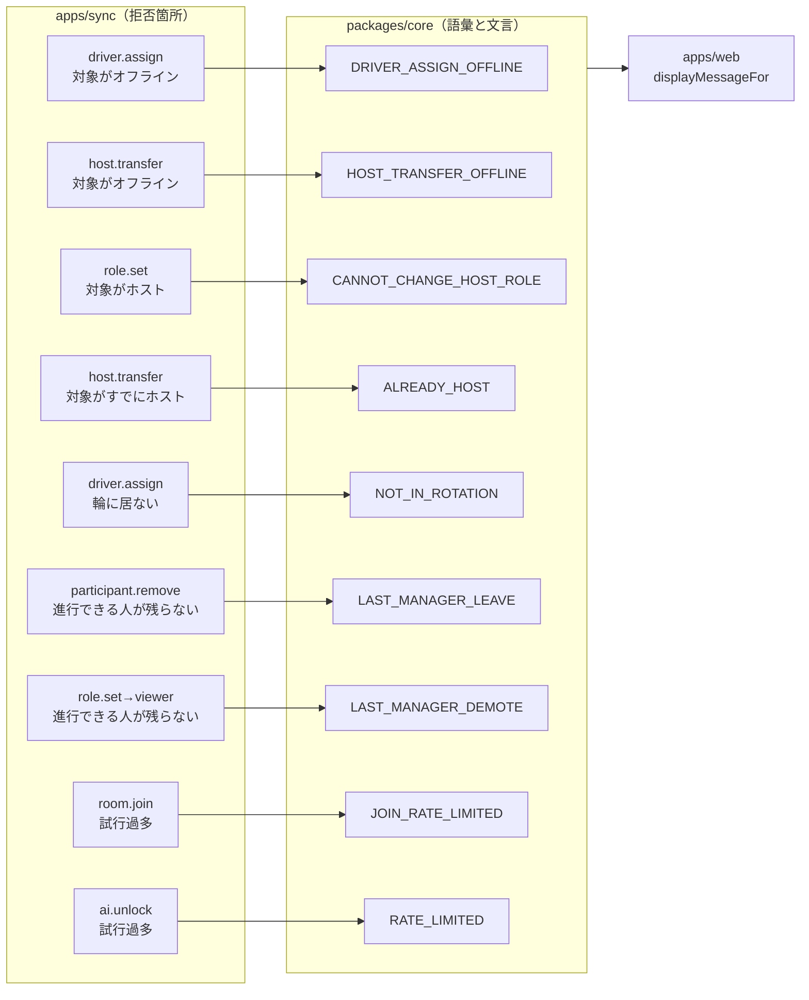

# 実装計画: 失敗の説明を、実際に行った操作と一致させる

**Issue:** [#29](https://github.com/tomohiroJin/tasuki-tools/issues/29) ・ **仕様:** [`spec.md`](./spec.md) ・ **ステータス:** Draft（設計レビュー中）

> **前提**: 本計画は Issue #32（`docs/plans/self-leave-notification/`）の完了後に着手する。
> #32 が `ERROR_MESSAGES` と `INTENTIONALLY_NOT_SHOWN` を触るため、
> 同時に進めると確実に競合する。#32 のマージ後に `main` から分岐する。

## 技術コンテキスト

新しい依存・新しい層は導入しない。変更は既存の 3 ファイルとその周辺に閉じる。

| 層 | パッケージ | 本計画での役割 |
|---|---|---|
| ドメイン | `packages/core` | 失敗コードの語彙（`SYNC_ERROR_CODES`）と利用者向け文言（`ERROR_MESSAGES`） |
| 同期サーバー | `apps/sync` | 各拒否箇所が返すコードを、操作に対応した新コードへ差し替える |
| クライアント | `apps/web` | **変更なし**（`displayMessageFor` 経由で表を引くため、表が正しければ自動的に正しい） |

### 技術選定と根拠

| 選定 | 根拠（紐づく要件） |
|---|---|
| **エラーコードを操作ごとに細分化する**（wire の `code` の値を増やす） | FR-131〜FR-136。`error-code-coverage.test.ts` が「ソースにあるコード ⊆ 表 ∪ 非表示集合」を検査するため、コードを 1 つ増やすと**文言を決めるまでテストが落ちる**。決め忘れが構造的に起きない |
| **`message` フィールドを表示に使わない**（現状維持） | spec の方針。サーバーに操作別の文言は既に存在せず、復活させると文言が二重管理になる（FR-105 違反） |
| **`ServerMsgSchema` の `code` は `nonEmptyString` のまま** | 非機能（後方互換）。列挙へ狭めると受信側が未知コードを弾くようになり挙動が変わる（`errors.ts` の既存注記に従う） |
| **使われなくなった旧コードは語彙から外し、文言だけ残す** | FR-137。`error-code-coverage.test.ts` の「列挙されたコードはすべてソースに実在する」検査が、語彙に残すことを許さない。一方で文言を消すと古い画面が既定文言に退化する（SC-047） |
| **`apps/web` は一切変更しない** | 表示は `displayMessageFor(code)` 一本に集約済み（#28 の FR-107）。クライアントに分岐を足す必要がない ＝ この集約が効いていることの確認にもなる |

## 規約チェック

| 原則 | 判定 | 備考 |
|---|---|---|
| 文言の定義箇所は 1 つ（FR-105） | **PASS** | すべて `packages/core/src/error-messages.ts` |
| 全ての箇所が共通の実装を経由する（FR-107） | **PASS** | サーバーは `errorMessageFor()`、画面は `displayMessageFor()` |
| エラーコードは列挙で型が付く（FR-101） | **PASS** | 新コードを `SYNC_ERROR_CODES` に追加。綴り違いは型で弾かれる |
| 到達不能な公開記号を作らない（SC-039） | **PASS** | 旧コードは語彙から外すので、使われない列挙要素が残らない |
| 1 関数 1 責務 | PASS | 変更は既存の拒否分岐 1 行ずつの差し替えが中心 |
| マジックな文字列を散らさない | PASS | コードは列挙の型で縛られ、文言は表から引く |
| テストは振る舞いベース・GWT の区切り（ADR 0009） | PASS | |
| 破壊的変更の禁止 | **PASS**（条件付き） | wire の `code` の値は増えるが形式は不変。旧コードの説明は残す |

## アーキテクチャ

変更の形は「拒否箇所 → コード」の写像を作り直すことである。層の構造は変わらない。



### 新旧の対応表（設計の中核）

| 旧コード | 拒否箇所 | 新コード | 新しい文言 |
|---|---|---|---|
| `PARTICIPANT_OFFLINE` | `handlers.ts` 指名（`driver.assign`） | **`DRIVER_ASSIGN_OFFLINE`** | オフラインの参加者はドライバーに指名できません。 |
| `PARTICIPANT_OFFLINE` | `handleHostTransfer` | **`HOST_TRANSFER_OFFLINE`** | オフラインの相手にはホストを移譲できません。 |
| `CANNOT_CHANGE_HOST` | `handleRoleSet`（対象がホスト） | **`CANNOT_CHANGE_HOST_ROLE`** | ホストの役割は変更できません。先にホストを移譲してください。 |
| `CANNOT_CHANGE_HOST` | `handleHostTransfer`（対象がホスト） | **`ALREADY_HOST`** | その相手はすでにホストです。 |
| `PARTICIPANT_NOT_FOUND` | `handlers.ts` 指名（輪に居ない） | **`NOT_IN_ROTATION`** | ドライバーの輪に加わっていない相手は指名できません。先にドライバーへ加えてください。 |
| `LAST_MANAGER` | `handlers.ts` 退出（`canRemoveParticipant`） | **`LAST_MANAGER_LEAVE`** | 進行できる人がいなくなるため退出できません。他の人が進行に加わってから操作してください。 |
| `LAST_MANAGER` | `handleRoleSet`（`canDemote`） | **`LAST_MANAGER_DEMOTE`** | 進行できる人がいなくなるため見学者にできません。他の人が進行に加わってから操作してください。 |
| `RATE_LIMITED` | `handleRoomJoin` | **`JOIN_RATE_LIMITED`** | 参加の試行が多すぎます。しばらく待ってから再試行してください。 |
| `RATE_LIMITED` | `handleAiUnlock` | `RATE_LIMITED`（**維持**） | 試行が多すぎます。しばらく待ってから再試行してください。 |

**語彙（`SYNC_ERROR_CODES`）の増減:**

- 追加 8 件: `DRIVER_ASSIGN_OFFLINE` `HOST_TRANSFER_OFFLINE` `CANNOT_CHANGE_HOST_ROLE`
  `ALREADY_HOST` `NOT_IN_ROTATION` `LAST_MANAGER_LEAVE` `LAST_MANAGER_DEMOTE` `JOIN_RATE_LIMITED`
- 削除 3 件: `PARTICIPANT_OFFLINE` `CANNOT_CHANGE_HOST` `LAST_MANAGER`
  （どの拒否箇所からも返らなくなる。語彙に残すと「列挙されたコードはすべてソースに実在する」検査が落ちる）
- 維持: `PARTICIPANT_NOT_FOUND`（指名以外の複数箇所で今後も使う）・`RATE_LIMITED`（解錠で使う）

### `ALREADY_HOST` の文言が「自分自身」を語らない理由（FR-138）

現在の文言は「自分自身にはホストを移譲できません。」だが、
**実行者と対象が同一とは限らない。** Issue #22 以降、`host.transfer` は開始後には
編集者以上が実行できる（`permissions.ts` の `HOST_ONLY_BEFORE_START` に含まれるため
開始後は緩む）。したがって編集者が「現ホストを対象に」移譲を送ると、
対象は実行者ではない。「自分自身には」は誤りになる。

新しい文言は主語を対象側に置き、実行者が誰であっても正しくなるようにする。

### `PARTICIPANT_NOT_FOUND` の分割（FR-134）

指名の拒否は現在 1 つの条件（`index < 0`）で「対象が存在しない」と
「対象は居るが輪に居ない」の両方を吸収している。**条件を 2 段に分ける。**

```
対象が participants に居ない          → PARTICIPANT_NOT_FOUND（従来どおり）
対象は居るが rotation に居ない        → NOT_IN_ROTATION（新規）
```

これは分岐を 1 つ増やすが、**利用者から見て解消手段が違う**（前者は打つ手なし、
後者は「ドライバーに加える」で解消できる）ため、区別に価値がある。

## コンポーネントとインターフェース

インターフェースの変更は無い。変更されるのは値と表の内容だけである。

### `packages/core/src/errors.ts`

`SYNC_ERROR_CODES` の該当節へ 8 件追加・3 件削除。
削除する 3 件については、**なぜ語彙から消して文言だけ残すのか**を
その場のコメントに残す（検査の要求と後方互換の両立）。

### `packages/core/src/error-messages.ts`

`ERROR_MESSAGES` へ 8 件の新しい文言を追加し、旧 3 件のエントリは
**「配備前から開かれた画面が旧サーバーの応答を受け取ったときのために残す」**
という注記を付けて残置する。値は変更しない。

### `apps/sync/src/application/handlers.ts`

9 箇所の `sendError` / `err()` の第 1・第 2 引数を差し替える。
指名の箇所のみ条件を 2 段に分ける。**それ以外のロジックは変えない。**

### `apps/sync/test/error-code-coverage.test.ts`

`INTENTIONALLY_NOT_SHOWN` は**触らない**（新コードはすべて `ERROR_MESSAGES` に載るため）。
このファイルが無変更のまま緑であることが、本計画が「決め忘れを作っていない」ことの証明になる。

## データモデル

永続データの変更なし。wire の `{ type: "error", code, message }` の `code` に
取り得る値が入れ替わるだけで、形式は不変。

## API / インターフェース契約

```
サーバー → クライアント（1 接続へ直送・形式は既存のまま）
{ "type": "error", "code": "<新コード>", "message": "<ERROR_MESSAGES の文言>" }
```

- `code` の値域: `SYNC_ERROR_CODES` ∪ ドメインエラーの種類。
- クライアントは `displayMessageFor(code)` で表を引く。未知コードは既定文言。
- **旧コードを受け取った場合**も表に文言が残っているため従来の説明が出る（SC-047）。

## プロジェクト構成

```
tdd-mob-pro-timer/
├── packages/core/
│   ├── src/
│   │   ├── errors.ts                # 変更: 語彙 +8 / −3
│   │   └── error-messages.ts        # 変更: 文言 +8、旧 3 件は注記付きで残置
│   └── test/
│       └── error-messages.specificity.test.ts   # 新規: 新旧の文言の性質を検証
└── apps/sync/
    ├── src/application/handlers.ts  # 変更: 9 箇所のコード差し替え＋指名の条件2段化
    └── test/
        ├── error-specificity.test.ts             # 新規: 拒否箇所 → コードの対応
        └── error-code-coverage.test.ts           # 無変更（緑であることが検証）
```

## エラー処理とセキュリティ

- 説明は**失敗の理由の分類**までであり、内部の状態や識別子を漏らさない。
  新しい文言はいずれも既存の粒度（役割・在席・輪に居るか）に留まる。
- レート制限の説明を参加専用に分けても、**ルームの存在有無は漏らさない**
  （試行過多は存在しないルームへの試行でも同じく返る）。
- 秘密（合言葉・トークン）は説明に含まれない。解錠の失敗は従来のまま。

## テスト戦略

| 層 | 何を検証するか |
|---|---|
| 単体（core） | 新 8 コードの表示文言が既定文言でない。**指名の文言に「移譲」が含まれない**／**役割変更の文言に「移譲」が含まれない**／`ALREADY_HOST` の文言に「自分自身」が含まれない。旧 3 コードの文言が従来値のまま引ける |
| 単体（core） | 語彙に旧 3 コードが**含まれない**。新 8 コードが**含まれる** |
| 結合（sync） | 9 つの拒否箇所がそれぞれ**対応する新コードを返す**。とくに (a) オフライン相手の指名 → `DRIVER_ASSIGN_OFFLINE`、(b) 輪に居ない相手の指名 → `NOT_IN_ROTATION`、(c) 存在しない相手の指名 → `PARTICIPANT_NOT_FOUND`（分割が両方向に効いているか）、(d) 編集者が現ホストへ移譲 → `ALREADY_HOST` |
| メタ（sync） | `error-code-coverage.test.ts` が**無変更で**緑（決め忘れが無い・語彙とソースが一致） |
| 回帰（sync/web） | 既存の全テストが緑。とくに旧コード名を直接検証しているテストの追随 |
| 実機 | Playwright で、指名・役割変更・移譲・退出の失敗を実際に起こし、**画面に出る文言が操作と一致する**ことを目視 |

> **検出力の確認**: 本計画の変更は「型が変わらない意味変更」の典型である
> （`sendError` の引数を別の文字列リテラルに変えるだけ）。
> コードだけを見るテストは文言の誤りを検出できないため、
> **文言の性質（何を含み、何を含まないか）を検証するテスト**を core 側に置く。
> これは #28 で `NOT_IN_ROOM` の表示が変わる退行を型検査もテストも素通しさせた反省に基づく。

## 段階分け / 順序

| 段階 | 内容 | 検証ゲート |
|---|---|---|
| **H0** | 現状の固定。9 つの拒否箇所が返すコードを**現状のまま**検証するテストを書く | 新テストが green（現状の記録） |
| **H1** | core: 語彙 +8、文言 +8。旧 3 件は残置 | core 緑 |
| **H2** | sync: 誤案内 2 件（指名のオフライン・役割変更のホスト）を差し替え | H0 の該当ケースを新コードへ更新して緑 |
| **H3** | sync: 具体性 3 件（輪に居ない・退出/降格・参加の試行過多）を差し替え | 同上 |
| **H4** | core: 語彙から旧 3 件を削除 | `error-code-coverage` が緑（＝どこからも返らなくなった証明） |
| **H5** | 抽象化と原則の適用・全ゲート | 全緑・カバレッジ閾値維持 |
| **H6** | 敵対的レビュー → 実機統合検証 | 全緑・実機 PASS |

**H4 を最後に置く理由**は、語彙の削除が「もうどこからも返らない」ことに依存しているためである。
H2/H3 の差し替えが 1 箇所でも漏れていれば、H4 で
`error-code-coverage.test.ts` の「ソースにあるコードはすべて語彙に含まれる」検査が落ちる。
**削除を最後に置くことで、この検査が差し替え漏れの検出器として働く。**

## 未解決の `[要確認]`

なし。細分化する 5 件・新コード名・文言・旧コードの扱い（語彙から削除・文言は残置）は確定済み。
既定文言のままの種類は対象外（spec のスコープ外）。
