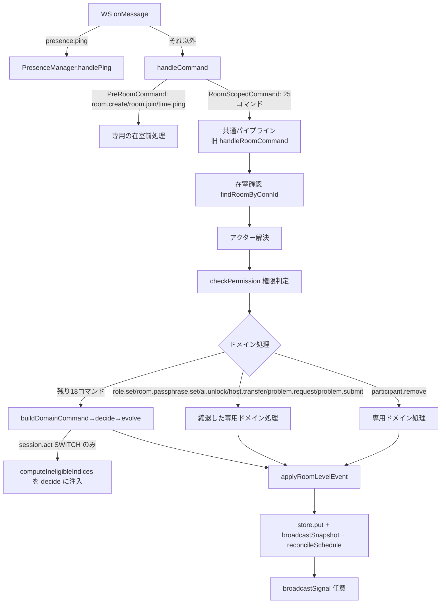
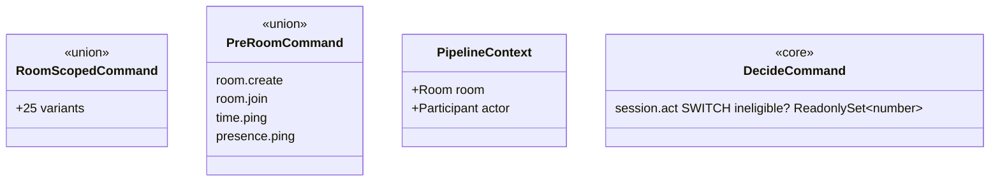

# 実装計画: handleCommand の単一パイプライン化と handlers.ts の責務分割

**入力:** spec.md（＋ baseline.md） ・ **ステータス:** Draft

## 技術コンテキストと意思決定

| 意思決定 | 選択 | 根拠 | 紐づく要件 |
|---|---|---|---|
| パイプラインの実装単位 | `handleRoomCommand` を「共通パイプライン本体」として維持し、旧専用ハンドラ6コマンド（`role.set`/`room.passphrase.set`/`ai.unlock`/`host.transfer`/`problem.request`/`problem.submit`）をこのパイプラインへ合流させる。新規に別のパイプライン実装を書き起こさない | 既存の `handleRoomCommand` が既に「在室確認→アクター解決→権限判定→（decide/evolve or 個別分岐）→配信」を実装済みであり、これを唯一の入口にするのが最小差分。ゼロから書き直すと挙動の再現ミスのリスクが上がる | FR-150, FR-153 |
| 在室前提コマンドの型分離 | `PreRoomCommand`（`room.create`/`room.join`/`time.ping`/`presence.ping`）と `RoomScopedCommand`（25コマンド）を判別可能な union として `schemas.ts` 由来の型から派生させ、`handleCommand` の引数型を `RoomScopedCommand \| PreRoomCommand` の union にした上で、`PreRoomCommand` は最初の分岐で早期 return する。共通パイプライン関数の引数型は `RoomScopedCommand` のみを受理する | 「型で例外を明示する」という spec の要求を満たす最小構成。`presence.ping` は現状 `server.ts` で `handleCommand` 呼び出し前に横取りされているため、`handlers.ts` 内では型としてだけ存在すればよい（挙動は変えない） | FR-151, FR-152 |
| 旧専用ハンドラの縮退方針 | 6コマンドの専用ハンドラ関数はドメイン処理（`ai.unlock` の合言葉照合、`room.passphrase.set` の平文保持、`host.transfer` のオフライン拒否、`role.set` の LAST_MANAGER_DEMOTE 検査、`problem.request`/`problem.submit` の delegator 呼び出し）のみを残し、在室確認・アクター解決・権限判定・snapshot 配信は共通パイプラインへ引き上げる | 専用ハンドラが「ドメイン処理だけを行う関数」に縮退するという Issue #26 の対応方針2そのもの | FR-152, FR-154 |
| B-2 の実装方式 | (a) `decide` の `session.act SWITCH` に**任意の** `ineligible?: ReadonlySet<number>` を追加し、`nextEligibleIndex`（既存の `aggregate.ts` 関数）で交代先を計算する形に変更する。省略時は空集合扱いとし、既存呼び出し（core のテスト等）の互換性を保つ。(b) `evolve` の `evolveDriverSwitched` を「`nextIndex === prevIndex` なら加算せずタイマーのみ再アンカー」に修正する。(c) `advanceDriver`（`evolve.ts`）はこの修正後の `evolveDriverSwitched` に一本化し、内部の「現状維持」分岐（重複コード）を削除して `nextEligibleIndex` → `evolve(DriverSwitched)` の1行に縮退させる。(d) `handleRoomCommand` は `session.act SWITCH` を検知したら `buildDomainCommand` が返した `domainCmd` に `computeIneligibleIndices(targetRoom)` を注入してから `decide` を呼び、返ってきたイベント列を他コマンドと同じ `evolve` ループに通す。現状の `isManualSwitch` 分岐（`decide` の結果を捨てて `advanceDriver` を呼び直す）を削除する | Issue #28 が挙げた2つの選択肢（「decide に ineligible を渡して core 内で決めきる」／「decide から交代先決定の責務を明示的に外す」）のうち前者を採る。理由: 後者（decide が「交代してよいか」だけを判定する契約に変える）は `DomainEvent` の `DriverSwitched.nextIndex` の意味を変える大改修になり、`evolve` 側の呼び出し規約全体に波及する。前者は `ineligible` を省略可能な追加情報として足すだけで、既存の `DecideCommand`/`DomainEvent` 型を壊さない。`autoSwitch`（タイマー発火）と `driver.skip` の即時繰り上げは、コマンド起点ではなく `Room` 直接操作のため従来通り `advanceDriver` を直接呼ぶ（挙動は不変。実装が1行に縮退するだけ） | FR-163〜FR-168 |
| 責務分割のモジュール境界 | `apps/sync/src/application/` 配下に `token-store.ts`（`hostTokens`/`resumeTokens`/`roomPassphrases`）・`join-rate-limiter.ts`（`joinFailures`/`recentJoinFailures`、`room.join`/`ai.unlock` 共有を型で明示）・`apply-room-level-event.ts`（移動のみ）・`build-domain-command.ts`（移動のみ）を新設する。`makeHandlers` はこれらのインスタンスを合成するだけの薄い組み立て関数に変える | クロージャが共有する可変状態を1状態=1モジュールへ機械的に分離するのが最小リスク。ロジックを変えずに「置き場所」だけを変える段階と、パイプライン統合の段階を分離できる（tasks.md の段階分けの根拠） | FR-157〜FR-162 |
| 専用ハンドラ関数の配置 | `apps/sync/src/application/command-handlers/` を新設し、9個の旧専用ハンドラ相当（`room-create.ts`/`room-join.ts`/`time-ping.ts`/`role-set.ts`/`room-passphrase-set.ts`/`ai-unlock.ts`/`host-transfer.ts`/`problem-request.ts`/`problem-submit.ts`）＋ `participant-remove.ts`（`handleRoomCommand` 内の専用分岐）をそれぞれ1ファイルに切り出す | `makeHandlers` の1,158行クロージャを関数単位に分解する Issue #28 D-1 の対応。1関数1ファイルにすることで `[P]` 並列タスク化しやすくなる | FR-162 |

## 規約チェック（Constitution Check）

| 原則 | ステータス | 備考 |
|---|---|---|
| I. コード品質（`coding-style.md`: 1関数1責務・30行目安） | PASS（計画上） | 専用ハンドラをドメイン処理のみに縮退させ、パイプライン共通処理を別関数へ切り出すことで両者とも30行前後に収まる見込み。`handleRoomCommand` 本体の decide/evolve 一本化ループも既存より短くなる |
| II. テスト基準（`testing.md`: 振る舞いベース・独立性） | PASS（計画上） | 既存テスト資産（`permissions-differential.test.ts` 等）を安全ネットとして維持しつつ、新規モジュールに対する単体テストを追加する。既存の GWT 規約（Issue #28 G3 で確立済み）に従う |
| III. セキュリティ（`security.md`: ホワイトリスト方式） | PASS | `permissions.ts` の `REGISTERED_COMMANDS` による default-deny 方針は変更しない。パイプライン統合により default-deny の適用箇所が単一化される（むしろ強化） |
| IV. 挙動不変の原則（本タスク固有の制約） | **要監視** | B-2 のみ意図的な内部経路統合を行うが、利用者可視の値は不変（FR-166）。各段階の完了時にゲート＋実機確認で監視する（違反はCRITICAL→即座に切り戻し） |

（違反はすべて CRITICAL → 原則ではなく plan を直す。現時点で CRITICAL 違反なし。）

## アーキテクチャ



## コンポーネントとインターフェース

- **`handlers.ts`（縮退後）** — `makeHandlers(deps)` の合成ルート。`handleCommand` のルーティング（`PreRoomCommand` 早期分岐 / `RoomScopedCommand` をパイプラインへ）と、パイプライン本体（旧 `handleRoomCommand`）のみを持つ。目標行数: **600行以下**（分割前1,549行の半分以下。内訳は下記「プロジェクト構成」参照）。
- **`command-handlers/*.ts`** — 各ファイルは1コマンドのドメイン処理のみを担う純粋に近い関数（`(ctx: PipelineContext, cmd) => Result<...>`)。`ctx` は在室確認・アクター解決・権限判定済みの `{ room, actor }` を受け取る（`requireEditor` が返す形と同じ）。副作用（store.put/broadcast）はパイプライン側が担う関数と、専用処理内で完結させる場合（`ai.unlock` の合言葉照合失敗時のレート制限記録など）が混在するため、各ファイルの docstring に「このハンドラが自分で行う副作用」を明記する。
- **`token-store.ts`** — `createTokenStore()` が `{ issueHost, issueResume, verify, releaseRoom, ... }` を返すファクトリ。`hostTokens`/`resumeTokens`/`roomPassphrases` を内包する。
- **`join-rate-limiter.ts`** — `createJoinRateLimiter({ windowMs, max })` が `{ recentFailures(connId, now), recordFailure(connId, now), clear(connId) }` を返す。`room.join` と `ai.unlock` が同一インスタンスを共有することをコメントと型（`SharedRateLimiter` 等の命名）で明示する。
- **`apply-room-level-event.ts`** — `applyEvents(room, agg, events, now)` と `applyRoomLevelEvent(room, event, now)` をそのまま移動（ロジック変更なし）。
- **`build-domain-command.ts`** — `buildDomainCommand(cmd)` をそのまま移動（ロジック変更なし）。
- **`packages/core/src/decide.ts`** — `DecideCommand` の `session.act` 変種に `ineligible?: ReadonlySet<number>` を追加。`decideSessionAct` の `SWITCH` 分岐で `nextEligibleIndex(session, currentIndex, ineligible ?? new Set())` を使うよう変更。
- **`packages/core/src/evolve.ts`** — `evolveDriverSwitched` に「`nextIndex === prevIndex` なら加算しない」分岐を追加。`advanceDriver` を `evolveDriverSwitched` の統一実装に一本化し、内部の重複した「現状維持」分岐を削除する。

## データモデル



`Room`/`Participant`/`Aggregate` 等の既存型は変更しない（`ineligible` の追加のみ）。

## API / インターフェース契約

| 関数 | 変更前シグネチャ | 変更後シグネチャ | 互換性 |
|---|---|---|---|
| `decide`（`session.act` action `SWITCH`） | `{ command: "session.act"; action: "SWITCH" }` | `{ command: "session.act"; action: "SWITCH"; ineligible?: ReadonlySet<number> }` | 後方互換（省略可能フィールド追加のみ。既存呼び出しは空集合として動作） |
| `evolve`（`DriverSwitched`） | 常に `driverCounts`/`totalSwitches` を加算 | `nextIndex === prevIndex` なら加算しない | **挙動変更点（意図的・FR-163）**。呼び出しシグネチャ自体は不変 |
| `advanceDriver` | 2分岐（交代/現状維持）を個別実装 | `nextEligibleIndex` → `evolve(DriverSwitched)` の1行に縮退 | 呼び出しシグネチャ・戻り値とも不変（内部実装のみ変更） |
| `handleCommand` | `(connId, cmd: { command: string; ... })` | `(connId, cmd: RoomScopedCommand \| PreRoomCommand)` | 型を厳密化（`server.ts` 側の呼び出しは `unknown` からのキャストのため実質無変更） |

## プロジェクト構成

```
tdd-mob-pro-timer/
  apps/sync/src/application/
    handlers.ts                      # 縮退後: makeHandlers 合成 + handleCommand ルーティング + パイプライン本体（目標 ≤600行）
    token-store.ts                    # 新設
    join-rate-limiter.ts              # 新設
    apply-room-level-event.ts         # 移動（handlers.ts の1426-1549行相当）
    build-domain-command.ts           # 移動（handlers.ts の1235-1300行相当）
    command-handlers/
      room-create.ts
      room-join.ts
      time-ping.ts
      role-set.ts
      room-passphrase-set.ts
      ai-unlock.ts
      host-transfer.ts
      problem-request.ts
      problem-submit.ts
      participant-remove.ts
  apps/sync/test/
    (既存 handlers.*.test.ts は段階ごとに import 元だけを追随させる。挙動検証は変更しない)
    error-code-coverage.test.ts       # 既存。統合後も件数据え置きを確認
  packages/core/src/
    decide.ts                        # session.act SWITCH に ineligible 追加
    evolve.ts                        # evolveDriverSwitched 修正・advanceDriver 縮退
  packages/core/test/
    driver-switch-equivalence.test.ts        # 「不一致」検証から「一致」検証へ更新
    driver-switch-characterization.test.ts   # 現状可視値の固定。変更不要（値が同じままであることの確認に使う）
  tdd-mob-pro-timer/docs/adr/0002-decider-pure-domain.md   # 末尾に ## 更新 セクションのみ追記（背景/決定/影響は1文字も変更しない。下記「ADR-0002 の担当領域分離」参照）
```

## エラー処理とセキュリティ

- 権限判定の default-deny 方針（`REGISTERED_COMMANDS` に無いコマンドは拒否）は変更しない。
- `ai.unlock`/`room.join` のレート制限窓は分離後も同一インスタンスを共有させ、切り離すと「合言葉総当たり対策が弱まる」退行になるため、分離作業（FR-158/010）の受け入れテストに**共有窓であることの直接検証**を含める（例: `room.join` の失敗回数が閾値に達した状態で `ai.unlock` も `RATE_LIMITED` になることを確認）。
- エラーコード・文言（`errorMessageFor`/`ERROR_MESSAGES`）は変更しない（FR-154 のスコープ内）。
- 秘匿情報（`aiUnlockKey`・`hostTokens`・`roomPassphrases` の平文）は分離後もモジュール内部に閉じ、`Room`/snapshot には反映しない現状の設計を維持する。

## テスト戦略

### 安全ネット（全段階で緑を維持）
- `packages/core/test/permissions-differential.test.ts`（25コマンド×3役割×2対象）。
- 既存の `pnpm test`（全パッケージ）・`pnpm typecheck`（4/4）・`pnpm lint`（3/3）・`pnpm build`（3/3）。

### 新規テスト
- **B-2**: `driver-switch-equivalence.test.ts` を「全入力で一致する」検証へ更新（fast-check 2000回）。`decide` の `ineligible` 追加に対する単体テスト（core）。`evolveDriverSwitched` の「同一 index では加算しない」を直接検証する単体テスト（core）。
- **パイプライン統合**: 集合表ミューテーションテスト（`permissions.ts` の集合表から1コマンドを外す/加えるパッチを想定し、旧専用ハンドラ6コマンドを含む全コマンドで判定が一致することを検証。`permissions-differential.test.ts` の拡張、または新規 `pipeline-single-route.test.ts`）。
- **責務分割**: `token-store.test.ts`／`join-rate-limiter.test.ts`（共有窓の検証を含む）を新設。`apply-room-level-event.test.ts`／`build-domain-command.test.ts` は既存の `handlers.*.test.ts` 内テストのうち対応箇所を import 先変更のみで維持（ロジック変更がないため新規テストは必須ではないが、独立モジュール化の恩恵として単体テスト化を推奨）。

### 実機検証（UI 事前抑止の限界への対応）
- **UI が事前に無効化するため画面操作で再現できない拒否経路がある**（例: viewer には操作ボタン自体が表示されない）。この種の検証は**実サーバーへの WebSocket 直結**で行う。
  - 手順: `bun run src/server.ts` でサーバーを起動 → 素の WS クライアント（`wscat` または簡易 Node スクリプト）で `role.set`/`ai.unlock`/`host.transfer` 等を viewer 権限・開始前 editor 権限で直接送信 → `{ type: "error", code: "UNAUTHORIZED" }` 等が返ることを確認。
  - 対象: 旧デッドコード6件それぞれ最低1ケース（例: `role.set` を viewer が送信 → 拒否、`ai.unlock` を開始前 viewer が送信 → 拒否）。
- 各段階の完了時、`docs/plans/codebase-refactoring/baseline.md` の実機確認手順（Setup→Lobby→Session）に準じ、ルーム作成・参加・役割変更・ドライバー交代（自動＋手動＋指名）・お題生成・退出を目視確認する。ドライバー交代は**輪1人のケース**（B-2 の反例）を含めて確認する。

## 段階分け（Sequencing）

1. **G0（計測）** — ベースライン実測（baseline.md の値の再実測）。
2. **G1（責務分割・挙動不変）** — トークン保持・レート制限・`applyRoomLevelEvent`・`buildDomainCommand` の移動のみ。ロジック変更なし。
3. **G2（専用ハンドラの切り出し）** — 9+1個の専用ハンドラを `command-handlers/` へ移動。ロジック変更なし（縮退はまだしない）。
4. **G3（B-2 の統合）** — core の `decide`/`evolve` 修正 → sync 側の `isManualSwitch` 分岐撤去。単独フェーズとして切り出す（挙動変更を含む唯一の段階のため、他の構造変更と混ぜない）。
5. **G4（パイプライン統合・専用ハンドラの縮退）** — 旧専用ハンドラ6コマンドを共通パイプラインへ合流。1コマンドずつ。
6. **G5（ADR 更新・最終検証）** — ADR-0002 更新（担当領域の分離は下記「ADR-0002 の担当領域分離」節を参照）、全ゲート＋実機確認の最終回。

## ADR-0002 の担当領域分離（Issue #33 との同時編集の衝突回避）

`tdd-mob-pro-timer/docs/adr/0002-decider-pure-domain.md`（背景/決定/影響の3節構成、31行）は、本ブランチ（`refactor/handlers-single-pipeline`、Issue #26）と `docs/adr-align-post-28`（Issue #33）の**2ブランチが同時に編集する**。衝突を避けるため、ファイル内で担当領域を完全に分離する。

| ブランチ | 担当範囲 | 状態 |
|---|---|---|
| `docs/adr-align-post-28`（Issue #33） | 既存「影響」節の「利点」小節、1文のみ（ソロモード依拠の記述を修正） | **完了済み** |
| 本ブランチ（Issue #26） | ファイル**末尾**に新設する `## 更新` セクションの追記のみ | 本タスクで実施 |

- 本ブランチは「背景」「決定」「影響」（「利点」小節を含む）を**1文字も変更しない**。Issue #33 側の修正と行レベルで競合しないよう、編集は常に新設セクションの追記（ファイル末尾への追記）に限定する。
- 検証手順（T030 で実施・SC-060 に対応）: 変更を加えた後、`git diff --stat docs/adr/0002-decider-pure-domain.md` を実行し、**削除行数（`-` の列）が0であること**を確認する。追加行数のみが計上されていれば、既存セクションへの変更が無いことの機械的な裏付けになる（Issue #33 側のブランチで同じ手法が実際に有効に機能している）。

各段階の完了時点で `pnpm test && pnpm typecheck && pnpm lint && pnpm build` が緑であることを tasks.md のタスク粒度で担保する（詳細は tasks.md）。

## デッドコード解消 → 回帰テスト要件への置き換え（確定・解決済み）

親セッションの実測により、Issue #26 本文が主張する「専用ハンドラ6コマンドが `checkPermission()` に到達しないデッドコード」は**現在の実装には存在しない**ことが確定した（`rejectIfUnauthorized`/`requireEditor` 経由で全6コマンドが到達済み。詳細は baseline.md 「1. `handlers.ts` の構造的事実」節）。これを受け、本プランは以下の方針を確定する。

- **目的からの除外**: 「デッドコードの解消」はG2（専用ハンドラ切り出し）・G4（パイプライン統合）のいずれの段階の目的からも外す。旧専用ハンドラの縮退・合流はあくまで US1（二重ルートの統合）・US3（責務分割）の目的で行う。
- **構造的動機の回帰テスト化**: 「経路が2つに分かれていること自体が将来の見落としを生む」という動機は、FR-155 として spec.md に残し、`permissions-differential.test.ts` へのミューテーションケース追加という形で固定する。
- **既存オラクルとの関係**: `permissions-differential.test.ts` は現状「25コマンド×3役割×2対象」の**静的な**組み合わせを `checkPermission()` というオラクルに対して突き合わせている。今回追加するのは、このオラクルの**入力そのもの**（`HOST_ONLY_BEFORE_START`/`EDITOR_PLUS_COMMANDS` の集合定義）を一時的にミューテーション（1コマンドを追加/削除）した状態で同じ25コマンド×3役割×2対象を回し、**変更後の判定結果が全コマンド（旧専用ハンドラ6件を含む）へ一貫して反映されることを検証する**、いわば「オラクルのオラクル」である。実装は既存ファイルの `describe` ブロック追加で足り、新規ファイルを起こす必要はない（T028 で実施）。
- **旧 `[要確認]`（plan.md 旧「デッドコード実測とIssue原文の整合をG2着手前に再確認する」項目）はクローズ**。以後の全タスクはこの結論を前提として進めてよい。

## 未解決の論点

- **[要確認]** `handlers.ts` 縮退後の目標行数（600行）は見積もりであり、実測して大きく外れる場合は spec.md の SC-054 の具体値をタスク完了時に実測値へ更新する。
- **[要確認]** `driver.skip` の即時繰り上げ（`handlers.ts:731-741`）と `autoSwitch`（タイマー発火）は `advanceDriver` を直接呼ぶ設計のまま残す前提だが、G3 完了後に「これらも decide 経由に統一すべきか」を再検討する余地がある（spec のスコープ外だが、統合の一貫性の観点で記録しておく）。
