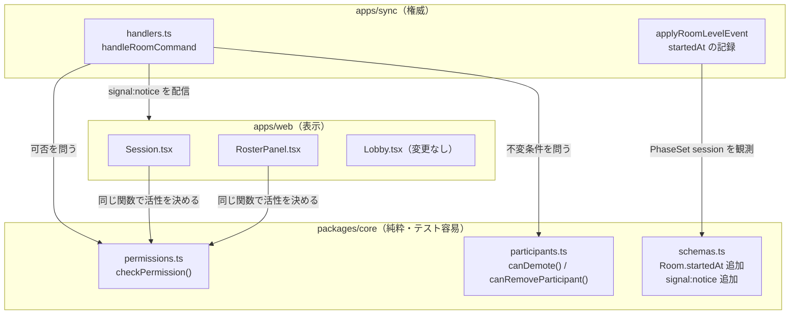

# 実装計画: 開始後は全員同格 — セッション進行から主催者を外す

**対応 spec:** [`spec.md`](./spec.md) ・ **Issue:** [#22](https://github.com/tomohiroJin/tasuki-tools/issues/22) ・ **ステータス:** Draft（設計レビュー中）

> 本計画は「どう作るか」に徹する。要件（何を・なぜ）は `spec.md` を唯一の情報源とする。

## 技術コンテキスト

| 項目 | 内容 |
|---|---|
| 構成 | pnpm workspace + turbo モノレポ。`packages/core`（純粋ドメイン） / `apps/sync`（WS サーバー） / `apps/web`（React SPA） |
| 権限判定の現在地 | `apps/sync/src/application/handlers.ts` に**5層に分散** |
| UI 側の権限表現 | `apps/web` に `isHost` / `canHostAction` / `role === "host"` が **22 行**（`grep` 実数。定義とコメント1行を含む）。本機能で置換が必要な**使用箇所**は `Session.tsx` **6 箇所**（361 / 394 / 405 / 442 / 454 / 465）と `RosterPanel.tsx` の `canHostAction`（**7 箇所**: 157 / 165 / 246 / 255 / 289 / 299 / 323）。`Lobby.tsx` は開始前専用のため**変更しない** |
| `apps/web` の core 依存 | あり（`package.json:17` に `"@tdd-mob/core": "workspace:*"`）。型だけでなく実行時関数も既に利用（`App.tsx:24` の `buildCompletionRecord`）＝**D1 が成立する前提を満たす** |
| 段階の表現 | `Room.phase: "setup" \| "ready" \| "session" \| "celebration"` |
| テスト | vitest。`packages/core/test`（純粋）・`apps/sync/test`（結合）・`apps/web` は限定的 |
| 検証コマンド | `pnpm test` / `pnpm typecheck` / `pnpm lint` / `pnpm build`（すべて turbo 経由） |

### 現在の権限判定が分散している5層

`handlers.ts` を読むと、可否判定は次の5箇所に分かれている。これが本機能の主な技術的負債である。
層の数は `grep -n "ホストのみ\|role !== \"host\"\|actor.role" apps/sync/src/application/handlers.ts` の実数に基づく。

| 層 | 位置 | 内容 |
|---|---|---|
| ① 集合ベース | `handlers.ts:1081-1115` | `HOST_ONLY_COMMANDS`（**13** コマンド）と `EDITOR_PLUS_COMMANDS`（**9** コマンド）を `authorize()` が判定 |
| ② 関係ベース | `handlers.ts:443-459` | `RELATIONAL_SELF_OR_HOST`（`participant.rename` / `driver.skip` / `driver.resume`）は「本人 or host」 |
| ③ 個別ガード | `handlers.ts:464-481` | `member.add` / `member.remove` は「自分の名前と一致するか」で判定（**表示名ベース**） |
| ④ `requireEditor()` | `handlers.ts:1026-1050` | 在室確認＋`role === "viewer"` の拒否。`handleProblemRequest`（954）と `handleProblemSubmit`（988）が使う |
| ⑤ 専用ハンドラの host 検査 | `handlers.ts:717` / `782` / `832` / `896` | `handleCommand` の `switch`（129-190）が `handleRoomCommand` を**通さず**分岐させるコマンドが、それぞれ独自に検査 |

**層の数は次の実数に基づく。** `grep -n 'role !== "host"' apps/sync/src/application/handlers.ts` → 465 / 717 / 782 / 832 / 896。
`grep -n "requireEditor" …` → 954 / 988 / 1026。

**なお `handlers.ts:497-503`（`participant.remove` の自己対象拒否）は権限検査ではなく妥当性検査である。**
`participant.remove` の host 制約は層①（`HOST_ONLY_COMMANDS`）由来であり、層①を置換すれば緩和される。
この区別は T020 の作業範囲に直結する（削除するのは `INVALID` 拒否のみ）。

#### ④⑤ の内訳と、二重定義によるデッドコード（重要）

`handleCommand` の `switch` で分岐する 6 コマンドは `authorize()` に到達しない。
したがって集合表への記載は**すべてデッドコードである**。

| コマンド | 独自検査の位置 | 集合表の記載（到達しない） |
|---|---|---|
| `role.set` | `handlers.ts:717`（⑤） | `HOST_ONLY_COMMANDS` |
| `room.passphrase.set` | `handlers.ts:782`（⑤） | `HOST_ONLY_COMMANDS` |
| `ai.unlock` | `handlers.ts:832`（⑤） | `HOST_ONLY_COMMANDS` |
| `host.transfer` | `handlers.ts:896`（⑤） | `HOST_ONLY_COMMANDS` |
| `problem.request` | `requireEditor`（④・954） | `EDITOR_PLUS_COMMANDS` |
| `problem.submit` | `requireEditor`（④・988） | `EDITOR_PLUS_COMMANDS` |

**集合表だけを書き換えても緩和は効かない。実装時は④と⑤を必ず個別に置換すること。**
これを見落とすと「集合から外したのに `room.passphrase.set` が拒否され続ける」「viewer 判定が2箇所に
残り FR-071 を満たせない」というハマりが生じる。

さらに **UI 側にも同じ規則が独立実装**されている（`isHost` 22 箇所）。サーバーを緩めても UI が
ボタンを隠していれば利用者から見て何も変わらない。この二重実装が spec の SC-022（提示と実際の可否の
不一致 0 件）が指す問題である。

---

## 技術選定と根拠

### D1. 権限判定を `packages/core` の純粋関数に集約し、サーバーと UI が同一実装を共有する

**選定:** `packages/core/src/permissions.ts` に `checkPermission()` を新設し、`apps/sync` の
`authorize()` ＋ 関係ガード ＋ ハンドラ内検査を**すべてこれに置き換える**。`apps/web` も同じ関数を
呼んでボタンの活性を決める。

**根拠:**
- **FR-071（判定を単一の規則として保持）・非機能要件「単純性」**に直接対応する。上記5層を1層にする。
- **SC-022（提示と実際の可否の不一致 0 件）**を、規約ではなく構造で保証する。同じ関数を使う限り乖離しない。
- `packages/core` は既に純粋関数（`decide` / `evolve` / `transferHost`）の置き場所として確立しており、
  `apps/sync` と `apps/web` の両方が依存している。新しい依存方向を作らない。
- 権限は「状態を変えない問い合わせ」なので `decide`（イベントを生む）ではなく独立モジュールが適切。

**却下した代替案:** `apps/sync` 内で `authorize()` を拡張するだけ。→ UI 側の 22 箇所が独立実装のまま残り、
SC-022 を満たせない。緩和したのに画面上は何も変わらないという最悪の結果になりうる。

### D2. 判定の入力に `phase` ではなく**単調フラグ `startedAt`** を使う

**選定:** `Room` に `startedAt: number | null` を追加する。**`PhaseSet(phase: "session")` または
`SessionStarted` のいずれか**を初めて観測した時点で記録し、**以後どのイベントでも消さない**。
権限判定は `started = room.startedAt !== null` を入力に取る。

**記録契機を2つにする理由（迂回路の封鎖）:** UI は `phase.set session` → `session.act START` の順に
送る（`App.tsx:531-533`）ので、UI 経路だけを見れば `PhaseSet` の観測で足りる。しかし
**`session.act` は `EDITOR_PLUS_COMMANDS` に属する**ため、`phase.set` を送らずに `session.act START`
だけを送ることがプロトコル上可能である。その場合 `clock.running === true`（セッションは実際に走っている）
のに `phase` は `"ready"` のままとなり、`startedAt` が `null` に留まって**権限が締まったまま＝本 Issue の
詰みがそのまま残る**。したがって「時計が走り出した」も開始の契機として扱う。

**根拠（これは安全性の要求である）:**
- `phase.set` は任意のフェーズへ遷移でき（`decide.ts:77` は無条件に `PhaseSet` を返す）、`"setup"` への
  **後戻りが可能**である。もし判定を「現在の phase が session か」で行うと、主催者が不在の状況で誰かが
  `phase.set setup` を実行した瞬間にルームが再びホスト限定へ戻り、**本 Issue の詰みが再発する**。
  しかも復帰手段がない（緩和されていないので誰も戻せない）。単調フラグならこの経路が存在しない。
- `session.reset` は phase を `"session"` のまま維持する（`handlers.ts:1284-1291`）ので影響しない。
  `session.abort` / `complete` は `"celebration"` へ進むが、spec の前提により振り返りも同格なので問題ない。
- 意味づけとしても正しい。「一度集まって開始したチームは、以後ずっと同格」であり、設定を見直すために
  ロビーへ戻ったことで権限が締まる理由はない。

**spec との関係:** spec の US6-1「セッションが開始されていないとき」を、**「一度も開始されていないとき」**と
解釈する。これは spec の意図（開始前はやり直しが安いので単一障害点を許容する）を満たしつつ、
再発経路を消す。この解釈を `spec.md` の前提に追記する必要がある（下記「spec への反映」参照）。

**後方互換:** `RoomSchema` に `v.optional(v.nullable(v.number()))` として追加する。
既存の任意フィールド（`problemMode` / `passphraseProtected` / `aiUnlocked`）と同じ扱い。

### D2b. 自己退出の対象が現ホストなら、退出の前にホストを引き継ぐ

**選定:** `participant.remove` の対象が `room.hostParticipantId` と一致する場合、退出処理の**前に**
既存の純粋関数 `transferHost(room, 次のホスト)`（`aggregate.ts:236`）を適用する。
次のホストは「代理でない在室者のうち、参加時刻が最も古い者」とする（`presence.ts:116-118` の
既存の選定規則と揃える）。候補がいない場合は引き継がず退出をそのまま実行する。
このとき残るのは代理参加者のみであり、代理は `presence: "offline"` で登録される（`handlers.ts:1333`）ため
アイドル回収（全員 offline で発火）の対象になる。ホストが実在しない状態で残り続けることはない。

**根拠（これは新規に持ち込む回帰の予防である）:**
現行の `handlers.ts:500` は自己退出を `INVALID` で拒否している。本計画はこれを緩和する（FR-079）。
そのまま緩和すると、**開始前にホストが自己退出した場合に `hostParticipantId` が実在しない参加者を指し、
残った編集者は `phase.set` すら実行できない**。しかも既存の自動委譲は `handleDisconnect` 契機
（`presence.ts:86`）でしか発火しないため救済もない。ロビーが恒久的に詰む。

ホスト以外が退出させられる場合も同じ経路を通るため、「他人がホストを退出させた」ケースも同時に守られる。

### D3. 不変条件（編集者以上が1名以上）は権限ではなく**ドメインガード**として実装する

**選定:** `packages/core/src/permissions.ts` とは別に、`packages/core/src/participants.ts` へ
`canDemote()` / `canRemoveParticipant()` を置き、「変更後の在室者に編集者以上が1名以上残るか」を検査する。

**根拠:** FR-072 は「〜してはならない」ではなく**状態に対する述語**である。権限（誰が実行できるか）と
不変条件（結果の状態が妥当か）を混ぜると、コマンドが増えるたびに両方の観点で漏れる。
分離すれば「役割変更」と「退出」の2経路から同じ述語を呼ぶだけで済む。

### D4. 確認ダイアログは既存 `ConfirmDialog` を使い、退出は行から隔離した位置に置く

**選定:** 新しいダイアログ機構は作らない。`EndSessionZone.tsx` が確立したパターン
（`ConfirmDialog` + `pending` state + 共有ルーム注記）を `RosterPanel` の退出操作に適用する。

**根拠:** FR-075/078 は既存パターンで満たせる。`EndSessionZone` は `isShared` に応じて
「他の参加者全員の画面にも反映されます」を出す仕組みを既に持っており、FR-076 がそのまま再利用できる。

### D5. 実行者の通知は新しい `signal` を1つ追加する

**選定:** `ServerMsg` に `{ type: "signal", signal: "notice", action, actorName, targetName? }` を追加する。

**根拠:** FR-077 は「**実行者**と対象を全員に提示」を要求する。snapshot は結果の状態しか運ばないため、
`hostChangeMessage`（`ui/host-change.ts`）が採った「snapshot 差分から導出する」方式では**実行者を復元できない**。
参加者が消えたことは差分で分かるが、誰が消したかは分からない。したがって signal が必要になる。
既存の `signal` は4種（`switch` / `celebration` / `need-problem` / `suggest-break`）あり、
`broadcastSignal()` の配線も済んでいるので追加コストは小さい。

**却下した代替案:** `error` メッセージを流用して全員に送る。→ 正常系を error 型で運ぶのは意味が壊れる。

### D6. `participant.remove` の表示名依存を、この機会に**識別子ベースへ寄せない**

**選定:** `member.add` / `member.remove` の表示名ベース判定（`handlers.ts:464-481`）は、
「他人の分も操作可」になることで**ガードそのものが開始後は不要になる**ため削除する。開始前は現状維持。
表示名で rotation を管理している設計自体には手を付けない。

**根拠:** spec のスコープ外「同名参加者の識別方法そのものの再設計はしない」に従う。
なお、二重参加の幽霊は本人と同名であるため、③のガードは元々素通りしていた（＝ローテーションからの除外は
以前から可能だった）。できなかったのは `participant.remove` だけであり、本機能でそこが解ける。

---

## 規約チェック

プロジェクトのガバナンス文書は `/workspaces/claym/CLAUDE.md`（親リポジトリ）および
`.claude/rules/`（`coding-style.md` / `security.md` / `testing.md` / `git-workflow.md`）。
本サブプロジェクト固有の CLAUDE.md は存在しない。

| 原則 | 判定 | 根拠 |
|---|---|---|
| `any` 型の使用禁止 | PASS | 新規コードは判別可能な union（`PermissionVerdict`）で表現する |
| 1関数1責務・30行以内 | PASS | `checkPermission()` は規則表への参照＋段階分岐のみ。判定表はモジュール定数 |
| 早期リターンでネストを浅く | PASS | 判定は「自己対象 → viewer → 開始後 → 開始前」の順に早期リターン |
| マジックナンバー/文字列を定数化 | PASS | コマンド名の集合は既存同様に `Set` 定数として保持 |
| 名前付きエクスポート優先 | PASS | `permissions.ts` は名前付きのみ |
| コメントは日本語・「なぜ」を書く | PASS | 既存 `handlers.ts` の記述密度に合わせる（D2 の単調性の理由は必ず書く） |
| 入力検証はサーバー側で必須 | PASS | UI が同じ関数を使うのは**表示のため**。サーバー側の検査は独立して必ず実行する（下記セキュリティ参照） |
| 機密情報を扱わない | PASS | 本機能は権限判定のみ。トークン・合言葉の値には触れない |
| テストは `*.test.ts` | PASS | 既存規約どおり |
| 色のみで情報を伝えない | PASS | 無効な操作は `disabled` 属性＋理由テキストで伝える（FR-069/080） |
| コミットは Conventional Commits | PASS | `feat:` / `refactor:` / `test:` を段階ごとに分ける |

**違反なし。** ただし1点、規約に照らして注意が必要な箇所を明記する。
`.claude/rules/security.md` の「サーバーサイドでの検証は必須（クライアントサイドだけでは不十分）」に対し、
D1 は UI とサーバーで同じ関数を共有する。これは**クライアント検証への置き換えではない**。
サーバーは受信した全コマンドについて独立に `checkPermission()` を呼ぶ。UI 側の呼び出しは
「押せないボタンを押させない」ための表示制御にすぎず、サーバー側の判定を省略しない。

---

## アーキテクチャ



**依存の向き:** `apps/*` → `packages/core` のみ。既存の依存方向を変えない。

### 判定の順序（`checkPermission` の内部）

```
0. 規則表に無いコマンドか？          → 拒否（default-deny）
1. 自己対象かつ SELF_SCOPED か？     → 許可（役割・段階を問わない。FR-068）
2. 自己対象かつ role.set かつ開始済み？→ 許可（D3b・FR-073b）
3. 役割が viewer か？                → 拒否（FR-067）
4. 開始済みか（startedAt）？          → 許可（FR-063/064/065）
5. 未開始 → 従来の規則                → HOST_ONLY / 他人対象の制限 / EDITOR_PLUS（FR-066）
```

**注:** ステップ 1・2 が 3 より先である。`checkPermission` は権限のみを判定し、
不変条件（FR-072）は判定しない。呼び出し側が `canDemote()` / `canRemoveParticipant()` を別途検査する（D3）。

**順序 1 が 2 より先である理由（spec の緊張の解消）:** spec の FR-067（viewer の状態変更操作を拒否）と
FR-068（自己対象の操作を段階に関わらず許可）は、**viewer が自分を対象にした場合**に衝突する。
現行実装では viewer は自分の改名・自分の見送り/復帰ができる（`handlers.ts:448-459` の関係ガードを
`isSelf` で通過し、`authorize()` のどちらの集合にも属さないため許可される）。
**この既存挙動を維持する**（見学者が自分の名前を直せないのは不便であり、他者への影響もない）。
したがって FR-068 を FR-067 より優先し、判定順で表現する。この precedence は `spec.md` に追記する。

---

## コンポーネントとインターフェース

### 新規: `packages/core/src/permissions.ts`

```ts
export type Role = "host" | "editor" | "viewer";

/** 権限判定の入力。room/participant をそのまま渡さず、必要な事実だけを取る（テスト容易性）。 */
export interface PermissionInput {
  /** 実行しようとしているコマンド名 */
  command: string;
  /** 実行者の役割 */
  role: Role;
  /** そのルームが一度でもセッションを開始したか（Room.startedAt !== null） */
  started: boolean;
  /** 操作対象が実行者自身か。対象を持たないコマンドは false */
  isSelfTarget: boolean;
}

export type PermissionVerdict =
  | { allowed: true }
  | { allowed: false; code: "UNAUTHORIZED"; message: string };

/** 段階と役割から可否を判定する。サーバーの強制と UI の活性表示が同一の実装を共有する。 */
export function checkPermission(input: PermissionInput): PermissionVerdict;

/** UI 向けの真偽値ヘルパー（checkPermission の薄いラッパ）。 */
export function isAllowed(input: PermissionInput): boolean;
```

**規則表（モジュール定数）:**

| 定数 | 内容 | 由来 |
|---|---|---|
| `SELF_SCOPED_COMMANDS` | `participant.rename` / `driver.skip` / `driver.resume` / `member.add` / `member.remove` / `participant.remove` | 既存②③のガード対象＋自己退出（FR-079）。対象が自分なら常に許可 |
| `SELF_SCOPED_AFTER_START` | `role.set` | **開始後に限り**自己対象を許可（D3b）。開始前の自己降格は従来どおり host のみ |
| `HOST_ONLY_BEFORE_START` | 現 `HOST_ONLY_COMMANDS` の **13** コマンド | 既存①。**開始前のみ**適用 |
| `EDITOR_PLUS_COMMANDS` | 現状の **9** コマンド | 既存①。viewer 拒否のために段階を問わず参照 |
| `VIEWER_READONLY` | 上記以外の状態変更コマンドすべて | viewer は状態変更を一切行えない |

### 新規: `packages/core/src/participants.ts`

```ts
/** 在室者のうち編集者以上（host または editor）の人数を数える。 */
export function countManagers(participants: readonly Participant[]): number;

/** 役割変更が「編集者以上が1名以上残る」不変条件を破らないか（FR-072/073）。 */
export function canDemote(
  participants: readonly Participant[],
  targetParticipantId: string,
): boolean;

/** 退出が同じ不変条件を破らないか（FR-072/073）。 */
export function canRemoveParticipant(
  participants: readonly Participant[],
  targetParticipantId: string,
): boolean;
```

**注意1:** 代理参加者（`isPlaceholder: true` / `connId: null`）は `role: "editor"` で登録されるが
**自分では操作できない**。不変条件の「編集者以上が1名以上」は**操作できる人**を数えなければ意味がないため、
`countManagers` は `isPlaceholder !== true` の参加者のみを数える。これは仕様の穴を塞ぐ実装判断である。

**注意2（不変条件だけでは塞げない残存経路）:** `countManagers` は**役割のみ**を数え、`presence` を見ない。
したがって「オフラインの編集者が一覧に残っており、オンラインは見学者だけ」という状態は不変条件を
満たすが、**誰も操作できない**。`presence` を不変条件に持ち込むことはできない（本計画は死活監視を
スコープ外にしたため `presence` は信頼できない）。この経路は D3b で塞ぐ。

### D3b. 開始後は自分の役割を自分で変更できる（見学者の自己昇格を許す）

**選定:** `role.set` を、対象が自分自身である場合に限り `SELF_SCOPED_COMMANDS` として扱う。
すなわち開始後は誰でも「見学に回る／進行に戻る」を自分で切り替えられる。他人の役割変更は
従来どおり（開始前は host、開始後は編集者以上）。

**根拠:** D3 注意2 の残存経路を、`presence` に依存せずに塞ぐ唯一の手段である。
本仕様の中心原則「本人が実行できない対象は他人が代われなければ詰む」の裏返しとして、
**残っているのが本人だけなら、本人ができなければ詰む**。見学者に留まりたい人は操作しなければよいだけで、
失うものはない。降格は元々「見学したい人のための表明」であり、権限の壁として設計されていない。

**制約:** 現行の `handleRoleSet` は `cmd.participantId === room.hostParticipantId` を
`CANNOT_CHANGE_HOST` で拒否する（`handlers.ts:727`）。この制約は**維持する**
（ホストの役割変更は移譲経路の責務であり、`transferHost` との二重管理を避ける）。
結果として「ホスト自身は自己降格できない」が、ホストは常に編集者以上として数えられるため詰みは生じない。

**spec への影響:** `spec.md` に自己昇格を禁じる非目標は存在しない（第1版にはあったが、
撤廃型への書き直しで削除済み）。したがって撤回すべき記述はなく、FR-073b の追加と
前提「見学者は明示的に降格された参加者のみ」の更新で足りる。

### 変更: `apps/sync/src/application/handlers.ts`

| 変更 | 内容 |
|---|---|
| `authorize()` を削除（層①） | `checkPermission()` の呼び出しに置換。`HOST_ONLY_COMMANDS` / `EDITOR_PLUS_COMMANDS` は core へ移設 |
| 関係ガード（443-459・層②）を削除 | `isSelfTarget` の算出に置換。算出だけを残す |
| 個別ガード（464-481・層③）を削除 | 同上。表示名ベースの判定は開始前も `isSelfTarget` 経由で表現する |
| `requireEditor()`（1026-1050・層④）の viewer 検査を置換 | `checkPermission()` に委ねる。在室確認（`NOT_IN_ROOM`）とアクター解決は残す |
| 専用ハンドラ4件（717 / 782 / 832 / 896・層⑤）の host 検査を削除 | `checkPermission()` に委ねる。`handleRoleSet` は加えて `canDemote()` を検査 |
| `participant.remove` の自己対象 `INVALID` 拒否（500）を削除 | 権限検査ではないので置換ではなく削除。`canRemoveParticipant()` の検査を追加 |
| `participant.remove` の自己対象拒否を緩和 | 自分自身の退出を許可する（FR-079）。確認は UI 側で課さない |
| `applyRoomLevelEvent` に `startedAt` 記録を追加 | `PhaseSet` で `phase === "session"` かつ `startedAt === null` のとき現在時刻を記録 |
| 退出・破壊的操作の後に `signal: "notice"` を配信 | FR-077 |
| エラーメッセージを段階込みに変更 | 「ホストのみ実行できます」→「開始前はホストのみ実行できます」（FR-069） |

### 変更: `apps/web`

| ファイル | 変更 |
|---|---|
| `ui/Session.tsx` | `isHost` による **6 箇所**のゲート（361 / 394 / 405 / 442 / 454 / 465）を `isAllowed({...})` に置換。150-151 の定義も判定入力の算出に置き換える。`EndSessionZone`（361）は全員に表示 |
| `ui/components/RosterPanel.tsx` | `canHostAction: boolean` を `canManage: boolean` に改名し、呼び出し側が `isAllowed` の結果を渡す。他人の退出操作に `ConfirmDialog` を追加。**自分の退出は行内に置かず** `SelfDriverToggle` 側にまとめる（確認を課さない操作を他人向け破壊ボタンの隣に並べない・FR-079/078） |
| `ui/components/SelfDriverToggle.tsx` | 自分の退出（ルームから抜ける）を追加。確認は課さないが、他人向けの退出ボタンとは配置を分ける |
| `ui/components/EndSessionZone.tsx` | 「完成」にも確認を追加（`PendingAction` に `"complete"` を足す）。中断・リセットとは文言を分け、**記録が残る**ことと締める対象を提示する |
| `ui/Lobby.tsx` | **変更なし**（開始前は従来どおり。`isHost` のままで正しい） |
| `sync/dispatch.ts` | `signal: "notice"` の受信を追加し、`ui/announce.ts` 経由でライブリージョンへ流す |
| `App.tsx:219` | `REMOVED_BY_HOST` の扱いを `REMOVED_FROM_ROOM` に追随（下記契約参照） |
| `ui/permission-hints.ts`（新規） | 拒否理由の日本語文言を1箇所に集約（サーバーの message と重複させない表示用ヒント） |

---

## データモデル

### `Room` への追加（1 フィールドのみ）

```ts
export interface Room {
  // ...既存
  /** 初めてセッションが開始された時刻（epoch ms）。一度設定したら消さない。
   *  権限判定を「一度でも開始したか」で行うための単調フラグ（D2）。 */
  startedAt?: number | null;
}
```

**Valibot スキーマ（`schemas.ts` の `RoomSchema`）:**

```ts
  // v2 追加フィールド（任意化で後方互換）
  problemMode: v.optional(v.picklist(["ai", "fallback"])),
  passphraseProtected: v.optional(v.boolean()),
  aiUnlocked: v.optional(v.boolean()),
+ startedAt: v.optional(v.nullable(v.number())),
```

**遷移:**

| 契機 | `startedAt` |
|---|---|
| `room.create` | `null` |
| `PhaseSet` で `phase: "session"`（初回） | `now` を記録 |
| **`SessionStarted`（`session.act START`・初回）** | **`now` を記録**（`phase.set` を伴わない迂回路の封鎖） |
| 上記いずれかの2回目以降 | 変更しない |
| `PhaseSet` で `"setup"` / `"ready"` へ後戻り | **変更しない**（D2 の要点） |
| `SessionReset` / `SessionAborted` / `SessionCompleted` | 変更しない |
| ルーム回収 | ルームごと消える |

**実装上の注意:** `SessionStarted` は集約レベルのイベント（`decide.ts:191`）であり、現在
`applyRoomLevelEvent`（`handlers.ts:1276`）には case が無い。`startedAt` はルームレベルの属性なので、
`applyRoomLevelEvent` に `SessionStarted` の case を追加する必要がある（集約側は変更しない）。

**役割の意味の変化:** `Participant.role: "host"` と `Room.hostParticipantId` は**残す**が、
`startedAt !== null` のとき権限判定に使わない。表示・記録のための属性になる（FR-082）。
データモデルの変更はこれだけであり、既存の役割フィールドは削除しない（後方互換・spec スコープ外）。

---

## API / インターフェース契約

### 1. 新規 `signal: "notice"`（サーバー → 全参加者）

```ts
const SignalNoticeMsg = v.object({
  type: v.literal("signal"),
  signal: v.literal("notice"),
  /** 何が起きたか。UI 側で文言に変換する（サーバーは意味だけを運ぶ）。 */
  action: v.picklist([
    "participant-removed",
    "session-aborted",
    "session-reset",
    // 完成も確認を課す操作（FR-074b）なので、実行者を全員に伝える対象に含める。
    "session-completed",
  ]),
  /** 実行者の表示名（FR-077） */
  actorName: nonEmptyString,
  /** 実行者の識別子。同名参加者を区別するために表示名と併せて送る */
  actorParticipantId: participantId,
  /** 対象の表示名。participant-removed のときのみ */
  targetName: v.optional(v.string()),
  /** 対象の識別子。participant-removed のときのみ */
  targetParticipantId: v.optional(v.string()),
});
```

配信は既存 `broadcaster.broadcastSignal(roomCode, msg)` を使う。
`participant-removed` の場合、**退出させられた本人には届かない**（snapshot 配信対象から外れるため）。
本人向けは下記2の専用 error を使う。

**識別子を併送する理由:** 二重参加の幽霊は本人と同じ表示名を持つ。表示名だけを送ると
「A さんが A さんを退出させました」となり、**本 Issue の主要シナリオでまさに判別不能になる**。
UI は識別子で自分／対象を判定し、同名が複数いる場合に限り参加時刻などで補って表示する。

### 2. 変更: 退出通知の error コード

| 現在 | 変更後 | 理由 |
|---|---|---|
| `code: "REMOVED_BY_HOST"` / `message: "ホストにより退出させられました"` | `code: "REMOVED_FROM_ROOM"` / `message: "<実行者名> さんにより退出させられました。招待から再参加できます。"` | 実行者がホストに限らなくなる。再参加可能である旨も伝える（spec 前提の回復可能性） |

`apps/web/src/App.tsx:219` の分岐を新コードに追随させる。**旧コードも一定期間受理する**
（サーバー先行デプロイ時の互換。web と sync は同時デプロイだが、開いたままのタブが存在しうる）。

### 3. 変更: `UNAUTHORIZED` の message

段階を含む文言に統一する（FR-069）。

| 状況 | message |
|---|---|
| 開始前・ホスト限定 | `<command> は開始前はホストのみ実行できます` |
| 見学者 | `<command> は見学者では実行できません（進行に加わると実行できます）` |
| 未在室 | 既存の `NOT_IN_ROOM` を維持 |

### 4. 新規コマンドは追加しない

自己退出は既存の `participant.remove` に自分の `participantId` を渡す形で実現する（新コマンド不要）。

---

## プロジェクト構成

```
tdd-mob-pro-timer/
├── packages/core/
│   ├── src/
│   │   ├── permissions.ts          # 新規: checkPermission / isAllowed / 規則表
│   │   ├── participants.ts         # 新規: countManagers / canDemote / canRemoveParticipant
│   │   ├── schemas.ts              # 変更: Room.startedAt・SignalNoticeMsg
│   │   └── index.ts                # 変更: 上記2モジュールを re-export
│   └── test/
│       ├── permissions.test.ts     # 新規: 判定表の網羅（段階 × 役割 × 対象）
│       └── participants.test.ts    # 新規: 不変条件（代理の除外を含む）
├── apps/sync/
│   ├── src/application/handlers.ts # 変更: 5層 → checkPermission に統合・startedAt 記録・notice 配信
│   └── test/
│       ├── permissions-after-start.test.ts  # 新規: 開始後は editor が全操作を実行できる
│       ├── permissions-before-start.test.ts # 新規: 開始前は従来どおり
│       ├── started-monotonic.test.ts        # 新規: phase 後戻りで権限が締まらない
│       ├── participant-remove.test.ts       # 変更: host 以外の退出・自己退出・不変条件
│       ├── authorize.test.ts                # 変更: 移設に追随
│       └── notice-signal.test.ts            # 新規: 実行者名が全員に配信される
└── apps/web/
    └── src/
        ├── ui/Session.tsx                   # 変更: isHost → isAllowed（6 箇所）
        ├── ui/components/RosterPanel.tsx    # 変更: canHostAction → canManage・退出に確認
        ├── ui/permission-hints.ts           # 新規: 拒否理由の表示文言
        ├── sync/dispatch.ts                 # 変更: signal:notice 受信
        └── App.tsx                          # 変更: REMOVED_FROM_ROOM 対応
```

---

## エラー処理とセキュリティ

### 判定は default-deny（ホワイトリスト方式）にする

`CommandSchema`（`schemas.ts:260-292`）は **31 コマンドの閉じた valibot union** である。
したがって対象コマンドを規則表に列挙し、**表に無いコマンドは拒否**できる。既存 `authorize()` は
どの集合にも属さないコマンドを `null`（許可）で返す fail-open だったが、これを踏襲しない。

**規則表の対象範囲（31 件の内訳）:**

| 区分 | 件数 | コマンド | 規則表 |
|---|---|---|---|
| 在室前（`checkPermission` を通らない） | 4 | `room.create` / `room.join` / `presence.ping` / `time.ping` | **対象外** |
| ルームスコープ・到達可能 | 25 | 上記と下記を除く全件 | **登録する** |
| ルームスコープ・到達不能 | 2 | `break.start` / `break.end`（`buildDomainCommand` に case がなく受理されない・v2.10 で撤去） | 登録しない（＝拒否。現状と同じ） |

- 規則表に無いコマンド → 拒否（`.claude/rules/security.md`「ホワイトリスト方式を優先」に合致）
- 未開始かつ `HOST_ONLY_BEFORE_START` に属する → 拒否（既存と同一）
- `role === "viewer"` かつ自己対象でない → 拒否（FR-067）
- 在室していない要求者は `checkPermission` の前段で `NOT_IN_ROOM` として拒否（既存を維持・FR-070）

**根拠:** fail-open の現状は、将来コマンドを追加した人が集合表への登録を忘れた瞬間に無検査で通る。
閉じた union があるのだから、網羅表の維持コストは低く、漏れは型と単体テストで検出できる。

**既存挙動との差分（実測に基づく訂正）:** 到達可能なコマンドのうちどちらの集合にも属さないのは
relational な3件（`participant.rename` / `driver.skip` / `driver.resume`）だけであり、いずれも
自己対象は FR-068 で維持される。`break.start` / `break.end` はスキーマに残っているが
**`buildDomainCommand` に case が無く受理されない**（v2.10 で休憩機能を撤去済み・`handlers.ts:93` の
コメントが明言）。したがって **viewer の実挙動はほぼ変わらない**。default-deny は現在の穴を塞ぐ変更ではなく、
将来の穴を予防する変更である。

### `isSelfTarget` の算出は単一の resolver に集約する

対象の指定方法がコマンドごとに異なるため、算出を各所に散らすと判定漏れが起きる。
`apps/sync` 側に1つの関数を置き、`checkPermission` の呼び出し前に必ずこれを通す。

| 対象の指定 | コマンド | 判定 |
|---|---|---|
| `participantId` | `participant.rename` / `driver.skip` / `driver.resume` / `participant.remove` / `role.set` | `cmd.participantId === actor.participantId` |
| `name`（表示名） | `member.add` | `cmd.name === actor.displayName` |
| `index`（rotation 位置） | `member.remove` | `room.session.rotation[cmd.index] === actor.displayName` |
| 対象なし | 上記以外 | `false` |

**既知の限界:** 表示名ベースの2件は同名参加者を区別できない（二重参加の幽霊は本人と同名なので
自己対象と判定される）。これは既存の挙動と同一であり、spec のスコープ外（同名参加者の識別方法の
再設計はしない）。開始後は他人対象も許可されるため実害はない。

### UI とサーバーの二重呼び出し

UI 側の `isAllowed()` は**表示制御専用**であり、サーバー側の `checkPermission()` を置き換えない。
コマンドは常に WS を経由してサーバーで再判定される。`.claude/rules/security.md` の
「サーバーサイドでの検証は必須」を満たす。

### 開放によって新たに開く攻撃面の評価

| 操作 | 開始後に誰でも実行可 | リスク評価 |
|---|---|---|
| `participant.remove` | はい | 退出は回復可能（招待で再参加できる）。ban 機能は導入しない（spec スコープ外）。確認＋全員通知で抑止 |
| `room.passphrase.set` | はい | サーバー側の resume 経路は合言葉を要求しない（`handlers.ts:344`）が、**web は resumeToken を保存も送信もしていない**（F11 参照）。したがって実際には「入り直す人」は全員が新規参加扱いであり、合言葉を変更すると**落ちた人の復帰を妨げる**。影響は「新規参加のみ」ではない |
| `role.set` | はい | 降格は他者が戻せる。全員が見学者になる詰みは不変条件（FR-072）で防ぐ |
| `ai.unlock` | はい | 合言葉が門番であり役割は門番ではない。実行者が増えても解錠強度は変わらない |
| `host.transfer` | はい（無害化） | 開始後は特権が伴わないため実質 no-op。UI からは隠す（FR-082） |
| `session.abort` / `reset` | はい | 確認ダイアログ＋実行者の全員通知（FR-074/077） |
| `session.complete` | はい | 記録は残るため破壊的ではないが、未完了のまま締める事故を防ぐため確認を課す（FR-074b） |

**入室が信頼境界である**という spec の前提が崩れる用途（公開ルーム）は現行の想定外であり、
本設計もその前提に立つ。合言葉保護（`room.passphrase.set`）が入室の門番として機能し続けることが条件。

---

## テスト戦略

### 単体（`packages/core/test`）— 判定表の網羅

`permissions.test.ts` は **段階（2）× 役割（3）× 対象（自分/他人）× コマンド区分（4）** の
組み合わせを表駆動でテストする。純粋関数なのでモック不要。

```ts
// 表駆動の骨格
const CASES: Array<[PermissionInput, boolean]> = [
  [{ command: "driver.assign", role: "editor", started: true,  isSelfTarget: false }, true ],
  [{ command: "driver.assign", role: "editor", started: false, isSelfTarget: false }, false],
  [{ command: "participant.rename", role: "viewer", started: false, isSelfTarget: true }, true ],
  [{ command: "session.abort", role: "viewer", started: true, isSelfTarget: false }, false],
  // ...
];
```

**境界の棚卸し（必須）:** 既存の `HOST_ONLY_COMMANDS` **13 件**すべてについて
「開始前は host のみ／開始後は editor も可」を1件ずつ明示的にテストする。網羅を目視に頼らない。
あわせて **ルームスコープの到達可能な 25 コマンドが規則表に登録されていること**をテストで固定する
（default-deny 方式では未登録＝拒否になるため、登録漏れが機能停止として現れる）。
在室前の 4 件と到達不能な 2 件は対象外であることを、テスト内の除外リストとして明示する。

`participants.test.ts` は不変条件を検査する。次の2ケースを必ず含める。
- **代理参加者だけが残るケース**（`isPlaceholder: true` の editor が1名＋実在の editor が1名 →
  実在の editor を外せない）
- **役割変更と退出の両経路**から同じ不変条件が効くこと

### 結合（`apps/sync/test`）— 実際のコマンド経路

既存の `authorize.test.ts` / `participant-remove.test.ts` / `handlers.v2.test.ts` の
ヘルパー（`test/helpers.ts` 相当の room 構築）を再利用する。

| テスト | 内容 |
|---|---|
| `permissions-after-start.test.ts` | 開始後、host でない editor が `driver.assign` / `member.shuffle` / `member.move` / `role.set` / `room.passphrase.set` / `participant.remove` を実行できる |
| `permissions-before-start.test.ts` | 開始前、editor が同じコマンドで `UNAUTHORIZED` を受ける |
| `started-monotonic.test.ts` | ①`phase.set session` → `phase.set setup` の後も editor が進行操作を実行できる（D2 の回帰防止） ②**`phase.set` を送らず `session.act START` だけを送った場合も `startedAt` が記録され、権限が緩和される**（F2 の迂回路封鎖） |
| `participant-remove.test.ts`（変更） | ①host 以外が他人を退出させられる ②自分自身を退出させられる ③最後の実在 editor は退出させられない ④退出させられた本人に `REMOVED_FROM_ROOM` が届く ⑤**開始前にホストが自己退出しても、残った編集者が `phase.set` を実行できる**（D2b の回帰防止） ⑥**他人がホストを退出させた場合もホストが引き継がれる** |
| `self-role-change.test.ts` | 開始後、viewer が自分を editor に戻せる。他人の役割は開始前は host のみ。ホスト自身の自己降格は `CANNOT_CHANGE_HOST` で拒否される（D3b） |
| `default-deny.test.ts` | 規則表に無いコマンド名が拒否される（fail-open への逆戻り防止） |
| `notice-signal.test.ts` | 退出・中断・リセットで `signal: "notice"` が実行者名つきで在室者へ配信される |
| `host-absence` 既存テスト | **落とさない**。開始前の自動委譲は現状維持なので `presence.ts` のテストは無変更で通ること |

### 契約（スキーマ）

`schemas.test.ts` に `startedAt` 省略時の後方互換（既存 snapshot がパースできる）と
`SignalNoticeMsg` の検証を追加する。

### UI（`apps/web`）の担保方針 — 単体テスト＋実機目視

**コンポーネントテストの基盤は追加しない。** タスキは今後も実装が揺れ動く段階にあり、
UI に対する自動テストは安定したリグレッション資産になりにくい。したがって次の分担で担保する。

| 対象 | 担保手段 |
|---|---|
| 判定ロジック（誰が何をできるか） | `packages/core/test/permissions.test.ts` の**単体テスト**。UI が呼ぶのと同一の関数なので、UI を起動せずに判定の正しさを固定できる |
| サーバーの強制 | `apps/sync/test/*` の**結合テスト** |
| 画面上の活性・確認ダイアログ・文言 | **実機目視**（dev 起動して実画面確認） |

**この分担が成立するのは D1（判定を core の純粋関数に集約）のおかげである。** UI 側に判定の
コピーが残っていれば「UI だけが間違っている」状態を単体テストで捕まえられないが、同じ関数を
呼ぶ限り、UI に残るのは「その関数を正しい引数で呼んでいるか」と「結果を正しく描画しているか」だけになる。
前者は型で、後者は目視で足りる。

### 手動確認（実機・タスク外）

spec の SC-016〜SC-022 は実機検証で確認する。`tasuki_v2_experience` の知見どおり
「テスト緑だけでは不十分・dev 起動して実画面目視」を守る。**本計画のタスクには含めない**
（コーディングタスクのみを `tasks.md` に置く方針）。

実機で確認する項目（`tasks.md` の完了後に別途実施）:
1. 2 タブで参加し、ホスト側のタブを閉じた直後に、残ったタブから交代・指名・並べ替えができる
2. 二重参加した幽霊を、ホストでない参加者が確認ダイアログ経由で一覧から退出させられる
3. 退出・中断・リセット・完成の確認ダイアログに、対象と影響が表示される
4. 退出させられた側のタブに再参加可能である旨が表示される
5. 開始前（ロビー）では従来どおりホストのみが設定を操作できる
6. `phase` をロビーへ戻した後も、進行操作が引き続き実行できる

---

## 段階分け / 順序

| 段階 | 内容 | 独立して出荷可能か |
|---|---|---|
| **P0** | `packages/core` に `permissions.ts` / `participants.ts` を新設（テストのみ・未配線） | はい（挙動不変） |
| **P1** | `Room.startedAt` の追加と記録（スキーマ＋`applyRoomLevelEvent`）。判定には未使用 | はい（挙動不変） |
| **P2** | `handlers.ts` の5層を `checkPermission()` へ置換。**この時点で開始後の緩和が有効になる** | はい（US1・US2 が満たされる） |
| **P3** | 不変条件の配線（`role.set` / `participant.remove`）＋自己退出の許可 | はい（US5・US3 の一部） |
| **P4** | `signal: "notice"` と `REMOVED_FROM_ROOM` の追加 | はい（US3-4・US4-3） |
| **P5** | `apps/web` の `isHost` 置換＋退出の確認ダイアログ | はい（US3・US7・SC-022） |

**順序の根拠:** P2 だけでサーバー側の詰みは解消する（Issue の直接の解決）。P5 まで到達しないと
利用者から見て何も変わらない箇所がある（`Session.tsx` の `isHost` ゲート）ため、**P2 と P5 は
同じリリースに含める**。P0/P1 は挙動を変えないので先行マージして差分を小さく保つ。

---

## spec への反映が必要な事項

設計中に判明した、`spec.md` 側を更新すべき点。**実装前に spec を直す**（仕様ドリフトを防ぐ）。

1. **US6-1 の「開始されていないとき」を「一度も開始されていないとき」に明確化する**（D2）。
   `phase` の後戻りで詰みが再発する経路を塞ぐため、判定は単調フラグに基づく。
2. **FR-067（viewer の制限）と FR-068（自己対象の許可）の優先順位を明記する。**
   自己対象が優先し、見学者も自分の改名・自分の見送り/復帰は行える（既存挙動の維持）。
3. **FR-072 の「編集者以上」に代理参加者を数えないことを明記する。**
   代理は自分で操作できないため、数に含めると不変条件が意味を失う。
4. **「完成」も確認の対象に加える（FR-074b）。** 記録が残るため破壊的操作ではないが、
   未完了のまま誰かが締めてしまう事故を防ぐ。中断・リセットとは異なり「何が失われるか」ではなく
   「記録として締めてよいか」を確認する。
5. **FR-073b（開始後は自分の役割を自分で変更できる）を追加する（D3b）。** これがないと
   「応答しているのが見学者だけ」の詰みが残る。あわせて前提「見学者は明示的に降格された参加者のみ
   （自ら見学者を選ぶ経路は現状ない）」を更新する。
6. **スコープ外に「再接続時の自動再参加（リジュームの配線）」を追加する（F11）。**
   二重参加の根本原因は本仕様の対象外であることを明記する。

---

## 付記: 二重参加の根本原因（本計画のスコープ外・別 Issue 推奨）

実機で報告された「二重に入ってしまい、本人がブラウザを閉じていて消せなかった」事象について、
根本原因が権限モデルの外側にあることを確認した。**本計画はこの症状への対処（誰でも退出させられる）を
行うが、原因は解消しない。**

| 確認事項 | 位置 |
|---|---|
| `onIdentity` が `participantId` のみ取り出し、**`resumeToken` を捨てている** | `App.tsx:192` |
| `room.join` に **`resumeToken` を渡していない** | `App.tsx:294` |
| したがってサーバー側のリジューム処理は **web から一度も実行されない** | `handlers.ts:312-341` |
| WS は自動再接続するが、**再接続後に `room.join` を再送する経路が無い**（`onConnectionChange` は UI 状態のみ更新） | `client.ts:160-162` / `App.tsx:252` |

**帰結:** 回線が切れて再接続すると新しい `connId` に参加者が紐づかず、以降のコマンドは
`NOT_IN_ROOM` で失敗する。利用者にできるのは手動での入り直しであり、それは**同じ表示名の
別 `participantId` として重複登録**される。古いレコードは `presence: "offline"` で一覧に残る。

**推奨:** `resumeToken` の永続化（`localStorage`）と再接続時の自動 `room.join` 再送を別 Issue とする。
これが解消すれば重複は原則発生しなくなり、本計画の退出緩和は「それでも残った場合の掃除」として機能する。
なお `.claude/rules/security.md` は localStorage への機密情報保存を禁じているため、
`resumeToken` の保存可否（ルーム限定・短命なトークンであることの評価）はその Issue で検討する。

---

## 未解決の `[要確認]`

なし。
