# 実装計画: 参加者行 UI の部品共通化（Lobby / RosterPanel）

**入力:** `spec.md`（FR-176〜FR-188・SC-061〜SC-066）・`baseline.md`（実測差分） ・
**ステータス:** Draft（要件レビュー反映済み・2026-07-31）

## 技術コンテキストと意思決定

| 意思決定 | 選択 | 根拠 | 紐づく要件 |
|---|---|---|---|
| 一本化の単位 | 行全体の共通コンポーネント（`RosterRow` + `variant`）ではなく、**実装が実際に一致している部品だけ**を共有コンポーネント化する | 旧 Draft の `RosterRow` 案は `RosterRowProps` が 17 props に達し、`compact` では約半数が未使用になる見込みだった。DRY のために単一責任を犠牲にしており、二重実装より保守しにくくなる懸念があるとレビューで指摘され不採用。バッジ・ボタンは実装が一致していない（下記「不採用にした共通化案」）ため、共有化すると同じ props 爆発を小さく再現するだけになる | FR-176〜FR-180 |
| 共有化する部品の選定基準 | 「Lobby と RosterPanel の両方に実在し、かつ実装（JSX/条件分岐）が一致しているもの」だけを対象にする。概念が同じでも実装が異なるものは対象外とする | `baseline.md` の実測（2〜3節）を突き合わせた結果、実装まで一致しているのは「在席ドット表示」と「退出確認ダイアログの生成」の2箇所のみだった。バッジ構成は Lobby=1種・RosterPanel=5種で情報量も CSS クラスも異なり、ボタン部品（`RowIconButton`/`MiniButton`）は見た目もインタラクション（`MiniButton` の pending 状態）も異なる | FR-176〜FR-179 |
| 判定ロジックの呼び出し | 共有コンポーネントは `participant-label.ts` の判定関数（`canTransferHostTo`/`canRemoveParticipant`/`canReorderRotation`/`participantLabel`）をそのまま呼ぶだけで、判定ロジック自体は変更しない | C-3 で統合済みの判定を再び分岐させないため | FR-178 |
| リスト構造（グルーピング・ソート） | `Lobby.tsx`/`RosterPanel.tsx` にそれぞれ残す。`RosterPanel.tsx` の `drivers`/`watchers` 分割とターン順ソートのロジックは移動しない | 行の描画とリストの並べ方は別の関心事。旧 Draft から変更なし | FR-180 |
| 段階分け | 5段階（G1〜G5）。各段階終了時に全ゲート緑を維持する | spec.md FR-184（各段階で緑を維持）・codebase-refactoring の教訓（一括書き換えは危険）。旧 Draft の G5（`sr-only` 追加）は撤回し、5段階に短縮した | FR-184 |
| 旧 FR-013（`sr-only` 追加）の扱い | **撤回。実装しない。** 本仕様は完全に振る舞い不変とし、a11y 改善は別 Issue として起票すべき事項として spec.md の「スコープ外 / 非目標」に記録するのみ | 要件レビューで「完全に振る舞い不変にする。a11y 改善は別 Issue として切り出す」と決定 | FR-188 |

## 規約チェック（Constitution Check）

| 原則 | ステータス | 備考 |
|---|---|---|
| I. コード品質（`rules/coding-style.md`） | PASS | 共有コンポーネントは関数コンポーネント・Props に型定義・小さく単一責任（`PresenceDot` は1 prop、`RemovalConfirmDialog` は5 prop 程度を想定） |
| II. テスト基準 | PASS | 各段階で TDD（red→green→refactor）。既存の `RosterPanel.test.tsx`（986行）・`Lobby.rotation.test.tsx` 等は**削除・弱体化せず**、共有コンポーネントを対象にした新規テストを追加する形で進める |
| III. 挙動不変（spec.md の中核制約） | PASS（違反ゼロが必達） | 例外は無い（旧 Draft の FR-013 例外は撤回済み）。「レビュー時のチェック項目」RC-002/RC-003 で担保 |

（違反はすべて CRITICAL → 原則ではなく plan を直す。本計画に現時点で違反は無い）

## アーキテクチャ

```mermaid
graph TD
  subgraph Before[現状]
    L1[Lobby.tsx: インライン&lt;li&gt;描画] -->|参照| PL1[participant-label.ts]
    R1[RosterPanel.tsx: renderRow&#40;&#41;] -->|参照| PL1
  end
  subgraph After[部品共通化後]
    L2[Lobby.tsx: リスト組み立て＋独自バッジ/ボタン] --> PD[PresenceDot.tsx]
    L2 --> RC[RemovalConfirmDialog.tsx]
    R2[RosterPanel.tsx: drivers/watchers 組み立て＋独自バッジ/ボタン] --> PD
    R2 --> RC
    PD -->|参照| PL2[participant-label.ts]
    RC -->|参照| PL2
  end
```



行のレイアウト・バッジ構成・ボタン部品（`RowIconButton`/`MiniButton`）は Lobby / RosterPanel の
各ファイルに残る。共有化するのは実装が一致している2部品のみ。

## コンポーネントとインターフェース

### 採用する共有部品

#### 1. `src/ui/components/PresenceDot.tsx`（新設）

- **目的**: 在席状態のドット表示。Lobby（430行目付近 234行目）と RosterPanel（229〜232行目）が
  `presenceDotClass(p.presence)` を使って**ほぼ同一の JSX**（クラスの並び順のみ異なり、
  視覚的な出力は同一）を描画している。これは「実装が一致している」と判断できる、
  最も明確な共有化対象。
- **公開インターフェース**:

```ts
interface PresenceDotProps {
  presence: Participant["presence"];
}
```

- **実装**: `presenceDotClass()`（`presence.ts`、変更しない）をそのまま呼び出し、
  `<span className={...} aria-hidden="true" />` を返すだけ。Lobby 側・RosterPanel 側の
  既存のクラス文字列を比較し、Tailwind のユーティリティクラスなので並び順は視覚に
  影響しないことを確認した上で、両呼び出し元の見た目を変えない1つのクラス文字列に統一する。
- **`sr-only` テキストは含めない**（旧 Draft の FR-013 は撤回済み）。RosterPanel が持つ
  `<span className="sr-only">{presenceLabel(p.presence)}</span>` は、`PresenceDot` の
  外側で RosterPanel 側にそのまま残す（Lobby 側には追加しない）。これにより
  `PresenceDot` 自体は両画面で完全に同一の出力になり、a11y の差分は現状のまま維持される。

#### 2. `src/ui/components/RemovalConfirmDialog.tsx`（新設）

- **目的**: 退出確認ダイアログの生成。Lobby（143〜156行目）と RosterPanel（354〜369行目）が、
  ほぼ同一の `ConfirmDialog` 呼び出し（`participantLabel()` で組み立てたタイトル・
  `confirmLabel="退出させる"`・`confirmIntent="danger"`・確定時に対象IDで `onRemove` 系を
  呼んでから `null` に戻す、というロジック）を持っている。差分は説明文のみ：
  RosterPanel は `isShared` で説明文に一文を足すか足さないかを分岐し、Lobby は常にその一文を
  含む（＝ Lobby は `isShared` が常に `true` であるのと同じ）。
- **公開インターフェース**:

```ts
interface RemovalConfirmDialogProps {
  /** 確認対象（居なければ何も描画しない）。identity のみで participants から都度引く既存設計を維持する。 */
  pendingRemoval: Participant | null;
  participants: readonly Participant[]; // participantLabel の同名判定に必要
  isShared: boolean; // Lobby は常に true を渡し、現状の文言を変えない
  onConfirm: (participantId: string) => void;
  onCancel: () => void;
}
```

- **状態管理**: `pendingRemovalId` の state と `participants.find(...)` によるルックアップは
  **呼び出し側（Lobby / RosterPanel）に残す**。理由: 両ファイルの既存コメントが明記する
  「参加者オブジェクトではなく識別子だけを保持し、表示は毎回最新の participants から引く」
  という設計（改名・退出との競合を避けるため）を変えないため。`RemovalConfirmDialog` は
  `pendingRemoval`（すでに解決済みの参加者オブジェクトまたは `null`）を受け取るだけの
  プレゼンテーショナルな部品にとどめる。
- **Lobby 側の呼び出し**: `isShared={true}` を固定で渡す（Lobby の既存文言を維持するだけで、
  新しい分岐を追加するわけではない）。

### 不採用にした共通化案（根拠を記録する）

要件レビューで名指しされた3部品の候補について、それぞれ採否と根拠を以下に固定する。

#### `ParticipantBadges`（採用しない）

`baseline.md` の差分表（2節）のとおり、バッジは Lobby が1種（主催者のみ・host限定）、
RosterPanel が5種（主催者・観覧・代理・離脱中・▶今）であり、**種類・出現条件・CSS クラス
（`instrument-label` 系 vs `chip` 系で装飾自体が異なる）のいずれも一致しない**。
共通の `ParticipantBadges` を作り「どのバッジを出すか」を props で切り替える設計にすると、
結局は次のような props が必要になる:

```
showHostBadge / showViewerBadge / showProxyBadge / showSkippingBadge / showCurrentDriverBadge
+ バッジごとの className バリアント（Lobby 風 or RosterPanel 風）
```

これは旧 `RosterRow` 案の 17 props 問題を「バッジ」という小さな単位で再現しているに
過ぎない。**バッジは各画面が実在する分だけ独立した小部品（またはインライン JSX）として
個別に持ち、呼び出し側が必要なものだけを並べる**という現状の構造（RosterPanel が
`role === "host"` / `role === "viewer"` / `isPlaceholder` / `isSkipping` / `isCurrentDriver` を
それぞれ独立した `<span className="chip ...">` として並べている）を維持する。
Lobby 側の主催者バッジも同様に独立のまま残す。**共有化しない。**

#### `RowActions`（ボタン部品の共有化。採用しない）

`RowIconButton`（Lobby）と `MiniButton`（RosterPanel）は見た目が明確に異なる:

| 観点 | `RowIconButton` | `MiniButton` |
|---|---|---|
| 表示 | アイコンのみ（`h-11 w-11 sm:h-8 sm:w-8` の正方形） | テキスト（+場合によりアイコン子要素）、`px-3 py-2` の横長 |
| インタラクション | クリックで即座にハンドラ呼び出し | クリック後 450ms の `pending` 状態（`disabled` + `aria-busy`）を持つ独自のデバウンス |
| 用途 | ロビー（開始前・操作対象が少ない） | セッション画面（開始後・操作対象が多く誤連打対策が要る） |

見た目だけでなく**インタラクションの実装自体が異なる**（`MiniButton` の pending 状態は
RosterPanel 固有の要件）。統合すると次のいずれかが必要になり、いずれも禁止されている
「振る舞いの変更」に該当する:

- `MiniButton` の見た目に寄せる → Lobby の見た目が変わる（外観の変更）
- `RowIconButton` の見た目に寄せる → RosterPanel の見た目とpending挙動が変わる（外観+挙動の変更）
- `variant` prop で切り替える基底コンポーネントにする → 旧 `RosterRow` 案と同じ props 分岐が
  ボタン単位で再生産される

**結論: 統合しない。** 各ファイルが現状のボタン部品をそのまま保持する。
`canTransferHostTo`/`canRemoveParticipant`/`canReorderRotation` という「どの条件でボタンを
出すか」の判定はすでに `participant-label.ts` に共有済みであり（C-3 で完了）、
残っているのは純粋に見た目とインタラクションの違いだけである。この違いを埋める必要は
本仕様のスコープに無い（挙動を変えないことが前提のため）。

## データモデル

新規の永続データ・スキーマ変更は無い。共有コンポーネントは既存の `Participant` 型
（`@tdd-mob/core`）をそのまま使う。

## エラー処理とセキュリティ

本仕様は表示層のリファクタリングであり、新しい入力経路・認証/認可・シークレットを
持ち込まない。既存の権限判定（`isHost` / `canManage`）は呼び出し側から
`RemovalConfirmDialog` の `isShared` 等へそのまま渡すだけで、判定の意味は変えない。

## テスト戦略

| 段階 | 追加/変更するテスト | 目的 |
|---|---|---|
| G1 | `test/ui/components/PresenceDot.test.tsx`（新設） | `PresenceDot` 単体（在席種別ごとのクラス出力）を検証する（red→green） |
| G2 | `test/ui/components/RemovalConfirmDialog.test.tsx`（新設） | `RemovalConfirmDialog` 単体（`pendingRemoval` が `null`/非`null`・`isShared` の分岐・確定/取消コールバック）を検証する（red→green） |
| G3 | `RosterPanel.tsx` を両共有コンポーネントの呼び出しに置き換えた後、既存の `test/ui/RosterPanel.test.tsx`（986行）・`test/ui/Session.roster.test.tsx` を**変更せず**そのまま実行し、全緑を確認する | 置き換えが RosterPanel の外部から見た振る舞いを変えていないことの回帰確認 |
| G4 | `Lobby.tsx` を両共有コンポーネントの呼び出しに置き換えた後、既存の `test/ui/Lobby.rotation.test.tsx` 等を**変更せず**そのまま実行し、全緑を確認する | 同上（Lobby 側） |
| G5 | 既存の RosterRow 系テストファイルに、同名3名のシナリオ（SC-064）と、Lobby 側に指名/改名/代理追加ボタンが出現しないことの否定的アサーション（SC-065）を追加 | 受け入れ基準の直接的な検証 |

**カバレッジ目標**: 既存の `packages/core` カバレッジ閾値（lines/branches 90%）に影響しない
（本仕様は `apps/web` のみを触る）。`apps/web` に閾値は現状設定されていないため、
既存の慣行どおりテスト件数の非減少（SC-062）を指標とする。

## 段階分け（Sequencing）

| 段階 | 内容 | 挙動変更 | 前提 |
|---|---|---|---|
| **G1** | `PresenceDot.tsx` を新設する。単体テストを先に書く（red→green） | 無し（新規ファイルのみ） | — |
| **G2** | `RemovalConfirmDialog.tsx` を新設する。単体テストを先に書く（red→green） | 無し（新規ファイルのみ） | — |
| **G3** | `RosterPanel.tsx` の在席ドット・退出確認ダイアログを両共有コンポーネントの呼び出しに置き換える | 無し（既存テストで回帰確認） | G1, G2 |
| **G4** | `Lobby.tsx` の在席ドット・退出確認ダイアログを両共有コンポーネントの呼び出しに置き換える | 無し（既存テストで回帰確認） | G1, G2 |
| **G5** | SC-064（同名3名）・SC-065（Lobby に指名/改名/代理追加が出ないこと）の回帰テストを追加＋全ゲート最終実行＋実画面確認（ロビー・セッション双方）。`baseline.md`/`spec.md` に結果を記録 | 無し | G3, G4 |

各段階の終了時点で `pnpm typecheck && pnpm lint && pnpm build && pnpm test` を実行し、
全パッケージが成功することを確認してからコミットする（FR-184）。

旧 Draft にあった G5（`sr-only` テキストの追加。唯一の意図的な挙動変更）は撤回した。
本計画には意図的な挙動変更を含む段階は存在しない。

## 未解決の論点

- なし。`baseline.md` の `[要確認]` 3件は spec.md の FR-181〜FR-183 で決定済み（現状維持）。
- a11y の穴（Lobby に在席の `sr-only` テキストが無い）は本仕様のスコープ外。
  完了後、別 Issue としての起票を推奨する（起票自体は本作業の範囲外）。
