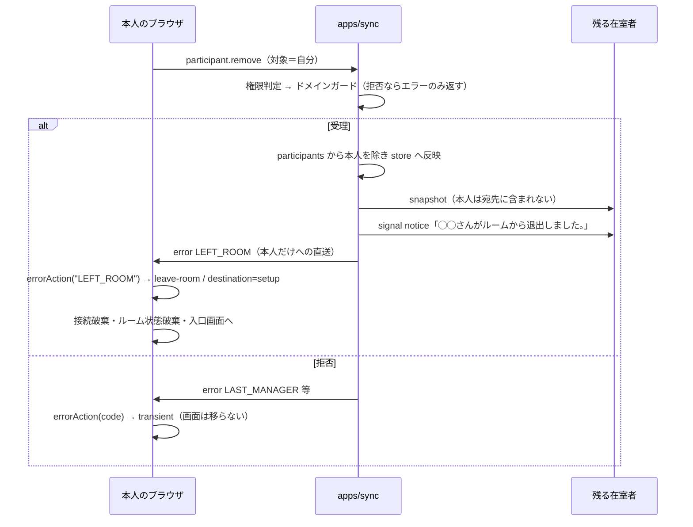

# 実装計画: 自己退出した本人に退出を伝え、入口へ戻す

**Issue:** [#32](https://github.com/tomohiroJin/tasuki-tools/issues/32) ・ **仕様:** [`spec.md`](./spec.md) ・ **ステータス:** Draft（設計レビュー中）

## 技術コンテキスト

既存構成をそのまま用いる。新しい依存・新しい層は導入しない。

| 層 | パッケージ | 本計画での役割 |
|---|---|---|
| ドメイン | `packages/core` | エラーコードの語彙・利用者向け文言・「誰の操作か」から通知種類を決める規則 |
| 同期サーバー | `apps/sync` | 退出成立時に本人へ通知を送る |
| クライアント | `apps/web` | 通知の種類から「画面が次に何をするか」を決め、状態を破棄して入口へ移す |

### 技術選定と根拠

| 選定 | 根拠（紐づく要件） |
|---|---|
| **新しいエラーコード `LEFT_ROOM` を追加する**（signal ではなく error の枠を使う） | FR-124/125。他者による退出が既に `REMOVED_FROM_ROOM` という error で本人へ届いており、**宛先が「在室者全員」ではなく「特定の 1 接続」**である点も同じ。signal は在室者への配信路であり、既に在室者でない本人へは届かない（Issue の原因分析そのもの）。同じ問題に同じ経路で答える |
| **サーバーからの通知を待ってから遷移する**（楽観的遷移にしない） | FR-129。退出は拒否され得る（進行できる人が残らない／最後のドライバー）。送信時点で画面を移すと、拒否された場合に操作できる画面から離れてしまう |
| **「誰の操作か → 通知種類」の規則を `packages/core` の純粋関数に置く** | FR-125。現在この規則は `handlers.ts` の `if` の条件式に埋まっており、テストから触れない。#28 で確認された「規則がテストの届かない場所にあると、型検査もテストも退行を素通しさせる」に該当する |
| **「エラーコード → 画面の次の動作」の規則を `apps/web` の純粋関数に置く** | FR-127/128/129。`App.tsx` の `onError` クロージャ内に埋まっており、**web には App 段の自動テストが 1 件も存在しない**。既存の `deriveConnectionStatus` / `hostChangeMessage` / `screenForPhase` と同じ形に揃える |
| **文言は `ERROR_MESSAGES`（core）に定義する** | FR-126/130。`error-code-coverage.test.ts` が「サーバーが送る全コードについて利用者に何が見えるか決まっている」ことを強制する。表に載せれば `INTENTIONALLY_NOT_SHOWN` を触らずに要件を満たせる |
| **既存コード `REMOVED_FROM_ROOM` / `REMOVED_BY_HOST` の受理を維持する** | 非機能要件（後方互換）。配備前から開いたままの画面が旧応答を受け取り得る |

## 規約チェック

| 原則 | 判定 | 備考 |
|---|---|---|
| 文言の定義箇所は 1 つ（FR-105） | **PASS** | `LEFT_ROOM` の文言は `packages/core/src/error-messages.ts` にのみ置く |
| 全ての箇所が共通の実装を経由する（FR-107） | **PASS** | 表示は `displayMessageFor()`、wire は `errorMessageFor()` を経由 |
| エラーコードは列挙で型が付く（FR-101） | **PASS** | `SYNC_ERROR_CODES` に追加し、`error-code-coverage.test.ts` の双方向照合に載せる |
| `any` 禁止・`undefined` 優先 | PASS | 追加する型は判別可能合併で表す |
| 1 関数 1 責務・30 行以内 | PASS | 追加する純粋関数はいずれも 10 行未満 |
| 関数パラメータ 3 個以内 | PASS | |
| テストは振る舞いベース・GWT の区切りを持つ（ADR 0009） | PASS | 既存 148 ファイルの規約に合わせる |
| React: 状態管理ロジックはカスタムフック/純粋関数へ | **PASS** | 判定を純粋関数へ出し、`App.tsx` は適用のみ |
| 破壊的変更の禁止 | PASS | 既存コードの受理・既存文言・既存遷移は変えない |

## アーキテクチャ



### 通知種類の対応

| 誰が誰を | 本人へ送るコード | 本人の画面の行き先 | 手がかりの保持 |
|---|---|---|---|
| 自分が自分を | **`LEFT_ROOM`（新規）** | **入口（setup）** | 保持しない |
| 他者が自分を | `REMOVED_FROM_ROOM`（既存） | 参加（join） | ルームコードを保持 |
| 他者が自分を（旧サーバー） | `REMOVED_BY_HOST`（既存） | 参加（join） | ルームコードを保持 |
| 代理（クライアント無し） | 送らない | — | — |

## コンポーネントとインターフェース

### 1. `packages/core/src/participants.ts` — 通知種類の規則（新規関数）

```ts
/** 退出の通知種類。誰の操作かで分かれる（FR-125）。 */
export type RemovalNotification = "LEFT_ROOM" | "REMOVED_FROM_ROOM";

/**
 * 退出させられた本人へ送る通知の種類を決める。
 * 自分が自分を外したのなら本人の意思による退出であり、他者の操作として伝えてはならない。
 */
export function removalNotificationFor(
  actorParticipantId: string,
  targetParticipantId: string,
): RemovalNotification;
```

`participants.ts` に置く理由は、既に `canRemoveParticipant` / `canDemote` という
**参加者の退出まわりの規則**が集まっている場所であり、同じ関心だからである。

### 2. `packages/core/src/error-messages.ts` — 文言（追記）

```ts
LEFT_ROOM: "ルームから抜けました。",
```

文言は 1 文に留める。遷移先が入口画面であり、そこには「名前を入れてルームを作る」導線が
既に見えているため、画面が説明していることを文言で繰り返さない。

### 3. `packages/core/src/errors.ts` — 語彙（追記）

`SYNC_ERROR_CODES` の「ルームの入退室」節へ `"LEFT_ROOM"` を追加する。

### 4. `apps/sync/src/application/handlers.ts` — 通知の送出（変更）

`participant.remove` の本人向け通知を、条件分岐から**規則の適用**へ置き換える。

```ts
// 変更前: 自己退出のときだけ何も送らない（＝取り残す）
if (target.connId && targetId !== participant.participantId) {
  sendError(target.connId, "REMOVED_FROM_ROOM", `${participant.displayName} さんにより…`);
}

// 変更後: 誰の操作かで種類を決め、どちらの場合も必ず送る
if (target.connId) {
  const code = removalNotificationFor(participant.participantId, target.participantId);
  sendError(target.connId, code, messageForRemoval(code, participant.displayName));
}
```

`messageForRemoval` は `handlers.ts` 内の小さな関数で、`REMOVED_FROM_ROOM` のときだけ
実行者名を差し込む既存の動的文言を返し、`LEFT_ROOM` のときは `errorMessageFor("LEFT_ROOM")` を返す。

> **既存の動的文言（`◯◯ さんにより退出させられました。`）は 1 文字も変えない。**
> これは `handlers.ts` に文言リテラルが残る形だが、**#28 が意図的にこの状態を選んでいる**
> （実行者名の差し込みが必要で、表に静的な 1 文として載らない）。本計画で移設すると
> 挙動不変の保証が要る別の変更になるため、Issue #29 とも切り離してここでは触らない。

### 5. `apps/web/src/ui/error-action.ts` — 画面の次の動作（新規ファイル）

```ts
/** エラーコードを受けて画面が次に何をするかの決定。 */
export type ErrorAction =
  | { kind: "session-lost" }
  | { kind: "leave-room"; destination: "join" | "setup" }
  | { kind: "transient" };

export function errorAction(code: string): ErrorAction;
```

| code | 返す値 |
|---|---|
| `ROOM_NOT_FOUND` | `{ kind: "session-lost" }` |
| `LEFT_ROOM` | `{ kind: "leave-room", destination: "setup" }` |
| `REMOVED_FROM_ROOM` / `REMOVED_BY_HOST` | `{ kind: "leave-room", destination: "join" }` |
| それ以外 | `{ kind: "transient" }` |

置き場所は `apps/web/src/ui/` とする。`connection-status.ts` / `host-change.ts` /
`screen.ts` と同じ「App から切り出した純粋な判定」の並びである。

### 6. `apps/web/src/App.tsx` — 適用（変更）

`onError` を `errorAction(code)` の結果に対する分岐へ書き換える。
`leave-room` の後始末（接続破棄・ルーム状態・自分の識別・各種ガード ref の初期化）は
**行き先によらず同一**なので 1 箇所に集約し、違うのは次の 2 点だけにする。

- バナー文言 — `friendlyError(code)` から引く（`LEFT_ROOM` / `REMOVED_*` それぞれの表の文言）
- 行き先 — `destination === "join"` なら直前のルームコードを保持して参加画面、
  `"setup"` なら保持せず入口画面

> **既存の `REMOVED_FROM_ROOM` のバナー文言は変わってはいけない。**
> 現在は `App.tsx` 内の直書きリテラル「ルームから退出しました。再参加するには名前を入力してください。」
> であり、`friendlyError` を通していない（そのため `INTENTIONALLY_NOT_SHOWN` に載っている）。
> 表へ移すと `error-code-coverage.test.ts` の「意図的に出さないコードは既定文言」の検査に
> 触れるため、**移設は `LEFT_ROOM` を表に載せるのと同時に `REMOVED_FROM_ROOM` /
> `REMOVED_BY_HOST` も表へ移し、`INTENTIONALLY_NOT_SHOWN` から外す**。
> 文言の値は 1 文字も変えないので表示は不変であり、定義箇所が 1 つに寄る（FR-105 の前進）。

## データモデル

新しい永続データ・新しい wire メッセージ型は無い。既存の
`{ type: "error", code, message }` の `code` に取り得る値が 1 つ増えるだけである。
`ServerMsgSchema` の `code` は `nonEmptyString` のままなので**スキーマ変更は不要**
（狭めると未知コードを弾く挙動の変更になる。`errors.ts` の注記に従う）。

## API / インターフェース契約

### `error` メッセージ（既存・値の追加のみ）

```
サーバー → クライアント（1 接続へ直送）
{ "type": "error", "code": "LEFT_ROOM", "message": "ルームから抜けました。" }
```

- **送出条件**: `participant.remove` が受理され、対象 `participantId` が実行者自身と一致し、
  対象が接続を持つ（代理でない）場合。
- **他への影響なし**: 在室者への snapshot / notice は従来どおり。

## プロジェクト構成

```
tdd-mob-pro-timer/
├── packages/core/
│   ├── src/
│   │   ├── errors.ts                    # 変更: SYNC_ERROR_CODES に LEFT_ROOM
│   │   ├── error-messages.ts            # 変更: LEFT_ROOM / REMOVED_* の文言を表へ
│   │   ├── participants.ts              # 変更: removalNotificationFor を追加
│   │   └── index.ts                     # 変更: 公開記号の追加
│   └── test/
│       ├── participants.removal-notification.test.ts   # 新規
│       └── error-messages.test.ts       # 変更 or 新規: LEFT_ROOM の表示文言
├── apps/sync/
│   ├── src/application/handlers.ts      # 変更: 本人への通知を規則の適用へ
│   └── test/
│       ├── self-leave-notification.test.ts             # 新規
│       └── error-code-coverage.test.ts  # 変更: INTENTIONALLY_NOT_SHOWN から REMOVED_* を外す
└── apps/web/
    ├── src/
    │   ├── ui/error-action.ts           # 新規: エラーコード → 画面の次の動作
    │   └── App.tsx                      # 変更: onError を errorAction で分岐
    └── test/ui/error-action.test.ts     # 新規
```

## エラー処理とセキュリティ

- **拒否時に画面を移さない**ことが唯一の安全側の要件である。`errorAction` の既定が
  `transient` であり、**明示的に列挙したコードだけが画面を移す**設計にすることで、
  新しいコードが増えても既定では画面が飛ばない。
- 通知は**特定の 1 接続への直送**であり、退出した本人以外へは届かない。
  在室者一覧に他人の退出理由が漏れることはない。
- 秘密（能力トークン・パスフレーズ）は通知に一切含まれない。
- 退出後にクライアントは接続を破棄する。切断後の再接続で古いルームへ戻ることはない
  （復帰は招待からやり直す）。

## テスト戦略

| 層 | 何を検証するか |
|---|---|
| 単体（core） | `removalNotificationFor` が自己と他者を区別する。`LEFT_ROOM` の表示文言が既定文言でない |
| 単体（web） | `errorAction` の写像が 4 系統すべて（session-lost / leave-room×2 / transient）正しい。未知コードは `transient` |
| 結合（sync） | 実サーバー相当のハンドラ経由で、自己退出時に**本人の接続へ** `LEFT_ROOM` が届く。他者退出では `REMOVED_FROM_ROOM` のまま。代理には送らない。**拒否時には退出通知が届かない** |
| 回帰（sync） | 残る在室者への snapshot と notice が従来どおり（既存 `notice-signal.test.ts` の維持） |
| メタ（sync） | `error-code-coverage.test.ts` が双方向照合を通す（列挙 ↔ ソース、コード ↔ 表示文言） |
| 実機 | Playwright で 2 タブ。参加者側で「ルームから抜ける」→ **入口画面へ移りバナーが出る**。ホスト側では退出が反映されている。単独編集者の場合はボタンが押せない |

`App.tsx` そのものの render テストは追加しない。**web には App 段のテストが 1 件も無く**、
WS を差し替える土台を新設することになる。本計画の範囲では判定を純粋関数へ出すことで
規則を検証可能にし、配線の確認は実機で行う（Issue #28 で確立した
「フロントの完了は実画面目視」の方針に従う）。

## 段階分け / 順序

| 段階 | 内容 | 検証ゲート |
|---|---|---|
| **G0** | 現状の固定。自己退出で本人へ何も送られないことを**失敗するテスト**として書く | 新テストが red |
| **G1** | core: 語彙・文言・`removalNotificationFor` | core 緑 |
| **G2** | sync: 本人への通知を規則の適用へ。`error-code-coverage` の集合を整える | sync 緑・G0 が green に反転 |
| **G3** | web: `errorAction` を新設し `App.tsx` を書き換える | web 緑 |
| **G4** | 抽象化と原則の適用（後始末の一本化・命名・重複除去） | 全緑を維持 |
| **G5** | 敵対的レビュー → 実機統合検証 | 全緑・実機 PASS |

順序の理由は**依存の向き**である。`core` は `sync` / `web` の両方から参照されるため先に固める。
`sync` を `web` より先にするのは、`web` の遷移が `sync` の送出を前提にしており、
逆順だと実機確認が G3 の時点で通らないためである。

## 未解決の `[要確認]`

なし。遷移先（入口画面）・通知手段（サーバー確認後の専用コード）・文言・拒否時の見せ方
（現状維持）はすべて確定済み。
