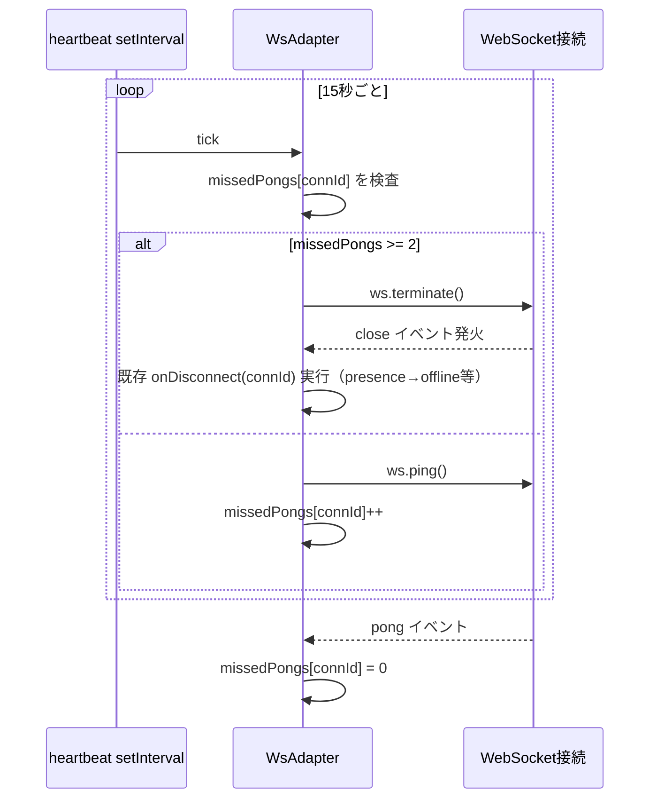

# 実装計画: サーバー側の死活監視（WS ping/pong ヘルスチェック）

**入力:** spec.md ・ **ステータス:** Draft

## 技術コンテキストと意思決定

| 意思決定 | 選択 | 根拠 | 紐づく要件 |
|---|---|---|---|
| 死活監視方式 | サーバー主導の `ws` 標準 ping/pong | Issue #25 の案1。クライアント実装不要で `apps/web` を触らずに済み、他トラック（App.tsx / Lobby.tsx 編集中）と非競合 | FR-001〜004 |
| 実装場所 | `WsAdapter`（`apps/sync/src/adapters/ws-adapter.ts`）内に閉じる | 既存の接続管理（`connections: Map<string, WebSocket>`）と同じ場所で完結させ、`server.ts` 以下の presence/reclaimer には触れない（DRY・疎結合維持） | FR-004 |
| 検出間隔既定値 | `HEARTBEAT_INTERVAL_MS = 15000` | 既存の30秒グレース系タイマーの半分程度。過度に高頻度にせず通信量を抑えつつ、猶予込みで許容範囲の検出時間に収める | FR-005, NFR性能 |
| 許容ミス回数既定値 | `HEARTBEAT_MAX_MISSES = 2` | 1回の欠落では切断しない（ジッター耐性）。2回連続欠落で切断＝検出まで最大 `INTERVAL × (MAX_MISSES + 1)` ≈ 45秒。既存の30秒系グレースと同オーダー | FR-003, US2 |
| 切断手段 | `ws.terminate()` | `close()` は close ハンドシェイクを待つため半開き接続に対しては効果が薄い。`terminate()` は即座に低レベルソケットを破棄し、確実に `close` イベントを発火させる（既存 `ws.on("close")` 実装と同じ手段を `WsAdapter.close()` でも既に使用しており一貫性がある） | FR-003 |
| 環境変数 | `HEARTBEAT_INTERVAL_MS` / `HEARTBEAT_MAX_MISSES` | 既存の `config.ts` の `intEnv` パターンを再利用。不正値は既定値にフォールバック | FR-005 |

## 規約チェック（Constitution Check）

| 原則 | ステータス | 備考 |
|---|---|---|
| DRY | PASS | close イベント経路（presence 更新・ホスト委譲・ドライバー繰り上げ）を再実装せず、`ws.terminate()` で既存経路に乗せる |
| SOLID（単一責任） | PASS | ハートビート機構は `WsAdapter` の接続ライフサイクル管理という既存責務の内側に閉じる。`PresenceManager` の責務（presence 状態遷移）は変更しない |
| YAGNI | PASS | `idle` 状態への遷移・クライアント側実装は spec で明示的にスコープ外化。二値検出のみ実装 |
| DbC（契約） | PASS | `WsAdapterOptions` に新規オプション（`heartbeatIntervalMs?`, `heartbeatMaxMisses?`）を追加するのみで、既存の `onMessage`/`onDisconnect` 契約は変更しない |
| SoT（単一の真実源） | PASS | 生存確認の判定ロジックは `WsAdapter` 内の1箇所（heartbeat interval コールバック）に集約 |

（違反なし。）

## アーキテクチャ



## コンポーネントとインターフェース

- **`WsAdapter`（既存クラスの拡張）**
  - 追加の内部状態: `private readonly missedPongs = new Map<string, number>();`
  - 追加の内部フィールド: `private heartbeatTimer: ReturnType<typeof setInterval> | null = null;`
  - `handleConnection` 内で `ws.on("pong", ...)` を登録し `missedPongs.set(connId, 0)`
  - コンストラクタで `startHeartbeat()` を呼び出し、`setInterval` を開始
  - `close()` 内で `stopHeartbeat()`（`clearInterval`）を呼ぶよう既存実装を拡張
  - 新規オプション: `WsAdapterOptions.heartbeatIntervalMs?: number`（既定 15000）、`WsAdapterOptions.heartbeatMaxMisses?: number`（既定 2）
- **`config.ts`（既存の `loadSyncConfig` を拡張）**
  - `SyncConfig` に `heartbeatIntervalMs: number` / `heartbeatMaxMisses: number` を追加
  - `intEnv(env["HEARTBEAT_INTERVAL_MS"], 15_000)` / `intEnv(env["HEARTBEAT_MAX_MISSES"], 2)`
- **`server.ts`（既存の `WsAdapter` 生成呼び出しを拡張）**
  - `new WsAdapter({ ..., heartbeatIntervalMs: config.heartbeatIntervalMs, heartbeatMaxMisses: config.heartbeatMaxMisses })`

## データモデル

新規の永続データモデルなし。`missedPongs: Map<connId, number>` はプロセス内メモリのみで、接続の `close` 時に確実に削除する（既存の `connections.delete(connId)` と対にする）。

## API / インターフェース契約

外部公開 API（WS プロトコル・HTTP エンドポイント）の変更なし。`ws` の ping/pong はプロトコルフレームレベルの機構であり、アプリケーションメッセージ（`CommandSchema`）には現れない。

`WsAdapterOptions` 契約の差分（後方互換な追加のみ）:

```ts
export interface WsAdapterOptions {
  // ...既存フィールド...
  /** ハートビート間隔（ms）。既定 15000。 */
  heartbeatIntervalMs?: number;
  /** 許容連続 pong 欠落回数。この回数に達したら terminate。既定 2。 */
  heartbeatMaxMisses?: number;
}
```

## プロジェクト構成

```
apps/sync/
├── src/
│   ├── adapters/ws-adapter.ts     # heartbeat 機構を追加（変更）
│   ├── config.ts                  # HEARTBEAT_* env を追加（変更）
│   └── server.ts                  # WsAdapter へ設定値を配線（変更）
└── test/
    ├── ws-adapter.heartbeat.test.ts   # 新規（heartbeat 単体のふるまい）
    ├── ws-adapter.integration.test.ts # 既存・非破壊を確認
    └── ws-adapter.admin.test.ts       # 既存・非破壊を確認

docs/plans/server-heartbeat/
├── spec.md
├── plan.md
└── tasks.md
```

## エラー処理とセキュリティ

- ハートビートの ping/pong はサーバーが能動的に送るのみで、ユーザー入力を経由しないため新規の入力検証は不要。
- `ws.terminate()` は例外を投げない前提（`ws` ライブラリの仕様）。念のため呼び出しは同期的な単純呼び出しに留め、例外処理の追加は行わない（既存の `close()` 実装と同水準）。
- `heartbeatIntervalMs` / `heartbeatMaxMisses` に不正値（負数・NaN）が渡っても、`config.ts` の `intEnv` が既定値にフォールバックするため異常な高頻度 ping や即時切断は起きない。
- 接続数上限（`maxConnections`）・メッセージサイズ上限（`MAX_MESSAGE_BYTES`）等の既存セキュリティ機構には触れない。

## テスト戦略

- **単体テスト（新規 `ws-adapter.heartbeat.test.ts`）**: フェイクタイマー（`vi.useFakeTimers()`）で `setInterval` を制御し、以下を検証する。
  - pong を返し続ける接続は `heartbeatMaxMisses` 回を超えても `terminate` されない
  - pong を一切返さない接続は、指定回数の interval 経過後に `terminate` される（`onDisconnect` が発火することも確認）
  - 1回だけ pong 欠落し、その後 pong を返した接続は `terminate` されない（誤検出しない = US2）
  - `close()` 呼び出し後は heartbeat の `setInterval` が停止する（テスト終了後のタイマーリークがないこと）
- **既存の結合テスト（非破壊確認）**: `ws-adapter.integration.test.ts` / `ws-adapter.admin.test.ts` をそのまま実行し pass することを確認
- **既存の presence/reclaimer テスト（非破壊確認）**: `driver-absence.test.ts` / `room-reclaimer.test.ts` を変更せず実行し pass することを確認（`WsAdapter` 経由ではなく `PresenceManager`/`RoomReclaimer` を直接呼ぶユニットテストのため、本変更の影響を受けない設計であることを確認する目的）
- カバレッジ目標: 新規追加コード（heartbeat 関連の分岐）は既存プロジェクトの慣習に倣い、正常系・異常系（欠落→復帰、欠落→切断、close 時の停止）を網羅する

## 段階分け（Sequencing）

1. `WsAdapter` に heartbeat 機構を Red→Green→Refactor で追加（テスト先行）
2. `config.ts` に環境変数を追加
3. `server.ts` の配線を更新
4. 既存テスト一式（`apps/sync` 配下）を実行し非破壊を確認
5. ドキュメント更新（README/ARCHITECTURE等、該当があれば）

## 未解決の論点

なし（spec.md の「前提」に既定値の根拠を明記済み）。
