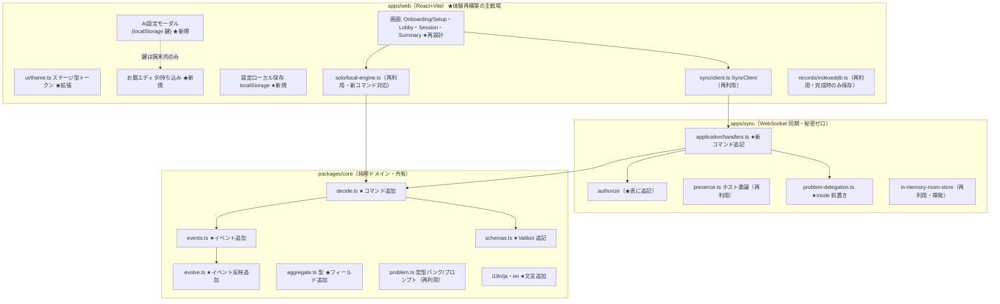
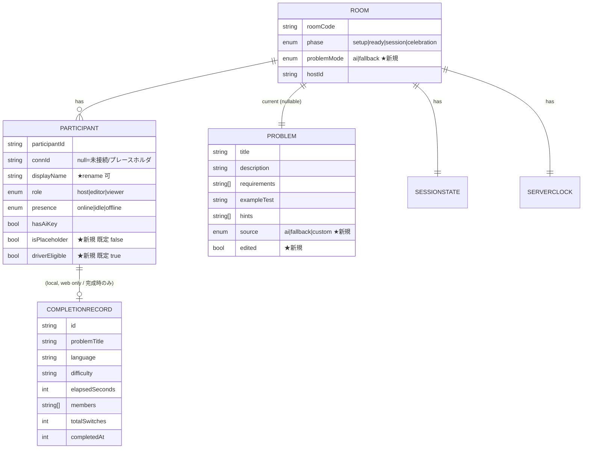

# 実装計画: TDD Mob Pro Timer v2 — 体験・導線の作り直し
**入力:** spec.md ・ **ステータス:** Implemented（v2.10.0 本番デプロイ済み 2026-06-26）

> 本計画の大原則: **v1 の動くコア（decide/evolve・ServerClock・full snapshot 同期・authorize・presence・problem delegation）を作り直さない。** v2 は (A) 体験を担う UI 層の再構築、(B) 既存サーバー能力を「表に出す」UI 導線、(C) 最小限の新規ドメイン能力（終了種別・代理参加・一時離脱・お題編集/持ち込み・出題モード・改名）追加、の3層で構成する。ドメイン層への追加はすべて既存 decide/evolve/Valibot/プロパティテストの枠内で行う。

---

## 技術コンテキストと意思決定

v1 の調査結果（既存能力の所在）を踏まえ、v2 の技術判断を要件に紐づけて確定する。

| 意思決定 | 選択 | 根拠 | 紐づく要件 |
|---|---|---|---|
| 全体方針 | v1 モノレポ（pnpm workspaces + Turborepo / core・sync・web）を継続。コアは拡張のみ | 「コアの作り直しはしない」が要件。v1 の状態機械・プロパティテストが堅牢 | 互換性(NFR)・スコープ外 |
| ドメイン拡張の方式 | 新コマンド/イベントを `decide.ts`/`events.ts`/`evolve.ts` に追加。既存イベントは破壊変更しない（フィールド追加は任意化で後方互換） | decide/evolve パターンは加算的拡張に強い。snapshot 全置換なので移行不要（揮発） | 全 FR の基盤 |
| 終了種別（完成/中断/リセット） | `session.complete`（完成）に加え **`session.abort`（中断）** コマンド＋`SessionAborted` イベントを新設。`session.reset` は据え置き。3つを別コマンドに分離 | FR-018「意味が取り違えられない別個の操作」をドメインレベルで保証 | FR-018,019,020,044,045 |
| 中断の記録 | **中断（abort）は記録を残さない（破棄）。** `session.complete`（完成）のみが `CompletionRecord` を生成・永続化する。中断は `SessionAborted` イベントで UI 締めくくりに使うだけで、記録には残らない | FR-020「途中終了を達成として記録しない」を最も単純に充足。完成/中断の区別はイベント型（SessionCompleted / SessionAborted）で保持され、永続記録は完成のみ | FR-020, US5 |
| 代理参加（プレースホルダ） | `Participant.connId: null` + 新フラグ `isPlaceholder: true`。新コマンド `participant.addProxy`（host限定）。rotation には通常どおり名前を載せドライバー対象にする | FR-047。connId=null は v1 既存表現の延長。Web 非接続者を回せる | FR-047, US9-2 |
| 一時離脱（ターンを飛ばす） | `Participant.driverEligible: boolean`（既定 true）。新コマンド `driver.skip`/`driver.resume`。交代ロジックが ineligible をスキップ | FR-051。rotation 構造を変えず、導出で対象外化（最小侵襲） | FR-051, US9-6 |
| 観覧専用 | 既存 `role: "viewer"` を活用。viewer は `driverEligible=false` 相当として交代対象外、authorize で状態変更コマンドを既に拒否 | FR-061 は v1 の viewer 権限でほぼ充足。UI で「観覧」を可視化 | FR-061, US9-7 |
| 表示名の決定・変更 | join 時の表示名指定は既存。変更用に新コマンド `participant.rename`（自分の名前は本人、他人は host） | FR-046/048。rename は v1 未実装のため新設 | FR-046,048, US9-1,9-3 |
| お題の出所と編集 | `Problem.source: "ai" \| "fallback" \| "custom"` と `Problem.edited: boolean` を追加。新コマンド `problem.edit`（各フィールド差し替え）。持ち込みは既存 `problem.submit` を拡張（source="custom"） | FR-009〜013,038,040。出所明示と編集をドメインで保持し snapshot 同期 | FR-011,015,038,040,041, US3 |
| 出題モード（AI/定型） | `Room.problemMode: "ai" \| "fallback"` を追加。新コマンド `problem.mode.set`。`ai` かつ鍵保有候補ありなら委譲、`fallback` または候補なしなら定型へ縮退（既存 problem-delegation の分岐を mode で前置き） | FR-042/043。「今日は AI を使わない」をモードで満たす（残量メーターは作らない） | FR-042,043, US4 |
| BYOK 鍵 UI | Web のみ。鍵入力 UI（設定モーダル）を新設。鍵は **サーバーへ送らない**（既存 ByokProvider はクライアント直叩き）。`hasAiKey` は自己申告フラグとして既存どおり snapshot に載る | FR-014,017。v1 は鍵入力 UI が無く常時定型縮退＝「AI が効かない」の主因 | FR-014,016,017,042, US4 |
| 鍵の保存先（セキュリティ） | 既定は **`sessionStorage`**（タブを閉じれば消える）。「この端末に保存」を明示オプトインしたときのみ `localStorage` に保存し、その際**「XSS 等で漏えいしうる」リスク注意を併記**。保存しない選択（毎回入力）も可 | デザインレビュー横断指摘。`security.md`「localStorage にトークン保存禁止」との整合。黙って永続化しない | FR-017, US4 |
| 設定のローカル保存 | 表示名・言語・難易度・メンバー・交代間隔を **localStorage**（小さなキー値）に保存し Setup 既定へ自動充填。完成記録は既存 IndexedDB を継続 | FR-053/054。設定は小さく同期不要なので localStorage、記録は件数があるので IndexedDB（v1 踏襲） | FR-053,054, US10 |
| 権限・ホスト委譲・復帰 | 既存 `authorize`・`PresenceManager`（30秒猶予のホスト昇格）・`resumeTokens` をそのまま使用。新コマンドを `authorize` の HOST_ONLY/EDITOR_PLUS 表へ追記するのみ | FR-055,056,057,058 は v1 実装済み能力の再利用 | FR-055〜058, US10 |
| セッション喪失の明示 | クライアントが join 失敗（room not found）を受けたとき「セッションは失われたがローカル記録は保持」を明示する UI を追加。サーバーは揮発のまま（恒久化しない） | FR-059。揮発インメモリは要件（スコープ外で恒久ストア否定） | FR-007,059, US10-7 |
| ビジュアル基盤 | 既存 `index.css`/`ui/theme.ts` の CSS 変数体系を拡張し「集中・ステージ型」のダークトークンを正本化。`prefers-reduced-motion` 対応の演出層を追加 | FR-025,028〜032。v1 のトークン資産（chrome/intent 分離・AA・P3・流動タイポ）を壊さず磨き込む（design-system スキル準拠） | FR-022,025,026,028〜032,060, US6,US7 |
| **ステージ構図（焦点の隔離）** | セッション/ロビーの**キャンバスはテーマに関わらずダークステージ固定**。タイマー＋現ドライバーを画面中央の「焦点ゾーン」に隔離し、周辺情報（お題詳細・統計・参加者一覧）は明度・サイズを一段落として退避（折りたたみ/低明度パネル）。現ドライバーは「次」より明確に格上げ | デザインレビュー必須1・2。v1 は単一カラム均等積みで図と地が不成立＝「チープ」の主因。FR-028/030・SC-006/008 | FR-028,030, SC-006,008, US7 |
| **操作色の三層化** | intent の氾濫（5〜6 色並列）を解消。1画面のアクセントは1箇所（10%ルール）。操作を【主操作1＋副操作（控えめ）＋終了系（隔離・確認付き）】に整理。`完成！`→`完成`等、語彙を実態へ | デザインレビュー必須3・4。類同崩壊と語彙不一致の是正。FR-044・SC-005 | FR-018,044, SC-005, US5,US8 |
| **永続ステータスストリップ** | 全画面に固定の状態帯（フェーズ＋ルーム / 自分の名前＋役割 / 接続状態●⟳⚠ / 出題モード AI・定型）。色＋テキスト併記 | デザインレビュー必須5。FR-036「現在地が常に分かる」・US8-6 接続可視化・FR-042 モード可視 | FR-036,042, US8 |
| ライトテーマ | ダークを主体験とし、v1 のライト資産は維持（トグルは残す）。ただし**セッション/ロビーの舞台はダーク固定**（ライト時も舞台は暗い、という割り切り）。v2 ではライトの磨き込みは最小 | スコープ外「ライトを主体験にしない」。資産は活かす | スコープ外 |
| 開発証跡の分離 | 自己テスト/診断トーストを本番描画経路から除去し、明示要求時のみ表示する開発フラグ配下へ | FR-027。v1 で混入していたチープさ要因の除去 | FR-027, US11 |

---

## 規約チェック（Constitution Check）

CLAUDE.md / rules（coding-style・testing・security・git-workflow）と spec 非機能要件に対する適合。

| 原則 | ステータス | 備考 |
|---|---|---|
| 既存コードの尊重・規約一貫性 | PASS | v1 の decide/evolve・命名・ファイル配置を踏襲。新規も同パターンで追加 |
| テスト基準（TDD・カバレッジ・プロパティテスト） | PASS | 新コマンド/イベントは red→green、不変条件はプロパティテストに追加（後述テスト戦略） |
| セキュリティ（秘密ゼロ・入力検証・XSS） | PASS | 鍵は端末内のみ（FR-017）。新コマンドは Valibot で境界検証。お題テキストは描画時にスクリプト実行を許さない（非機能） |
| アクセシビリティ（AA・キーボード・支援技術） | PASS | 焦点/状態は色のみ依存禁止・AA 準拠。モーダルはフォーカストラップ+Esc。状態変化は aria-live で通知 |
| ドメイン互換（v1 を壊さない） | PASS | 既存イベントは破壊変更せず、追加フィールドは任意化。揮発 snapshot のため移行不要 |
| 多言語（ja/en） | PASS | 新規 UI 文言は `i18n/ja.ts`・`en.ts` に追加（既存セクション構造を踏襲） |

違反なし（CRITICAL なし）。

---

## アーキテクチャ

3層は v1 と同一。v2 で追加・改修する箇所を ★ で示す。



**データフローの要点（v1 踏襲）:** クライアントは Command を送る → サーバーが `authorize` → `decide` → `evolve` → Room 更新 → `broadcastSnapshot` で在室者全員へ全置換。ソロモードは同じ decide/evolve をローカルで回す。v2 の新コマンドもこの一本道に乗せる（差分同期や新経路は作らない）。

---

## コンポーネントとインターフェース

### core（純粋ドメイン）
- **`decide.ts`** — 目的: コマンド検証＋イベント生成。追加: `session.abort` / `participant.addProxy` / `participant.rename` / `driver.skip` / `driver.resume` / `problem.edit` / `problem.mode.set`。既存 `session.complete` は v1 のまま（完成記録を生成）。依存: aggregate 型・schemas。
- **`events.ts` / `evolve.ts`** — 追加イベント: `SessionAborted` / `ProxyMemberAdded` / `ParticipantRenamed` / `DriverSkipped` / `DriverResumed` / `ProblemEdited` / `ProblemModeSet`。`SessionCompleted` は v1 のまま（記録は完成時のみ生成）。`SessionAborted` は記録を生成せず phase を締めくくりへ遷移させるだけ。evolve は各イベントを Aggregate に反映。
- **`aggregate.ts`** — 型拡張: `Participant.isPlaceholder?: boolean`・`Participant.driverEligible?: boolean`、`Problem.source`・`Problem.edited`、`Room.problemMode`。`CompletionRecord` は v1 のまま（完成のみ・中断は破棄するため終了種別フィールドを追加しない）。`nextEligibleIndex(state)` ヘルパを新設（交代対象外をスキップ）。
- **`problem.ts`** — 再利用。定型バンク・`buildProblemPrompt` はそのまま。`source` の付与は呼び出し側（delegation / submit）で行う。プロンプトは spec FR-009/010（十分な情報量・テスト可能要件）を満たすよう要件数/例示テストの下限を明示するよう微修正。
- **`schemas.ts`** — 新コマンド/イベント/拡張フィールドの Valibot スキーマを追記。`CommandSchema`・`ServerMsgSchema` の union に追加。

### sync（同期サーバー）
- **`application/handlers.ts`** — 新コマンドのハンドラ追加（decide 呼び出し→store 保存→broadcast）。`HOST_ONLY_COMMANDS`/`EDITOR_PLUS_COMMANDS` に新コマンドを分類追記（addProxy=host、rename=本人/host、skip/resume=本人/host、problem.edit/mode.set=editor+、abort=host）。
- **`application/problem-delegation.ts`** — `Room.problemMode==="fallback"` または鍵保有候補が居ない場合は委譲せず即定型（source="fallback"）。`ai` かつ候補ありで委譲（source="ai"）。
- **`application/presence.ts` / `resumeTokens`** — 改修なし（再利用）。一時離脱は driverEligible で表現し presence とは独立。
- **`adapters/in-memory-room-store.ts`** — 改修なし（揮発のまま）。room not found は handlers がエラー応答（FR-007/059）。

### web（フロント・体験再構築の主戦場）
- **画面（フェーズ）** — `ui/screen.ts` の `setup/lobby/session/celebration` を踏襲しつつ、**Onboarding を Setup に統合**（初回は主アクション1つ）、**Celebration を Summary に一般化**（完成/中断で見出し・締めくくりを出し分け）。
- **`ui/theme.ts` + CSS 変数** — ステージ型ダークトークン（`--stage-bg`=最暗キャンバス・`--stage-focus-bg`・`--focus-glow`・`--font-size-driver`・焦点サイズ/余白）を正本化。セッション/ロビーはテーマ非依存でダークステージ固定。`prefers-reduced-motion` で演出を控えめ版へ。
- **`StatusStrip`（新規）** — 全画面共通の永続状態帯。フェーズ＋ルーム／自分の名前＋役割／接続状態（●オンライン・⟳再接続中・⚠喪失）／出題モードチップ（AI・定型）。色＋テキスト併記（FR-032）。FR-036/042・US8-6。
- **AI 設定モーダル（新規）** — 鍵入力/消去・出題モード切替（AI/定型）・出所表示。鍵は既定 sessionStorage、明示同意時のみ localStorage（リスク注意併記）、サーバー送信なし。
- **お題エディタ/持ち込み（新規）** — 各フィールド編集・自前貼り付け・コピー（既存 clipboard 関数の移植）・再生成・言語/難易度変更で出し直し。共有時は `problem.edit`/`problem.submit` を送信し snapshot 反映。
- **設定ローカル保存（新規）** — Setup の値を localStorage に保存/復元。
- **`sync/client.ts` SyncClient** — 改修なし（pendingMessages キュー・clockOffset・backoff を再利用）。新コマンドは型を増やすのみ。
- **`solo/local-engine.ts`** — 新コマンド（abort/skip/rename/problem.edit 等）にソロ対応を追加（同じ decide/evolve を呼ぶ）。
- **`records/indexeddb.ts`** — 改修なし（v1 のまま）。記録の保存は完成時のみ。中断（`SessionAborted`）では保存を呼ばない。
- **開発証跡** — 自己テストトースト等を本番経路から除去し、`?diag=1` 等の明示要求時のみ表示。

### ステージ構図の設計契約（デザインレビュー必須修正の具体化）
v1 の「チープさ」は素材ではなく構図に起因（トークン/A11y は良好）。v2 は次を満たす:
1. **焦点ゾーンの隔離**（FR-028/SC-008）— セッション中は「残り時間＋現ドライバー」を画面中央の焦点ゾーンに、最大サイズ・最明・上下に十分な余白で配置。お題詳細・統計・参加者一覧・引き継ぎメモは焦点ゾーン外の低明度パネル/折りたたみへ退避（FR-030）。
2. **現ドライバー > 次**（SC-008）— 現ドライバーは名前を大きく＋輪郭/発光で格上げ、「次」は `fg-muted` 以下に。同サイズ並置をやめる。
3. **ダークステージ固定**（FR-028/SC-006）— セッション/ロビーのキャンバスは `--stage-bg` で暗く固定（テーマ非依存）。
4. **操作の三層**（FR-018/044・SC-005）— 主操作1（一時停止/再開）＋副操作（スキップ/休憩・控えめ）＋**終了系ゾーン**【完成／中断／リセット】を意味差が一目で分かる見出し・説明・確認付きで隔離。アクセント色は1画面1箇所。
5. **節目だけ強演出**（FR-031）— 平時は静か、交代・残り10秒のみ ≤300ms の強調＋既存アナウンサー同期。reduced-motion 版を併設。
6. **永続ステータスストリップ**（FR-036）— 上記 `StatusStrip` を全フェーズ共通で固定表示。

---

## データモデル

v1 の型に対する **加算的拡張のみ**（既存フィールドは変更しない）。



**端末ローカル（同期しない）:**
- `SavedPreferences`（localStorage）— `{ displayName, language, difficulty, members[], intervalMinutes }`。FR-053/054。
- `AiSettings`（localStorage）— `{ apiKey }`（鍵そのもの。サーバー送信禁止）。FR-017。
- 完成記録（IndexedDB）— v1 のまま（**完成時のみ生成。中断は記録を作らない＝破棄**）。FR-020。

**不変条件（プロパティテストに追加）:**
- `rotation.length === driverCounts.length`（v1 既存）を維持。
- 交代は `driverEligible !== false` の名前のみを currentIndex にする（全員 ineligible のときは現状維持）。
- placeholder/viewer 追加・proxy 削除後も上記不変条件が崩れない。
- `SessionAborted` は `CompletionRecord` を生成しない（中断は破棄）。記録が生成されるのは `SessionCompleted` のときのみ。

---

## API / インターフェース契約（WebSocket メッセージ）

v1 の `CommandSchema`（client→server）/ `ServerMsgSchema`（server→client）union への **追加分** のみ記載。既存メッセージは不変。応答は原則 `snapshot` 全置換（v1 踏襲）、不正時は `error`。

| コマンド（client→server） | 権限 | 目的 | 主なペイロード | 結果 |
|---|---|---|---|---|
| `session.abort` | host | 中断で終える | `{ roomCode }` | `SessionAborted` → phase=締めくくり（中断表示）。**記録は生成しない（破棄）** |
| `participant.addProxy` | host | Web 非接続者を代理追加 | `{ roomCode, name }` | placeholder 参加者作成＋rotation 追加 → snapshot |
| `participant.rename` | 本人 / host | 表示名変更 | `{ roomCode, participantId, displayName }` | snapshot に反映（全員へ） |
| `driver.skip` | 本人 / host | 自分のターンを一時的に飛ばす | `{ roomCode, participantId }` | driverEligible=false、現ドライバーなら次の対象へ |
| `driver.resume` | 本人 / host | ドライバー対象へ復帰 | `{ roomCode, participantId }` | driverEligible=true |
| `problem.edit` | editor+ | お題の各フィールド差し替え | `{ roomCode, patch:{title?,description?,requirements?,exampleTest?,hints?} }` | `ProblemEdited`（edited=true）→ snapshot 全員反映 |
| `problem.submit`（拡張） | editor+ / 委譲先 | 持ち込み・AI 結果投入 | `{ roomCode, problem, source }` | source 付きでお題確定 → snapshot |
| `problem.mode.set` | editor+ | 出題モード切替（AI/定型） | `{ roomCode, mode }` | `ProblemModeSet` → 以降の出題に適用 |
| `session.complete` | host | 完成で終える | `{ roomCode }` | `SessionCompleted` → 完成記録を生成（v1 のまま） |

**エラー応答（既存 `error` メッセージ）の追加ケース:**
- room not found / expired → `error{ code:"room-not-found" }`（クライアントは「セッション喪失・ローカル記録は保持」を表示。FR-007/059）。
- 権限不足 → `error{ code:"forbidden" }`（既存 authorize）。
- お題形式不正（submit/edit）→ Valibot 失敗で `error`、AI 委譲経路なら定型へ自動縮退（FR-011）。

**鍵は契約に存在しない:** AI 鍵はいかなるメッセージにも含めない。サーバーは `hasAiKey`（真偽の自己申告）だけを知る（FR-017）。

---

## プロジェクト構成

既存ツリーへの追加・改修（★=新規, ◇=改修）。

```
tdd-mob-pro-timer/
├─ packages/core/src/
│  ├─ aggregate.ts            ◇ Participant/Problem/Room/CompletionRecord にフィールド追加, nextEligibleIndex ★
│  ├─ decide.ts               ◇ 新コマンド7種
│  ├─ events.ts               ◇ 新イベント7種（SessionAborted 等。SessionCompleted は不変）
│  ├─ evolve.ts               ◇ 新イベント反映
│  ├─ schemas.ts              ◇ Valibot 追記（Command/ServerMsg union）
│  ├─ problem.ts              ◇ プロンプトの要件下限明示, source 付与点
│  └─ i18n/{ja,en}.ts         ◇ v2 文言（終え方/お題編集/AI設定/在席/オンボーディング）
├─ apps/sync/src/application/
│  ├─ handlers.ts             ◇ 新コマンドのハンドラ＋authorize 分類
│  └─ problem-delegation.ts   ◇ problemMode 前置き
├─ apps/web/src/
│  ├─ ui/theme.ts             ◇ ステージ型ダークトークン正本化
│  ├─ ui/tokens.css (or 既存CSS) ◇ CSS 変数（焦点/余白/タイポ/モーション）
│  ├─ ui/screens/
│  │  ├─ Setup.tsx            ◇ オンボーディング統合・主アクション1つ・既定自動充填
│  │  ├─ Lobby.tsx            ◇ 招待1操作コピー・在室/開始可否・在席一覧
│  │  ├─ Session.tsx          ◇ 焦点(残り時間/現ドライバー)・終え方3操作・在席/スキップ
│  │  └─ Summary.tsx          ★ Celebration を一般化（完成/中断 出し分け）
│  ├─ ui/components/
│  │  ├─ AiSettingsModal.tsx  ★ 鍵入力/モード切替/出所表示
│  │  ├─ ProblemEditor.tsx    ★ 編集/持ち込み/コピー/再生成/言語難易度変更
│  │  ├─ RosterPanel.tsx      ★ 在席一覧・改名・代理追加・スキップ
│  │  ├─ StatusStrip.tsx      ★ 永続状態帯（フェーズ/役割/接続/出題モード）
│  │  ├─ EndSessionZone.tsx   ★ 終了系3操作の隔離ゾーン（完成/中断/リセット）
│  │  └─ ConfirmDialog.tsx    ◇ 中断/リセットの結果提示（共有時は他者影響）
│  ├─ ai/byok.ts              ◇ 鍵入力 UI と連携（localStorage I/O）
│  ├─ prefs/local-prefs.ts    ★ SavedPreferences の save/load
│  ├─ solo/local-engine.ts    ◇ 新コマンドのソロ対応
│  └─ records/indexeddb.ts    （改修なし・完成時のみ保存。中断は保存しない）
└─ docs/plans/tdd-mob-pro-timer-v2-experience/  （本 SDD 文書）
```

---

## エラー処理とセキュリティ

- **障害モード/復旧:**
  - 接続断 → 既存 SyncClient の指数バックオフで自動再接続、resumeToken で同一参加者復帰（FR-049/058）。UI に「再接続中」を aria-live で提示（FR-036/US8-6）。
  - サーバー再起動でルーム消失 → join 時 `room-not-found` → 「セッション喪失・ローカル記録は保持」を明示（FR-059）。サーバーは恒久化しない（揮発が要件）。
  - お題生成失敗/不正形式 → 定型へ縮退し画面を壊さない、出所を「定型」と明示（FR-011/015）。
  - ホスト不在 30 秒超 → 既存 PresenceManager が最古オンライン editor を昇格（FR-057）。
- **認証/認可:** 既存 `authorize`（role ベース、コマンド単位検証）を新コマンドにも適用（FR-055）。viewer は状態変更不可（FR-061）。rename/skip は「本人 or host」を handlers で判定。
- **入力検証:** すべての新コマンド/お題ペイロードを Valibot で境界検証（schemas.ts）。お題の requirements 等はサイズ上限を設け、巨大入力を拒否。
- **シークレット管理:** AI 鍵は localStorage のみ。いかなる WS メッセージ・ログ・記録にも含めない（FR-017）。サーバーは秘密ゼロ（v1 設計を維持）。
- **XSS/描画安全:** お題・表示名など利用者/AI 由来テキストは React のエスケープに委ね、`dangerouslySetInnerHTML` を使わない。Markdown を表示する場合もスクリプト/生 HTML を実行しない（非機能）。
- **性能しきい値（plan で確定する数値）:**
  - 主要操作のフィードバックは体感即時（目標 < 100ms、楽観的 UI ＋ ローカル即時反映）。
  - 共有時の状態反映は同一 LAN で体感即時（目標 1 RTT + 描画、概ね < 300ms）。
  - 初回表示 FCP 目標 < 1.5s（ダーク基調・初期 JS を肥大させない）。
  - タイマー精度は ServerClock 導出（v1 維持、1本の setTimeout）でドリフトを補正。

---

## テスト戦略

v1 のテスト資産（Vitest + fast-check、core 871 行 / sync ~1400 行 / web ~500 行）を土台に **テストファースト** で追加する。

- **単体（core）:** 新コマンドごとに decide の成功/失敗、evolve の状態反映を red→green。`session.abort` が完成と区別され **記録を生成しない** こと、`session.complete` のみが記録を生成すること、`driver.skip/resume` が交代対象を正しく増減すること、`problem.edit/submit` が source/edited を正しく付すこと。
- **プロパティテスト（core）:** 既存不変条件に加え、任意操作列（proxy 追加・skip・remove・switch を混在）で `rotation.length===driverCounts.length` と「交代は eligible のみ」を保証。全員 ineligible の縮退も検証。
- **結合（sync）:** authorize 表に新コマンドを足した上で、viewer 拒否・host 限定・本人/host 判定（rename/skip）を検証。problemMode による委譲/定型分岐。room-not-found 応答。
- **契約（schemas）:** Command/ServerMsg union の Valibot ラウンドトリップ（新メッセージの直列化/検証）。鍵がペイロードに混入しないことの明示テスト。
- **web 単体:** local-prefs の save/load、中断（SessionAborted）で indexeddb 保存が呼ばれないこと・完成でのみ保存されること、AI 設定モーダルが鍵をサーバーへ送らないこと、solo-engine の新コマンド。
- **振る舞い/受け入れ（既存 docs/plans の Example Map・Gherkin 路線）:** 招待→合流1操作、終え方の取り違え防止、出所/モード可視、代理追加と復帰で進行が止まらない、の SC を外側から検証（Playwright 雛形は段階3の枠で別途）。
- **カバレッジ目標:** 追加ドメイン分岐は実質 100%（decide/evolve は純粋関数）。sync ハンドラの権限分岐を網羅。

---

## 段階分け（Sequencing）

UI から作ると土台が揺れるため、**コア → 同期 → 体験 UI** の順で、各々テストファースト。各フェーズは独立して緑にできる単位。

1. **P1: ドメイン拡張（core）** — 終了種別・代理参加・一時離脱・お題出所/編集・出題モード・改名のコマンド/イベント/型/スキーマ/プロパティテスト。UI なしで全テスト緑。（依存なし・最優先）
2. **P2: 同期反映（sync）** — 新コマンドのハンドラと authorize 分類、problemMode 委譲分岐、room-not-found。結合テスト緑。（P1 に依存）
3. **P3: ビジュアル基盤（web/theme）** — ステージ型ダークトークン（`--stage-bg`等）・CSS 変数・reduced-motion・**焦点ゾーン隔離構図**・`StatusStrip`。既存4画面へ適用（機能不変）。デザインレビュー必須1・2・3・5・6 をここで吸収。（並行可、P1/P2 非依存）
4. **P4: オンボーディング & 終え方 UI** — Setup 統合（主アクション1つ・既定充填）、Summary（完成/中断 出し分け）、`EndSessionZone`（操作の三層化・3操作隔離・確認ダイアログ）。デザインレビュー必須3・4 をここで吸収。（P2,P3 に依存）
5. **P5: お題体験 UI** — ProblemEditor（編集/持ち込み/コピー/再生成/言語難易度変更）、AiSettingsModal（鍵 UI・モード・出所）。（P2,P3 に依存）
6. **P6: 在席・継続性 UI** — RosterPanel（在席一覧・改名・代理追加・スキップ・観覧表示）、招待1操作、再接続/喪失提示、設定ローカル保存。（P2,P3 に依存）
7. **P7: 仕上げ** — 開発証跡の除去、アクセシビリティ通し確認（キーボード/AA/aria-live）、i18n 文言確定、外側受け入れ検証。

P3 は P1/P2 と並行着手可能。P4〜P6 は P2・P3 完了後に並行可能（互いに別ファイル中心）。

---

## 未解決の論点

- なし（中断時の記録は **破棄する** に確定。`SessionAborted` は記録を生成せず締めくくり表示のみ。永続記録は `SessionCompleted` のときだけ作る。FR-020 を最も単純に充足する）。
