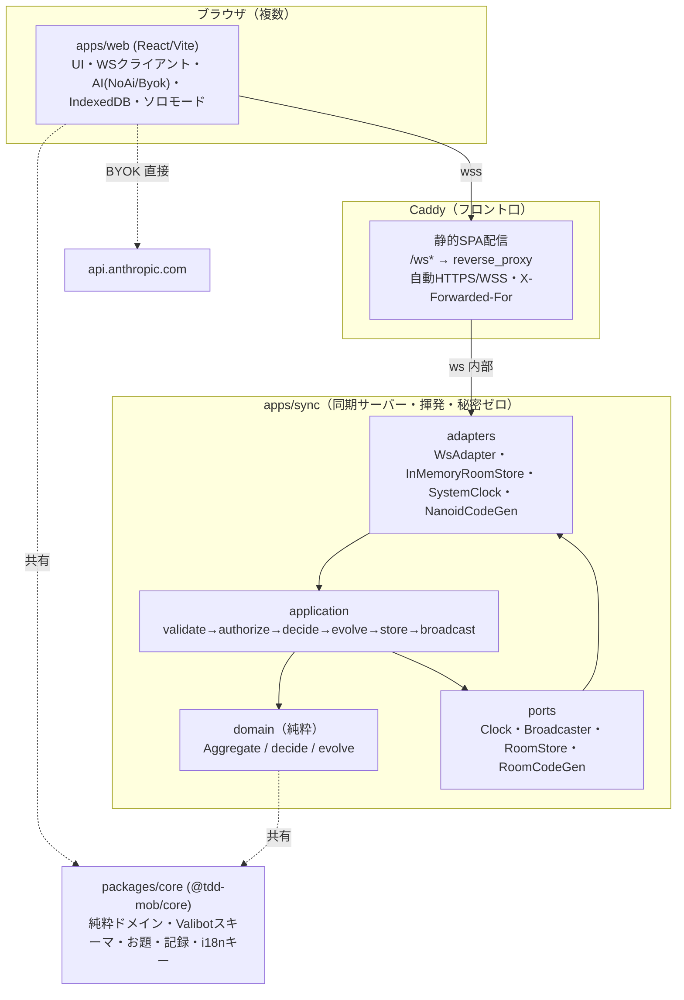
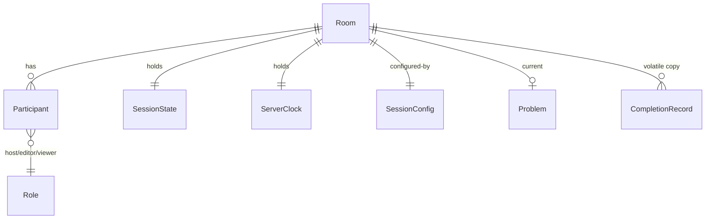

# 実装計画: TDD Mob Pro Timer

**入力:** spec.md ・ **ステータス:** Implemented（v1 本番公開済み 2026-06-09） ・ **設計出典:** `../archive/tdd-mob-pro-timer-spec-v3.0-final.md`（実装前の最終設計書・アーカイブ）

> spec.md（何を・なぜ）に対する「どう作るか」。技術選定はすべて要件に紐づける。本計画の確定アーキテクチャは「モノレポ + Caddy 前段 + 軽量同期サーバー（サーバー権威タイマー・full snapshot・秘密ゼロ・状態揮発）」。

---

## 技術コンテキストと意思決定

| 意思決定 | 選択 | 根拠 | 紐づく要件 |
|---|---|---|---|
| 実装言語 | **TypeScript（関数型スタイル）** | 現行プロトタイプと整合。front/server で型・純粋ロジックを共有 | 全般 |
| モノレポ | **pnpm workspaces + Turborepo**（Bun 採用時は Bun workspaces 可） | `@tdd-mob/core` を front/server で共有 | FR-031, FR-008 |
| 共有パッケージ | **`@tdd-mob/core`**（純粋ドメイン・スキーマ・お題・記録・i18n キー） | ドメインを 1 箇所に集約、ソロ/共有で同一ロジック | FR-001〜FR-010, FR-031 |
| 同期サーバー ランタイム | **Bun（ネイティブ WS）で開発・起動。本番は Bun か Node 24 + `ws` を選択可** | WS/DX は Bun が強い。状態揮発で再起動安全のため退避が容易 | FR-013, NFR可用性 |
| WS アダプタ | **`ws` 互換の薄い WS アダプタ越し**に実装 | Bun↔Node の退避を可能にする | FR-013 |
| WS クライアント | **ネイティブ WebSocket + 自前バックオフ、または `partysocket`** | 自動再接続・ハートビート | FR-019, US6 |
| 関数型エラー処理 | **neverthrow（`Result<T,E>`）** | `decide` の戻り値に最適・軽量。例外を投げない | FR-010, FR-017 |
| 境界スキーマ検証 | **Valibot** | モジュラー・軽量・front/server で同一スキーマ共有・Standard Schema 準拠 | FR-023, NFRセキュリティ(S3/S5) |
| ドメイン設計 | **Hexagonal（薄め）+ Decider（`decide`/`evolve`、集約一括 evolve）** | 現行 reducer と整合・テスト容易 | FR-008, US1 |
| サーバー権威タイマー | **集約内 `ServerClock` に時刻を一本化。1 本の `setTimeout` で次交代のみ待つ。1Hz TICK 廃止** | 端末間の時刻ずれ排除・残り時間/経過時間を導出で一致 | FR-003, FR-006, FR-007, SC-001/002/004 |
| 状態同期 | **full snapshot（差分なし）** | 共有状態が小さく整合バグの温床を断つ | FR-013, FR-015, SC-005 |
| お題 AI | **`ProblemProvider` ポート。NoAi（既定）+ Byok（本人ブラウザから直接 Anthropic API）** | サーバーは鍵を持たない（秘密ゼロ）。失敗時は必ず定型へ縮退 | FR-021〜FR-027, NFRセキュリティ(S6) |
| ルームコード/ID | **nanoid** | URL 安全・推測困難 | FR-011, NFRセキュリティ(S1) |
| サニタイズ | **DOMPurify**（Markdown 描画時） | XSS / AI 出力取り違え対策 | FR-023, NFRセキュリティ(S4/S5) |
| QR | **`qrcode`** | Lobby 用 | FR-011 |
| 恒久記録 | **クライアントの IndexedDB + JSON 入出力** | サーバーは揮発。記録は端末側 | FR-028, FR-029, SC-008 |
| フロント | **React + TypeScript + Vite + Tailwind** | 現行 UI 流用 | UI 全般 |
| フロント口 | **Caddy（静的配信 + `/ws*` reverse_proxy + 自動 HTTPS/WSS + X-Forwarded-For）** | WSS 必須・実 IP 伝達（DoS 対策） | NFRセキュリティ(S2/S7) |
| i18n | **文字列外部化（JP 主・EN 追加）を M0/M1 で基盤導入** | 後付けは高コスト | FR-036, US11 |
| テスト | **Vitest + fast-check（プロパティ）+ Clock 注入のフェイクタイマー** | 純粋ドメインの網羅・時刻決定論 | SC-010, FR-006, FR-008 |
| ライセンス | **MIT（既定案）** | 依存と整合しやすい | — |

> 将来枠（v1 非対象）: Effect（重量 FP）、managed/subscription Provider、local-first 同期エンジン（Zero/LiveStore/TanStack DB 等）、永続ストア。設計原則「データ同期 ≠ 一時イベント」は採用し `snapshot`（状態）と `signal`（演出）を分離する。

## 規約チェック（Constitution Check）

ガバナンス: ルート `CLAUDE.md`（claym サンドボックス規約）、グローバル指示（日本語・安全性・機密管理）。

| 原則 | ステータス | 備考 |
|---|---|---|
| 破壊的変更は事前確認 | PASS | `session.reset` は host 限定の破壊操作として UI/権限で隔離（FR-017） |
| 機密情報をコード/コミットに含めない | PASS | AI 鍵は同期サーバーへ送らない・ログに残さない（NFR S6/S11）。`.env` は扱わない |
| 既存コードパターン尊重 | PASS | 現行 `sessionReducer` を `decide`/`evolve` へ無破壊に分割。純粋関数群を core へ集約 |
| テストで動作確認 | PASS | TDD 進行・ドメインは fast-check で不変条件検証・CI 必須（spec SC-010） |
| `local/` 配下は独立プロジェクト | PASS | 本プロジェクトは `local/Tasuki` 配下・git 非追跡。ルート規約を強制適用しない |
| コメント/ドキュメント日本語 | PASS | コメント・docstring・本ドキュメントは日本語 |
| `local/` を git 追跡に含めない | PASS | 成果物は `local/Tasuki/` 配下に留める |

> 違反は 0 件。`local/` 配下のため claym ルートのモノレポ構成とは独立する。

## アーキテクチャ



- **依存方向**: 外（adapters/application）→ ドメイン（純粋）。ドメインは外部依存ゼロ。
- **AI はサーバーを通らない**: 共有時はルーム代表クライアントが生成し、サーバーには `problem.submit`（外部入力イベント `ProblemSubmitted`）として届く。
- **ソロモード**: WS を通らず完全ローカル。ローカルの `setTimeout` がサーバーの schedule 層の役を担い、**同一の集約 `evolve`** を使う（FR-031）。

## コンポーネントとインターフェース

**packages/core（@tdd-mob/core）** — 共有純粋ロジック。
- `aggregate.ts` `decide.ts` `evolve.ts` — 集約と状態遷移。`Decide = (cmd, agg, now) => Result<DomainEvent[], DomainError>`、`Evolve = (agg, event, now) => Aggregate`。
- `schemas.ts`（Valibot）— Command/ServerMsg/Problem/Config のスキーマ。front/server 共有。
- `problem.ts` — `buildProblemPrompt`、`FALLBACK_PROBLEMS`、`pickFallback`。
- `records.ts` `format.ts` — 完成記録・表示整形。
- `i18n/` — JP/EN メッセージキー。

**apps/sync** — 同期サーバー（薄い WS アダプタ越し）。
- `domain/` — `decide.ts evolve.ts aggregate.ts events.ts errors.ts`（core を再利用 or 内包）。
- `application/` — `handlers.ts`（フロー）`schedule.ts`（setTimeout 管理）`presence.ts`（間引き配信）。
- `ports/` — `Clock`・`Broadcaster`・`RoomStore`・`RoomCodeGen`。
- `adapters/` — `ws-adapter.ts in-memory-room-store.ts system-clock.ts nanoid-code-gen.ts`。
- `server.ts` — 起動・依存注入 `makeHandlers({ clock, store, broadcast, codeGen })`。

**apps/web** — フロント。
- WS クライアント（再接続バックオフ・clockOffset 推定 ping）。
- AI Provider（`NoAiProvider`/`ByokProvider`、失敗時 `pickFallback`）。
- IndexedDB 記録層・JSON 入出力。
- 画面: Setup / Lobby / Ready / Session / Celebration（§UI）。

## データモデル



```typescript
interface Aggregate { session: SessionState; clock: ServerClock; }
interface SessionState { rotation: string[]; currentIndex: number; isPaused: boolean; driverCounts: number[]; totalSwitches: number; }
interface ServerClock {
  running: boolean; intervalSeconds: number;
  anchorServerTime: number;     // 開始/再開/交代時のサーバー時刻(epoch ms)
  secondsLeftAtAnchor: number;  // その時点の残り秒
  accumulatedElapsedMs: number; // 稼働区間の合計（停止時に確定加算）
  runningSince: number | null;  // 現在の稼働区間の開始時刻（停止中 null）
}
interface Room {
  code: string; createdAt: number; hostParticipantId: ParticipantId;
  config: SessionConfig; problem: Problem | null;
  session: SessionState; clock: ServerClock;
  phase: 'setup'|'ready'|'session'|'celebration';
  participants: Participant[]; sessionRecords: CompletionRecord[];
  handoffNote: string; onBreak: boolean;
}
interface SessionConfig { language: string; difficulty: string; members: string[]; intervalMinutes: number; navigatorEnabled?: boolean; breakEveryRotations?: number; assertiveSwitch?: boolean; }
interface Participant { participantId: ParticipantId; connId: ConnId | null; displayName: string; role: 'host'|'editor'|'viewer'; presence: 'online'|'idle'|'offline'; hasAiKey: boolean; joinedAt: number; }
interface Problem { title: string; description: string; requirements: string[]; exampleTest: string; hints: string[]; }
interface CompletionRecord { id: string; roomId?: string; problemTitle: string; language: string; difficulty: string; elapsedSeconds: number; members: string[]; totalSwitches: number; completedAt: number; }
type ConnId = string; type ParticipantId = string;
```

**時刻の導出（クライアントは導出のみ）:**
- `secondsLeft = running ? secondsLeftAtAnchor − (now + clockOffset − anchorServerTime)/1000 : secondsLeftAtAnchor`
- `elapsedMs = accumulatedElapsedMs + (running ? (now + clockOffset) − runningSince : 0)`
- `clockOffset` は接続時の複数 ping の中央値で推定。

## API / インターフェース契約（WS メッセージ）

**Command（クライアント→サーバー・境界で Valibot 検証）**

| command | payload | 権限 | 紐づく要件 |
|---|---|---|---|
| `room.create` | `{ displayName, config? }` → `{ code, hostToken, resumeToken, participantId }` | — | FR-011, FR-012 |
| `room.join` | `{ code, displayName, hasAiKey, resumeToken? }` | — | FR-012, FR-016, FR-019 |
| `config.set` | `Partial<SessionConfig>`（decide 検証必須） | editor+ | FR-009, FR-030 |
| `phase.set` | `{ phase }` | host | FR-001, FR-017 |
| `problem.request` | `{ requestId }` | editor+ | FR-025 |
| `problem.submit` | `{ requestId, problem, usedFallback }` | 委譲代表のみ(editor+) | FR-025, FR-026 |
| `session.act` | `{ action }`（START/SWITCH(=skip)/PAUSE/RESUME/MOVE/ADD/REMOVE。**TICK 無し**） | editor+ | FR-003〜FR-005, FR-009 |
| `session.complete` | `{}` | **host** | FR-017, FR-028 |
| `session.reset` | `{}`（破壊的） | **host** | FR-017 |
| `handoff.note.set` | `{ text }` | editor+ | FR-030 |
| `break.start` / `break.end` | `{}` | host | FR-030 |
| `role.set` | `{ participantId, role }` | host | FR-016, FR-017 |
| `presence.ping` | `{}` | — | FR-014 |
| `time.ping` | `{ clientTime }` → `{ serverTime }`（clockOffset 推定用・状態を変えない） | — | FR-007, SC-001 |

**Server → Client（差分なし）**
- **`snapshot`**: 唯一の状態同期手段。`Room` 全体。受信ごとに置き換え（FR-013, FR-015）。
- **`signal`**（演出専用・状態ではない）: `switch` / `celebration` / `need-problem{requestId, deadlineMs}`。欠落しても整合に無害（FR-035, 演出）。
- **`error`**: `{ code, message }`。

**リクエスト処理フロー（1 コマンド・full snapshot）:**
```
WS message
 ─▶ parse + Valibot 検証（不正/巨大は即拒否 S3）
 ─▶ authorize(role, hostToken)（コマンドごと再検証 S9）
 ─▶ decide(cmd, agg, now)
      ├─ Err(DomainError) ─▶ sender へ error
      └─ Ok(events) ─▶ agg' = events.reduce((a,e)=>evolve(a,e,now), agg)
                      ─▶ store.put(room') ─▶ broadcast(snapshot(room'))
```

**代表生成（タイムアウト・再委譲）:** host 優先 → `editor+ かつ hasAiKey の online` を joinedAt 昇順 → 末尾に fallback 担当。先頭へ `need-problem`、deadline 内に `problem.submit` 無ければ次候補、全滅で `pickFallback` 確定（FR-026）。

## プロジェクト構成

**設置先**: `local/Tasuki/tdd-mob-pro-timer/`（git 非追跡。`docs/plans/` は計画文書のみ、コード本体はこのモノレポルートに置く）。

```
tdd-mob-pro-timer/                 # 設置先: local/Tasuki/tdd-mob-pro-timer/（git 非追跡）
├─ package.json / pnpm-workspace.yaml / turbo.json
├─ packages/core/                  # @tdd-mob/core
│  ├─ src/{aggregate,decide,evolve,events,errors}.ts
│  ├─ src/{problem,records,format}.ts
│  ├─ src/schemas.ts               # Valibot（Command/ServerMsg/Problem/Config）
│  ├─ src/i18n/{ja,en}.ts
│  └─ test/{decide,evolve,clock,properties}.test.ts   # Vitest + fast-check
├─ apps/web/
│  ├─ src/ui/{Setup,Lobby,Ready,Session,Celebration}.tsx
│  ├─ src/ui/components/{TeamOrbit,RotationPreviewCard,RotationStatsPanel,Card,...}.tsx
│  ├─ src/sync/{client.ts,backoff.ts,clock-offset.ts}
│  ├─ src/ai/{provider.ts,no-ai.ts,byok.ts}
│  ├─ src/records/{indexeddb.ts,io.ts}
│  ├─ src/solo/local-engine.ts
│  └─ test/...
├─ apps/sync/
│  ├─ domain/      decide.ts evolve.ts aggregate.ts events.ts errors.ts
│  ├─ application/ handlers.ts schedule.ts presence.ts
│  ├─ ports/       clock.ts broadcaster.ts room-store.ts code-gen.ts
│  ├─ adapters/    ws-adapter.ts in-memory-room-store.ts system-clock.ts nanoid-code-gen.ts
│  ├─ server.ts
│  └─ test/...
└─ deploy/Caddyfile
```

## エラー処理とセキュリティ

- **ドメインエラー**: `decide` は `Result`。`EmptyName/DuplicateName/MemberLimit/MinMembers/Unauthorized/PhaseConflict` 等を `Err` で返し、application が sender へ `error` を返す（例外を投げない）。
- **AI 失敗**: Provider は失敗・無効 JSON で必ず `pickFallback`（`source:'fallback'`）へ縮退。お題は決して画面を壊さない（FR-024）。
- **境界検証**: 全 WS メッセージを Valibot で 1 度だけ検証。未知 type・余剰フィールド・サイズ超過を即拒否（S3）。`config.set` も必ず decide のドメイン検証を通す（S10）。
- **認可**: Cookie ではなく最初のメッセージのトークンで認可。host 操作は `hostToken` 必須。コマンドごとに role 再検証（S2/S9）。
- **WSS / Origin**: Caddy で WSS 強制、`Origin` を許可ドメインのみ検証（S2）。
- **秘密ゼロ**: AI 鍵はクライアントのみ・サーバー送信禁止・ログ禁止。トークンは sessionStorage 既定、localStorage 永続はオプトイン＋警告（S4/S6/S11）。
- **XSS**: React 既定エスケープ。AI/ユーザー由来テキストへ `dangerouslySetInnerHTML` 不使用。Markdown は DOMPurify（S4/S5）。
- **DoS**: 実 IP（X-Forwarded-For）あたり同時接続上限・全体ルーム数上限・参加者上限(10)・アイドル回収・コマンドのレート制限・失敗 join のレート制限（S1/S7）。**初期設定値**: 同時接続 ≤ 5/IP、ルーム総数 ≤ 100、アイドル回収 30 分、失敗 join ≤ 10/分/IP（運用で調整可）。

## テスト戦略

- **ドメイン（最重要・単体）**: `decide`/`evolve`（集約一括）を純粋関数として網羅。現行 `runSelfTests` を Vitest へ昇格。`now` 引数で時刻依存遷移を決定論的に検証。
- **プロパティテスト（fast-check）**: 任意の操作列で不変条件（`rotation.length === driverCounts.length`、`currentIndex` 妥当、clock と session の整合）を検証（SC-010, FR-008）。
- **時計の決定論**: `Clock` 注入 + フェイクタイマーで交代・一時停止・再開・**elapsed の停止除外**・休憩を再現（FR-006, SC-004）。
- **同期/整合（結合）**: full snapshot の冪等な置き換え、再接続後の整合、ホスト委譲、代表生成タイムアウト→再委譲→フォールバック収束（SC-005/006, FR-026）。
- **契約**: Command/ServerMsg の Valibot スキーマを front/server 双方で共有・検証。
- **カバレッジ目標**: `@tdd-mob/core` のドメインは行・分岐とも高カバレッジ（目標 90%+）。**CI 必須**。

## 段階分け（Sequencing）— v3.0 §15 のマイルストーンに対応

1. **M0 — core 基盤**: `@tdd-mob/core`（集約 decide/evolve 分割・時間系分離・elapsed 積算）、Valibot スキーマ、i18n キー、Vitest + fast-check、モノレポ骨組み。→ US1 のドメイン部・FR-001〜010, FR-036, SC-010。
2. **M1 — 脱 Artifact / ローカル**: IndexedDB 記録、`ProblemProvider`（NoAi + Byok）、ソロモード、「API キーあり/なし」UI。→ US3/US4/US9・FR-021〜029, FR-031。
3. **M2 — 同期サーバー**: `apps/sync`（集約 evolve・サーバー権威時計・揮発・秘密なし・full snapshot）、薄い WS アダプタ、WS クライアント、Caddy 前段。→ US1/US2・FR-007, FR-011〜015。
4. **M3 — 共有仕上げ**: ルームコード/QR・ID/トークン・既定 viewer・権限/委譲・再接続復帰・代表生成（editor+ 限定・再委譲）・プレゼンス間引き・ナビゲーター/休憩/強い通知/引き継ぎ・Wake Lock・通知/バイブ・記録入出力。→ US5/US6/US7/US8/US10・FR-016〜020, FR-025〜027, FR-030, FR-032〜035。
5. **M4 — 堅牢化（v1 後）**: セキュリティ網羅・a11y 仕上げ・PWA・（任意）managed/subscription・チーム共有記録ストア検討。**本タスク計画は M0〜M3 を対象**。

**コンポーネント依存**: core → (web ローカル / sync) → 共有同期 → 共有仕上げ。

## 未解決の論点

- なし（spec の `[要確認]` は性能基準値の確定により解消済み）。
- 将来要件化したら扱う: 永続ストア（M4）、managed/subscription Provider、PWA、チーム横断記録（TanStack DB 等）。
