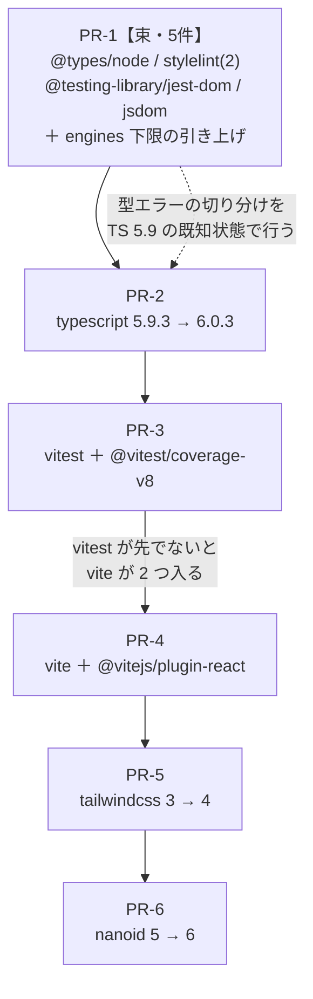

# 実装計画: メジャー依存の更新

**入力:** [`docs/superpowers/specs/2026-08-11-major-dependency-updates-design.md`](../specs/2026-08-11-major-dependency-updates-design.md)
**Issue:** [#113](https://github.com/tomohiroJin/tasuki-tools/issues/113) ・ **ステータス:** Draft

## 実測ログ（2026-08-11 測定）

**この節がこの計画の根拠であり、版に関する測定値の置き場である。**対象パッケージの
一覧と現在版→最新版の正本は Issue #113（仕様の「前提」）。ここには**判断に使った測定値だけ**を
測定日つきで置く。**着手時に再実測すること。**

### peer 依存による束縛（分離できない組）

| 組 | 束縛の内容 | 出典 |
|---|---|---|
| `vite` ↔ `@vitejs/plugin-react` | plugin-react 6.0.5 の peer が `vite: "^8.0.0"` | `pnpm view` |
| `vitest` ↔ `@vitest/coverage-v8` | coverage-v8 4.1.10 の peer が `vitest: "4.1.10"`（完全一致） | 同上 |
| `stylelint` ↔ `stylelint-config-recommended` | config 18.0.0 の peer が `stylelint: "^17.0.0"` | 同上 |

**Issue #113 本文の方針「1 メジャー = 1 PR」は、この 3 組では成立しない。**着手時に本文を訂正する。

### 順序を決める束縛（peer ではない依存関係）

- `vitest@3.2.7` は `vite` を **peer ではなく直接依存**として `^5.0.0 || ^6.0.0 || ^7.0.0-0` で持つ。
  **先に `vite` を 8 にすると、vitest 用に vite 7 系がもう 1 つ入り、「ビルドは 8・テストは 7」に割れる。**
- `vitest@4.1.10` の直接依存は `vite: "^6.0.0 || ^7.0.0 || ^8.0.0"`。
  → **`vitest` を先に 4 へ上げれば、vite は常に 1 つに保たれる。順序は vitest → vite で固定。**

### 実行環境の下限

| 出所 | 宣言 |
|---|---|
| ルート `package.json` の `engines.node` | `>=22.13.0` |
| `jsdom@30.0.1` の `engines.node` | `^22.22.2 \|\| ^24.15.0 \|\| >=26.0.0` |
| `@vitejs/plugin-react@6.0.5` / `vite@8.2.0` | `^20.19.0 \|\| >=22.12.0` |
| `stylelint@17.14.1` / `stylelint-config-recommended@18.0.0` | `>=20.19.0` |
| `nanoid@6.0.1` | `^22 \|\| ^24 \|\| >=26` |
| `vitest@4.1.10` | `^20.0.0 \|\| ^22.0.0 \|\| >=24.0.0` |

**`jsdom@30` だけがリポジトリの宣言を上回る。**下限を `>=22.22.2` へ引き上げる必要がある。
CI は `node-version: 22`（22 系の最新を引く）、開発機は `v22.23.2` で、いずれも実体は条件を満たす。

### TypeScript の到達点（実測済み・本計画の中心的な判断）

| 版 | `pnpm peers check` | `pnpm typecheck` | `pnpm lint` | `pnpm test` |
|---|---|---|---|---|
| 5.9.3（現行） | 問題なし | 13/13 | 10/10 | 11/11 |
| **6.0.3** | **問題なし** | **13/13** | **10/10** | **11/11** |
| 7.0.2 | `unmet peer typescript`（8 パッケージ） | 13/13 | **0/10** | 未実行 |

7.0.2 での lint の失敗は精度低下ではなく**起動の拒否**である。

```
Error: typescript-eslint does not support TS 7.0.
    at Object.<anonymous> (.../typescript-eslint/dist/index.js:52:11)
```

（`@tasuki/ui` の stylelint も失敗表示になるが、これは turbo の巻き添え。単独実行では通る。）

### TypeScript 7 が取れない原因（2026-08-11 時点の外部状況）

- `typescript-eslint` は **latest 8.67.0 / canary 8.67.1-alpha.0 のいずれも peer が `>=4.8.4 <6.1.0`**。
  9.x 系も `next` タグも npm 上に存在しない（`@typescript-eslint/parser` ほか 3 パッケージも同じ）
- 対応が入らない原因は typescript-eslint 側の怠慢ではなく、**TypeScript 7.0 が安定した
  programmatic API を出していない**こと（7.1 で入る予定。`typescript@7.1.0-dev.*` の nightly が
  2026-08-10 まで継続）。加えて ESLint 本体に非同期パーサの仕組みが無い
  （[typescript-eslint#10940](https://github.com/typescript-eslint/typescript-eslint/issues/10940)・オープン）
- Microsoft 自身が `@typescript/typescript6`（6.0.2・2026-07-06 公開。`tsc6` と TS 6.0 API を提供）を
  出しており、**エコシステムが接続する API のベースラインは TS 6 である**ことを示している

→ **6.0.3 を取り込み、7.0.2 は不採用。将来の方針は #113 完了時に改めて判断する**（仕様 FR-010）。

### 待機期間（`minimumReleaseAge: 10080` = 7 日）との関係

対象の最新版はすべて公開から 7 日を超えており（最短 `nanoid@6.0.1` の 7 日、最長 `vitest@4.1.10` の
35 日）、**待機期間による除外の追加は不要**。`typescript@6.0.3` は 116 日経過。

## 技術コンテキストと意思決定

| 意思決定 | 選択 | 根拠 | 紐づく要件 |
|---|---|---|---|
| PR の粒度 | 危険度で束ねた **6 更新単位** | 開発時のみ・失敗の現れ方が区別できる・実確認が不要な 5 件を 1 PR に束ね、残りは単独。#69 PR-4（非メジャー 6 件を 1 PR）の前例に沿う | FR-001, FR-002 |
| `typescript` の到達点 | **6.0.3**（7.0.2 は不採用） | 6.0.3 は全検査緑を実測。7.0.2 は lint が 0/10 で起動拒否 | FR-004, FR-009 |
| `vitest` と `vite` の順序 | **vitest → vite** | vitest 3 が vite を直接依存で `^5〜^7` に固定しており、逆順だと vite が 2 つ入る | FR-002 |
| Node 下限 | `>=22.13.0` → **`>=22.22.2`** | `jsdom@30` の engines が `^22.22.2`。宣言が実態と食い違う状態を作らない | FR-012 |
| Tailwind 4 の移行方式 | **`@tailwindcss/postcss` へ差し替え＋既存 JS 設定を `@config` で再利用** | 振る舞い不変（エピック #67 の全体制約）を最優先。CSS-first への全面移行は差分が大きく、#78 のトークン設計に踏み込む | FR-007, FR-014 |
| `autoprefixer` の扱い | **触らない**（要否の判断は #71 へ申し送り） | 削除は「依存の削除」で仕様の非目標。Tailwind 4 が自前で prefix する点は事実として記録する | 非目標 |
| 検証の主手段 | 既存の `typecheck` / `lint` / `test` / `build` / `e2e` | 新しい検査を足さない（#70 の担当）。既存の検査を通すことのみ | 非機能要件 |
| 失敗時の扱い | 原因の 1 件を束から外して別 PR へ | まとめたことで全体が止まらないようにする | FR-003 |

## 規約チェック（Constitution Check）

| 原則 | ステータス | 備考 |
|---|---|---|
| I. テスト駆動開発 | PASS（一部該当なし） | 新規の実装コードを書かないため Red→Green の対象が無い。既存テスト（`pnpm test`）が回帰検出を担う。DoD 項目 1 は各 PR で「該当なし」と明記する |
| II. 技術選定は ADR を通す | **要判断** | 版の更新は技術選定の変更ではない。ただし Tailwind 4 で必要になる `@tailwindcss/postcss` の追加が「新しいライブラリの追加」に当たるかは解釈が割れる → 未解決の論点 1 |
| III. 揮発インメモリと単純運用 | PASS | 保存機構に触れない。デプロイは #66 でまとめて 1 回（本件では行わない） |
| IV. 境界の型安全 | PASS | 検証・`Result` の構造に触れない。`nanoid` はアダプタ層（`apps/timer-sync/src/adapters/nanoid-code-gen.ts`）に閉じている |
| V. 実画面検証 | PASS | PR-4（vite）・PR-5（tailwind）は実画面、PR-6（nanoid）は実プロトコルで確認する。PR-1〜3 は「該当なし」と明記 |
| VI. 依存は内向き | PASS | 依存の向きを変えない |
| VII. 検査は壊して確かめる | PASS | 新しい検査は足さないため変異検査は該当なし。ただし **Tailwind 移行では「トークン参照が壊れてもユニットテストは緑のまま」になりうる**ため、実画面確認をその代替として明示的に置く |
| VIII. 記録が正本 | PASS | 版の一覧の正本は Issue #113。本計画は測定値を測定日つきで持つのみ（二重正本を作らない） |
| IX. 小さく回す | PASS | 6 PR・各 PR で DoD を満たす・デプロイは行わない |
| X. 抽象は実需で | PASS | 抽象を導入しない |

## アーキテクチャ

更新そのものに構造は無い。**設計の実体は「どの順に、どの単位で入れるか」の依存関係**である。



**順序の根拠は 2 本だけで、残りは危険度の低い順である。**

1. **PR-3 → PR-4 は必須**（vitest 3 が vite を直接依存で抱えているため。実測ログ参照）
2. **PR-1 → PR-2 が望ましい**。`@types/node` の型エラーは、既知の安定状態である TS 5.9 の上で
   切り分けたい。TS 6 に上げた後だと「TS 6 のせいか型定義のせいか」が混ざる

PR-5（tailwind）と PR-6（nanoid）は他のどれとも依存しないため、順序は入れ替え可能。
実画面確認の重い順に後ろへ置いている。

## コンポーネントとインターフェース

「コンポーネント」は更新単位、「インターフェース」は各単位が触る設定ファイルと、
影響が及ぶワークスペース内パッケージである。

| 更新単位 | 触るファイル | 影響が及ぶパッケージ | 失敗が最初に現れる場所 |
|---|---|---|---|
| PR-1 `@types/node` | ルート `package.json`, `e2e/package.json` | `tasuki`(root), `@tasuki/e2e` | `pnpm typecheck` |
| PR-1 `stylelint` ＋ `stylelint-config-recommended` | `packages/ui/package.json`, `packages/ui/stylelint.config.mjs` | `@tasuki/ui` | `pnpm lint`（stylelint） |
| PR-1 `@testing-library/jest-dom` | `apps/timer-web/package.json`, `apps/landing/package.json` | `@tasuki/timer-web`, `@tasuki/landing` | `pnpm test`（アサーション） |
| PR-1 `jsdom` ＋ 下限 | 同上 ＋ ルート `package.json` の `engines` | 同上 | `pnpm test`（テスト環境の起動） |
| PR-2 `typescript` | ルート ＋ 5 パッケージの `package.json` | `tasuki`, `@tasuki/e2e`, `landing`, `poker-core`, `poker-sync`, `poker-web` | `pnpm typecheck` / `pnpm lint` |
| PR-3 `vitest` ＋ `@vitest/coverage-v8` | 8 パッケージの `package.json`, 各 `vitest.config.ts`, `packages/timer-core/vitest.config.ts`（カバレッジ設定） | vitest を使う 8 パッケージ | `pnpm test` |
| PR-4 `vite` ＋ `@vitejs/plugin-react` | `apps/{timer-web,poker-web,landing}/package.json` と各 `vite.config.ts` | web 3 アプリ | `pnpm build` |
| PR-5 `tailwindcss` | `apps/timer-web/package.json`, `postcss.config.js`, `tailwind.config.js`, `src/index.css` | `@tasuki/timer-web` | `pnpm build` ＋ **実画面** |
| PR-6 `nanoid` | `apps/timer-sync/package.json` | `@tasuki/timer-sync` | `bun test` ＋ **実プロトコル** |

**`apps/timer-sync` は `typescript` を直接依存として宣言していない**（`typecheck` スクリプトは持つ）。
`packages/{timer-core,protocol,ui}`, `apps/timer-web` も同様。PR-2 では宣言のある 6 箇所のみを
書き換え、残りは巻き上げに従う（現状の構成を変えない）。

## 変更されるファイル

```
tasuki-tools/
├── package.json                          # @types/node(PR-1), engines(PR-1), typescript(PR-2)
├── pnpm-lock.yaml                        # 全 PR
├── pnpm-workspace.yaml                   # （待機期間の例外は追加不要。期限切れ例外の掃除のみ）
├── e2e/package.json                      # @types/node, typescript, vitest
├── packages/
│   ├── ui/{package.json,stylelint.config.mjs}   # PR-1
│   ├── timer-core/{package.json,vitest.config.ts}  # PR-3（カバレッジ設定）
│   ├── poker-core/package.json           # PR-2, PR-3
│   └── protocol/package.json             # PR-3
└── apps/
    ├── timer-web/{package.json,vitest.config.ts,vite.config.ts,
    │              postcss.config.js,tailwind.config.js,src/index.css}
    ├── landing/{package.json,vitest.config.ts,vite.config.ts}
    ├── poker-web/{package.json,vitest.config.ts,vite.config.ts}
    ├── poker-sync/{package.json,vitest.config.ts}
    └── timer-sync/package.json           # PR-6（nanoid）
```

`.github/workflows/ci.yml` は **PR-1 で確認するが、変更は不要な見込み**（`node-version: 22` は
22 系の最新を引くため新しい下限を満たす）。実測して必要なら明示的に固定する。

## 障害モードと戻し方

| 障害 | 現れ方 | 対処 |
|---|---|---|
| 束ねた PR の 1 件だけが赤い | `pnpm test` / `lint` / `typecheck` のいずれかが特定パッケージで失敗 | 原因の 1 件を束から外して別 PR へ（FR-003）。残りは通す |
| 更新でテストが黙って実行されなくなる | 検査は緑だが実行件数が減る | 各 PR で**更新前後のテスト実行件数を突き合わせる**（FR-006）。減っていたら原因を特定するまで完了としない |
| 設定移行でトークン参照が死ぬ | ユニットテストは緑のまま、画面だけ崩れる | PR-5 は実画面確認を完了条件に置く（原則 VII の代替手段として明示） |
| 実行時依存の破壊 | テストは緑、実際の接続で失敗 | PR-6 は実プロトコル確認（ルーム作成→コード発行）を完了条件に置く |
| 更新で新たな脆弱性が入る | CI の `audit` ジョブが high 以上で落ちる | 当該 PR を完了とせず、解消または不採用を判断（FR-009） |
| 作業中の取り違え | `pnpm update -r <pkg>@<version>` が直接依存も巻き込む | 実行直後に対象パッケージの直接依存宣言を `git diff` で確認する（#69 で 2 度発生した罠） |

**戻し方は全 PR 共通で「単独の revert」。**更新単位を跨いだ変更を 1 PR に混ぜないことで、
これを成立させる（FR-001）。

## セキュリティ

- **待機期間の防御を外さない。**対象はすべて公開から 7 日超で、`minimumReleaseAgeExclude` への
  追加は不要（実測ログ）。追加が必要になった場合は解除予定日を併記する（FR-013）
- **`postcss-selector-parser` の期限つき例外（解除予定 2026-08-14）を掃除する。**#113 とは
  独立に期限が来るため、**PR-1 に相乗りさせる**（着手が 8/14 以降であること。それ以前なら
  最後の PR へ回す）
- `pnpm audit` は CI の独立ジョブで high 以上を落とす。**各 PR でこのジョブが緑であること**を
  完了条件に含める（#69 PR-3 で導入済みの仕組みを使うだけで、新しい検査は足さない）

## テスト戦略

新しいテストは書かない。**既存の検査をどう使うか**が戦略の実体である。

| 更新単位 | `typecheck` | `lint` | `test` | `build` | `e2e` | 実画面 | 実プロトコル |
|---|---|---|---|---|---|---|---|
| PR-1 | ✅ | ✅ | ✅ | ✅ | CI | 該当なし | 該当なし |
| PR-2 | ✅ | ✅ | ✅ | ✅ | CI | 該当なし | 該当なし |
| PR-3 | ✅ | ✅ | ✅ **件数を突合** | ✅ | CI | 該当なし | 該当なし |
| PR-4 | ✅ | ✅ | ✅ | ✅ **成果物を確認** | CI | ✅ 3 アプリ | 該当なし |
| PR-5 | ✅ | ✅ | ✅ | ✅ | CI | ✅ timer 画面 | 該当なし |
| PR-6 | ✅ | ✅ | ✅ | ✅ | CI | 該当なし | ✅ ルーム作成 |

- **カバレッジのしきい値**: `packages/timer-core` は `lines: 90 / branches: 90` を宣言している。
  PR-3 でカバレッジ実装（`@vitest/coverage-v8`）が変わるため、**しきい値を下げることで通さない**。
  下がった場合は原因（計測対象の変化か、実際の欠落か）を特定する
- **テスト実行件数の突合**: 各 PR の作業開始時に `pnpm test` の件数を記録し、完了時に比較する。
  件数の正本は各 PR の記述とし、この計画には転記しない
- **E2E** は CI の独立ジョブに任せる（ローカルでは `pnpm dev` と同時に走らせられない）。
  PR-4 / PR-5 は利用者の通る経路が変わりうるため、CI の e2e ジョブの結果を PR に記す

## 段階分け（Sequencing）

| 段 | ブランチ | 対象 | DoD で「該当あり」になる項目 |
|---|---|---|---|
| PR-0 | `docs/113-pr0-spec-and-plan` | 本仕様・本計画・タスク | 7（文書）・8（完了条件） |
| PR-1 | `chore/113-pr1-outer-checks` | `@types/node` / `stylelint` ＋ `stylelint-config-recommended` / `@testing-library/jest-dom` / `jsdom` ＋ Node 下限 ＋ 期限切れ例外の掃除 | 8 |
| PR-2 | `chore/113-pr2-typescript` | `typescript` → 6.0.3（7.0.2 不採用の記録を含む） | 8 |
| PR-3 | `chore/113-pr3-vitest` | `vitest` ＋ `@vitest/coverage-v8` | 8 |
| PR-4 | `chore/113-pr4-vite` | `vite` ＋ `@vitejs/plugin-react` | 2・5・8 |
| PR-5 | `chore/113-pr5-tailwind` | `tailwindcss` → 4 | 2・5・7・8 |
| PR-6 | `chore/113-pr6-nanoid` | `nanoid` → 6 | 5・8 |
| 締め | — | #113 へ取り込み／不採用の一覧をコメントし、振り返りを書いてクローズ | 7・8 |

**積み上げではなく、各 PR を `main` から切って順に出す。**PR-3 → PR-4 の順序制約があるため、
PR-4 は PR-3 のマージ後に切る。マージは `gh pr merge --merge`（`--delete-branch` を付けない）。

## 未解決の論点

- **[要確認 1]**: Tailwind 4 で必要になる `@tailwindcss/postcss` の追加は、憲法 原則 II が
  ADR を要求する「新しいライブラリの追加」に当たるか。**私の判断は「当たらない」**
  （Tailwind 4 が PostCSS プラグインを本体から分離した結果であり、技術選定は Tailwind のまま。
  同一エコシステム内の構成変更）。ただし解釈が割れうるため、必要なら `docs/adr/0001`
  （デザインシステムの範囲）への追記で担保する。
- **[要確認 2]**: Tailwind 4 の移行方式は「既存 `tailwind.config.js` を `@config` で再利用する
  最小移行」でよいか。**私の推奨は最小移行**（振る舞い不変を最優先し、CSS-first への全面移行は
  #78 のトークン設計に踏み込むため別途）。**`@config` が Tailwind 4.3.3 で実際に機能するかは
  未実測**であり、PR-5 の最初のタスクで確認する。機能しない場合は移行方式を再検討する。
- **[要確認 3]**: `autoprefixer` は Tailwind 4 では不要になる見込みだが、削除は仕様の非目標
  （依存の削除）に当たる。**私の判断は「触らず #71 へ申し送る」**。PR-5 で残置したままビルドが
  通ることを確認する。

## 関連

- 仕様: [`../specs/2026-08-11-major-dependency-updates-design.md`](../specs/2026-08-11-major-dependency-updates-design.md)
- 供給網対策の決定: [`docs/adr/0008`](../../adr/0008-dependency-supply-chain.md)（#69）
- デザインシステムの範囲: [`docs/adr/0001`](../../adr/0001-design-system-scope.md)（#78）
- DoD: [`docs/guides/definition-of-done.md`](../../guides/definition-of-done.md)
- 開発手順: [`docs/guides/development.md`](../../guides/development.md)
